# SPHIRUS — BODY-ONLY ANATOMICAL CORRECTION PASS

> GitHub kapsamı: rapor, 12 beden karşılaştırma panosu ve teknik kayıtlar. Blender/FBX dosyaları yerel teslim klasöründedir. [Önceki yumuşatma ve beden referansı raporu](../character-softening-2026-09-27/TEKNIK_RAPOR.md) korunmuştur. Çalışma 27 Eylül’de başladı; yayın 28 Eylül 2026 (Türkiye).

27 Eylül 2026. **Son aday: v3. Başlangıç: son tamamlanmış yumuşatma + beden referansı sonucu.**

Bu geçiş yalnızca bedeni düzeltir. Göğüs tabanı, alt/yan dolgunluk, göğüs altı, kaburga–bel ve karın–pelvis ilişkisi mevcut topoloji içinde yeniden şekillendirildi. **Baş/yüz değişimi 0 mm.** Önceki sürümler korunmuştur. MetaHuman Conform, Unreal import, saç, kıyafet veya gameplay çalışması yapılmadı.

## Korunan başlangıç ve sürümleme

`Sphirus_Softening_EDITABLE.blend` içindeki `TARGET_BODY` ve `SPH_Body_Reference_Correction` temel alındı. Orijinalden yeniden başlanmadı. Kaynak, `CHECKPOINT_LatestSoftening_EDITABLE.blend` olarak birebir kopyalandı; SHA-256: `d6ff48cf17e364522911240ce86f5e0ec899dd1135b35cab36a7253a42493316`.

Orijinal / Pass 1 / Pass 2 / düzeltici sürümlere ait **664 dosya** hash kontrolünde değişmemiştir. Kontrol edilen **86 Unreal kaynak paketi** aynı kalmıştır. İşleme sahibi yalnızca yeni Blender kaynak klasörüdür; eski kaynak veya üretim varlığı üzerine yazılmadı.

Yeni `SPH_Body_Anatomy_Correction`, yalnızca BODY üzerinde, önceki `SPH_Body_Reference_Correction` anahtarına göreli bir katmandır. Önceki dört form katmanı 1 iken yeni anahtar **1 = son beden**, **0 = son geçişten önceki beden**. Önceki 5 BODY ve 863 HEAD anahtarının koordinatları ve göreli ilişkileri korunur. HEAD üzerinde yeni anahtar yoktur.

## Göğüs anatomisinde düzeltmeler

Yakın kil görünümlerinde önceki göğsün alt ve yan hacminin bastırıldığı, üst göğüs ile ön yüzeyin fazla düz okunduğu doğrulandı. Rig'in nötr hedef üzerindeki dünya-konumu farkı 0,00072 mm'nin altındaydı; ana sorun doğrudan şekildi.

Göğüs duvarı, üst kutup, alt kutup, yan bağlantı ve göğüs altı dönüşü ayrı ama birbirine bağlı yüzey geçişleriyle çalışıldı:

- Sternum çevresindeki orta düzlem ile meme tabanı ayrıştırıldı; iç hacim öne ve birbirine itilmedi.
- Üst kutuptan öne geçiş daha uzun ve yumuşak bir eğriye yayıldı.
- Alt dolgunluk ve aşağı yönlü doğal akış geri verildi; hacim yalnızca öne büyütülmedi.
- Yan göğüs hacmi göğüs duvarının çevresine yayıldı; koltuk altı bağlantısı korundu.
- Göğüs altı kıvrımı düz bir oyuk yerine yumuşak bir yay olarak çözüldü; alt kutbun kaburga üzerine oturuşu belirginleştirildi.

Nötr, desteksiz yetişkin anatomisi yorumlandı. Referanstaki sütyen desteği, baskı veya ışık kaynaklı gölgeler kopyalanmadı. Bir meme objesi büyütme, global ölçekleme, push-up dekolte veya küresel implant biçimi uygulanmadı. Yeni mikro-detay ya da cilt üretimi yoktur.

## Kaburga, bel, karın ve pelvis

Göğüs altındaki alt kaburga yayı ile üst karın arasında daha okunur geçiş oluşturuldu. Üst karın yüzeyi hafifçe geri alınıp alt karın yumuşak hacmi korundu. Bel daralması yan karın/oblik ve iliak geçişle bağlandı; sert kas çizgisi veya six-pack eklenmedi.

İliak bölge ve yan kalçadan üst uyluğa akış küçük miktarda yeniden dengelendi; arka pelvis geçişi yumuşatıldı. Göğüs–ön deltoid–üst kol bağlantısı üzerinde çalışıldı, ancak stres testinde sorun çıkaran ön koltuk altı kıvrımının şekil değişimi yerel olarak azaltıldı. Alt bacaklar, dizler, eller ve ayaklar yeniden tasarlanmadı.

## Teknik koruma ve ölçülen yer değiştirmeler

Aşağıdaki değerler aynı vertex indekslerinin dünya koordinatlarından ölçülür. Referans fotoğrafına ait anatomik ölçü veya tarama doğruluğu iddiası değildir.

| Bölge / ölçüt | Son başlangıç → v3 azami hareket |
|---|---:|
| BODY toplam | **39.822731018066 mm** |
| HEAD | **0 mm** |
| Göğüs bölgesi | 39.822731018066 mm |
| Göğüs altı / alt kaburga | 16.935726165771 mm |
| Karın / bel | 4.824936389923 mm |
| Pelvis / kalça | 4.803182125092 mm |

BODY 32.334 vertex / 60.816 üçgen; tam HEAD 34.657 vertex / 64.094 üçgen. Vertex/kenar/polygon/loop sırası, kaynak mesh konumları, eski shape key verileri, UV katmanları ve koordinatları, materyal indeksleri, skin ağırlıkları ve vertex grupları aynıdır. Export kaynak indeks eşlemeleri son önceki teslimle aynıdır. Retopoloji, weld ve yeniden UV açma yapılmadı.

Tüm armature rest matrisleri, mevcut referans pozları ve nesne dönüşümleri korunur. **Başlangıç ve son boy: 173.40184020996 cm.** Blender dünya birimi metre, −Y ileri / +Z yukarı; FBX +X ileri / +Z yukarı. İskelet veya ölçek değişikliği yoktur.

## Poz güvenliği ve giderilen hata

Önceki beden ile yeni beden 12 aynı geometrik stres pozunda karşılaştırıldı: nötr idle, yürüyüş, koşu, crouch, kollar yukarı, kollar öne, omuz rotasyonu, dirsek bükümü, kalça bükümü, geniş duruş, derin diz bükümü ve gövde dönüşü. Bunlar geçici referans pozlarıdır; yeni animasyon varlığı üretilmedi.

v2'de kollar öne uzatıldığında iki ön koltuk altı kıvrımında toplam **6 küçük üçgen yön değişimi** bulundu. Kıvrım çevresindeki yer değiştirme geniş, yumuşak bir geçişle azaltıldı. Göğsün alt/yan hacmi korunarak sorun giderildi; ağırlıklar boyanmadı.

**v3: 12 pozda yeni dejenere üçgen 0, karşıt normal 0.** Bu sonuç hem önceki sürüme hem korunmuş orijinal geometri karşılaştırmasına göre geçerlidir. Yakın gövde pozlarında büyük yeni çökme görülmedi. Mevcut referans skinning'inin omuz/koltuk altı gerilmesi ve güçlü gövde bükümündeki sıkışma çizgileri kalır. Bunların nihai MetaHuman rig'iyle değerlendirilmesi gerekir. Statik normal ve görsel kontrol, bütün kesişmeleri veya sürekli animasyonu kanıtlamaz; yumuşak doku fiziği test edilmedi.

93 baş–gövde eşleşmesi aynıdır. Nötr azami birleşim farkı **0.000242560811 mm**; 12 poz içindeki azami fark **0.000721197925 mm**. Önceki 0,001 mm altı tolerans korunmuştur.

## Teslim ve FBX kontrolü

Yerel klasör: `SourceAssets/Characters/SphirusBodyAnatomy_20260927/`.

- `Sphirus_BodyAnatomy_EDITABLE.blend`: yeni beden katmanı, korunmuş önceki katmanlar ve değişmemiş HEAD.
- `Sphirus_BodyAnatomy_NeutralTargets.blend`: temiz nötr hedefler; 0 armature, 5 görünür bileşen.
- `ConformTargets/SM_SPH_ANAT_BodyTarget.fbx`: yeni beden.
- `SM_SPH_ANAT_HeadTarget.fbx`, göz/diş yardımcıları ve tam baş referansı: son baş geometrisini değişmeden taşır.
- Kaynak vertex/polygon indeks dosyaları, hedef manifesti ve dosya hash'leri.

Altı FBX Blender'a geri alınarak doğrulandı: vertex sayıları ve topoloji aynı, UV farkı **0**, azami dünya-konumu farkı **0.000136571398 mm**. Eksik görsel dosyası yoktur. Bu işlem **Unreal import değildir**. Nötr HEAD yeniden şekillendirilmedi. Üretim materyali, doku veya yüz ifadesi düzenlemesi yoktur; kil/silüet ışıkları yalnızca geçici tanılama renderlarında kullanıldı.

## Görsel değerlendirme ve sınır

Ön, gerçek yan, arka, ön/arka 3/4, büyük gövde/göğüs yakın planları, düz diffuse kil ve siyah silüet incelendi. Alt ve yan göğüs hacmi artık önceki bastırılmış silüetten belirgin biçimde ayrılıyor. Göğüs altından kaburgaya dönüş, üst karın ve pelvis bağlantısı daha tutarlı; beden doğal yetişkin kadın anatomisi yönünde ilerledi. Göğüs düz bir levha gibi gövdeye bastırılmış görünmüyor; üst ve alt kutupların akışı farklıdır.

**Görsel karar: sonraki kontrollü MetaHuman Conform denemesi için kabul edilebilir bir BODY şekil adayı.** Bu sanatsal bir değerlendirmedir; birebir tarama benzerliği veya son üretim kabulü değildir. Referanslar kalibre değildir ve beden görselinde destekli göğüs formu vardır. Kıyafet altı anatomi ve nihai deformasyon sonraki kontrollü aşamada yeniden değerlendirilmelidir.

**MetaHuman Conform, DNA, Unreal import, runtime/locomotion testi: NOT_TESTED / çalıştırılmadı.** Yüz bu geçişte çalışılmadı ve önceki sınırlı yüz doğrulamasının riskleri yeniden değerlendirilmedi. Saç, kıyafet, gameplay, rig mimarisi ve üretim sistemleri değiştirilmedi. Bu aşamada duruldu.

## Kanıt dosyaları

- [v3_validation.json](v3_validation.json)
- [v3_change_metrics.json](v3_change_metrics.json)
- [fbx_roundtrip.json](fbx_roundtrip.json)
- [preservation_check.json](preservation_check.json)
- [neutral_delivery_check.json](neutral_delivery_check.json)
- [artistic_review.json](artistic_review.json)
- [target_manifest.json](target_manifest.json)
- [delivery_hashes.json](delivery_hashes.json)

## Karşılaştırma görselleri

Tüm model görselleri gerçek Blender mesh renderlarıdır. Konsept ve beden referansı kullanıcının verdiği görüntülerdir. PREVIOUS, bu geçişten önceki son tamamlanmış beden; BODY ANATOMY, yeni v3 sonucudur. Düz kil ve silüet yalnızca tanılama görünümleridir. Poz panoları sınırlı geometrik kontrolleri gösterir; nihai MetaHuman deformasyon onayı değildir.

### Önceki / yeni beden: ön, yan, arka, ön ve arka 3/4

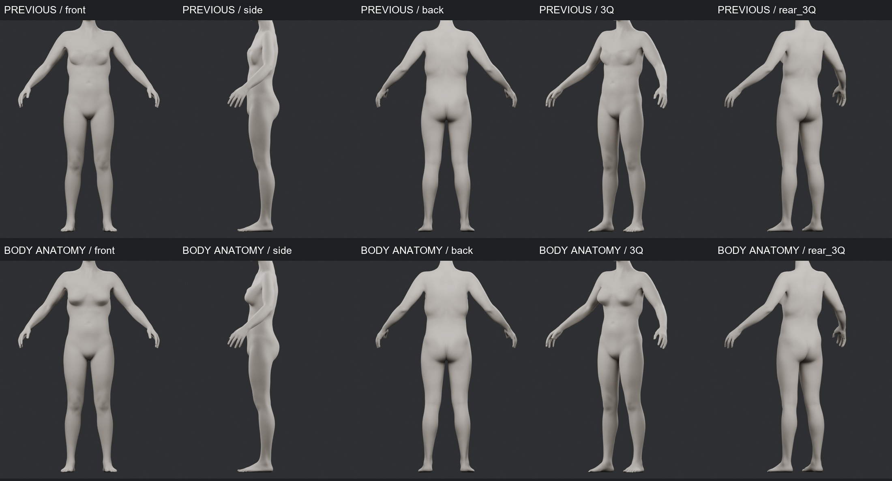

### Büyük gövde karşılaştırması: ön, yan ve 3/4

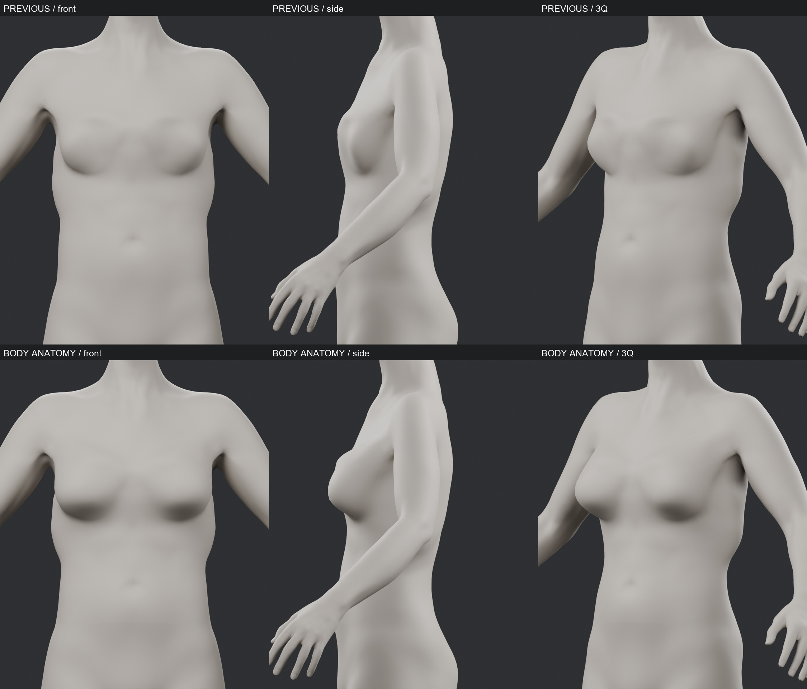

### Gövde: arka 3/4 geçişi

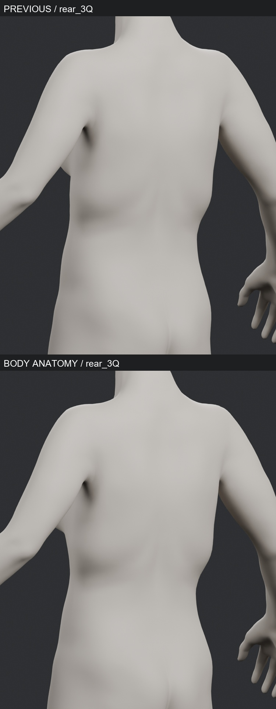

### Göğüs anatomisi: yakın 3/4 karşılaştırması

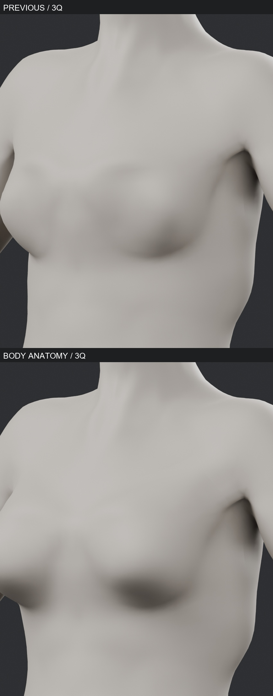

### Önceki / yeni beden / beden referansı / ana konsept

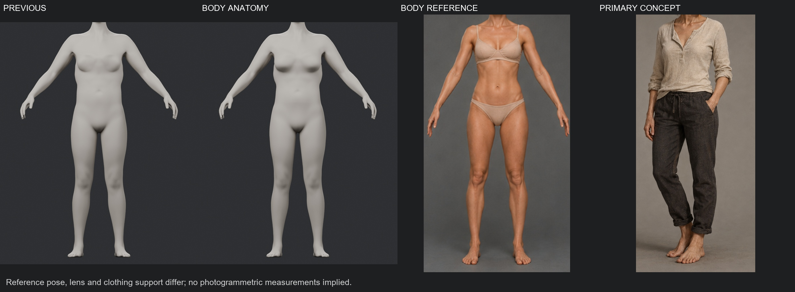

### Gövde ve referans; destekli / desteksiz anatomi farkı

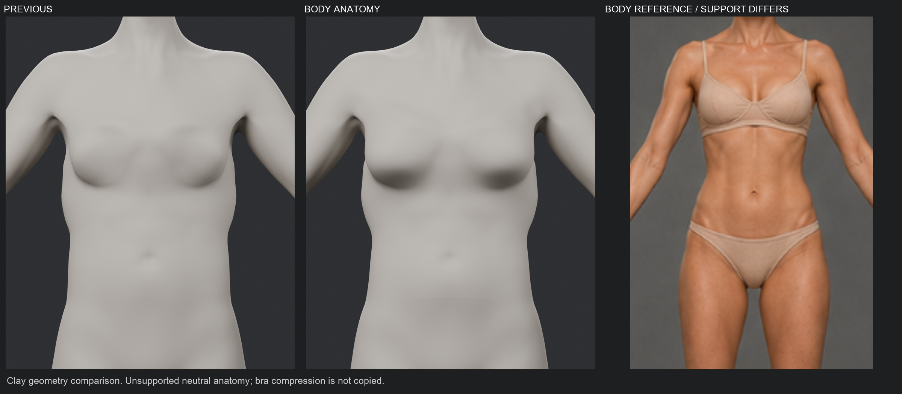

### Dokusuz düz kil: ön ve 3/4

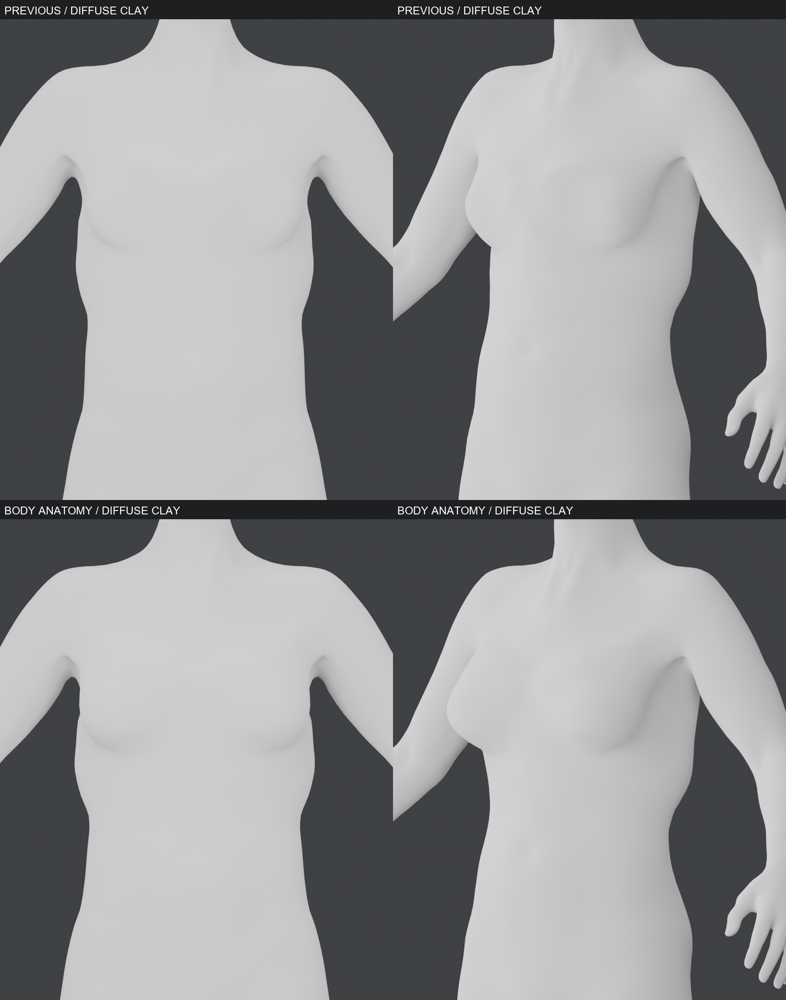

### Siyah silüet: ön, yan ve 3/4

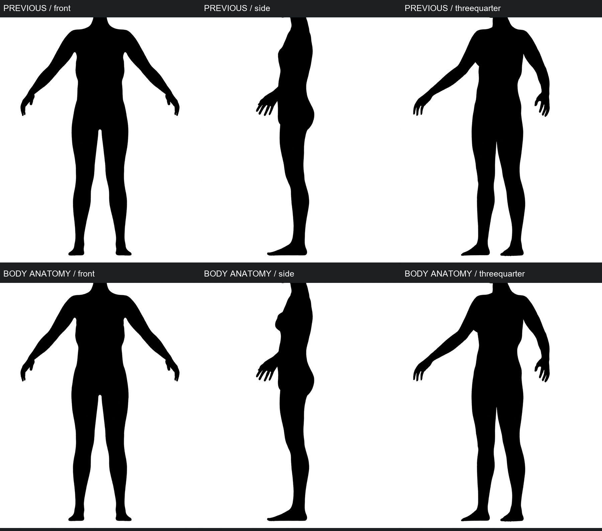

### Poz kontrolü: nötr, yürüyüş, koşu, crouch

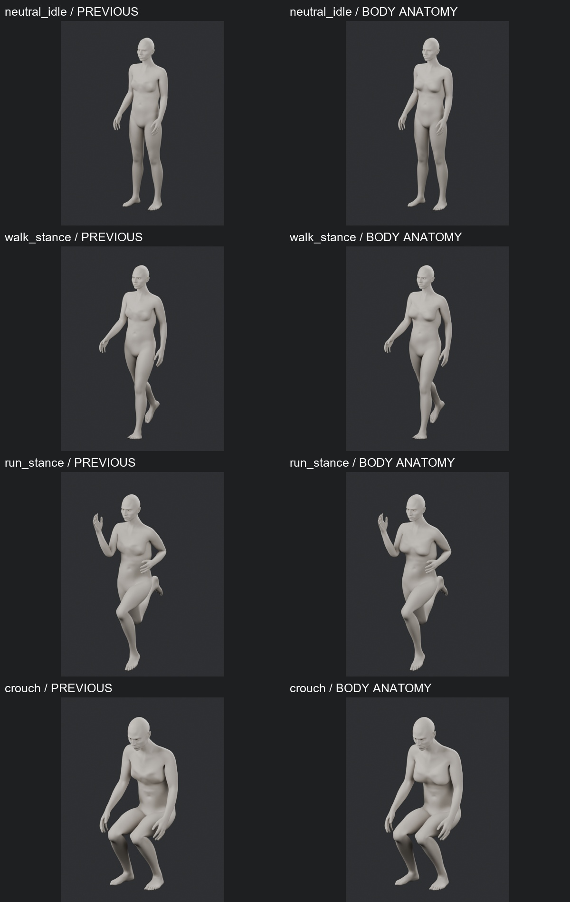

### Poz kontrolü: kollar yukarı / öne, omuz ve dirsek

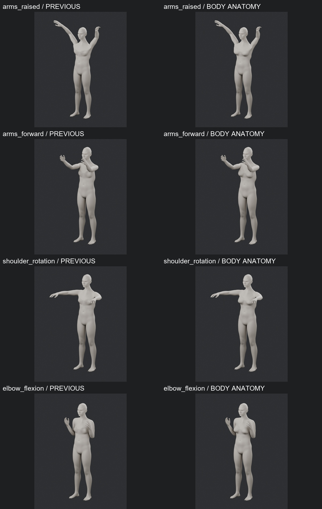

### Poz kontrolü: kalça, geniş duruş, diz ve gövde dönüşü

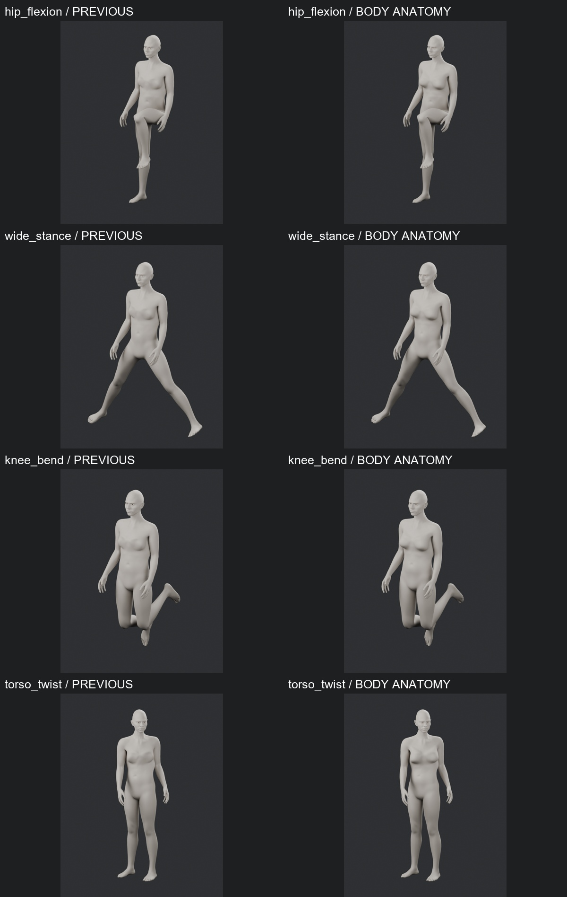

### Yakın gövde kontrolü: crouch, kollar yukarı / öne ve omuz

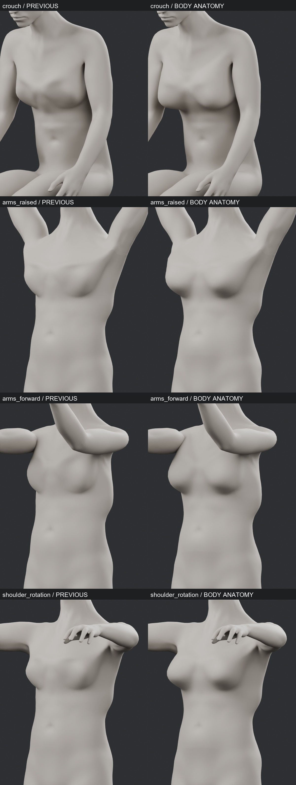
