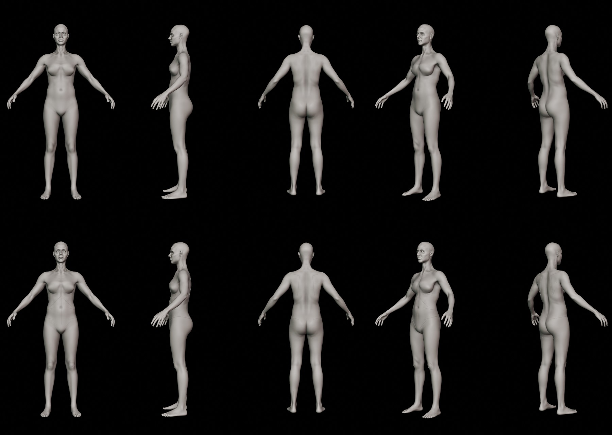

# BR_ArtistNeutral: Blender sculpt round-trip package (2026-09-29)

Status: **PREPARED. Waiting for the manual artist sculpt.** Nothing has been imported into Unreal. No Unreal asset was modified.
The only editor jobs were read-only extraction jobs, and their dirty-package lists were empty.



**Not uploaded (local only, large raw character data):** `SPH_BR_ArtistSculpt_20260929.blend` (15.6 MB, sha256 eeace78d…),
`sculpt_package.json.gz` (10.3 MB, sha256 b2b7a57b…). See `sha256_manifest.txt`. Scripts are in `tools/`; the sculpt guide is `SCULPT_GUIDE.md`.

Production MH_MainCharacter (45d4d909…) and accepted B2 (59d604a4…) are unchanged.

## Files
| File | Purpose |
|---|---|
| `Blender/SPH_BR_ArtistSculpt_20260929.blend` | **the file to sculpt** (opens in Sculpt Mode) |
| `Blender/SPH_BR_ArtistSculpt_20260929_PRISTINE.blend` | read-only untouched copy (sha256 eeace78d…) |
| `Blender/sculpt_package.json.gz` | exact source data (topology, UVs, weights, bind skeleton, B2 + BR_Neutral, groups, mask, measurements, guide rays) |
| `Blender/validation_pristine.json` | validator on the delivered file: **PASS** (0 mm, all exact) |
| `Blender/validator_selftest.json` | 11 negative/positive tests (all behave as designed) |
| `Blender/previews/` | 5 sculpt-camera renders, plain + guides |
| `Tools/CharacterArtistSculpt_20260929/` | builder, validator, tools panel, exporter, guide (SCULPT_GUIDE.md, also inside the .blend) |

## Data contract
- One object, `SPH_BR_ArtistSculpt`: 64,300 vertices = body 0..30454 (UE SKM_BR_BodyMesh source LOD0 ids), then head
  30455..64299 (SKM_BR_FaceMesh ids). 124,910 triangles in UE order, 1 UV set (per-corner exact), 16 material slots, 952 vertex
  groups (18 protection/region groups + 934 skin-weight bones).
- Coordinates: Blender = (x, −y, z) × 0.01 m (UE handedness flip). UV v = 1 − UE v.
- Shape keys: ACCEPTED_B2 (basis, locked), BR_NEUTRAL (locked), SCULPT_BASE (locked), ARTIST_SCULPT (working, value 1).
- Bind skeleton = neutral-capture component transforms. **Finding:** the skeleton asset's reference pose is the generic
  MetaHuman base and does NOT match this body (for example, the elbow is 6 cm off), so it must not be used for body-space work.
- **Finding (open):** SKM_BR_BodyMesh's source-model triangle list differs from the older cached B2Reload export. The positions
  and vertex ids are identical, but the triangle order differs and 1 of 91,270 edges is flipped. The package uses the current BR asset's
  triangles (the morph import target). The trace job (`ue_as_tri_trace.py`) couldn't run because the editor had closed.
  Run it at the next editor session.

## After the sculpt (Claude runs these)
```
blender -b <FINAL.blend> --python Tools/CharacterArtistSculpt_20260929/validate_sculpt.py -- Blender/sculpt_package.json.gz <report.json>
blender -b <FINAL.blend> --python Tools/CharacterArtistSculpt_20260929/export_artist_delta.py -- Blender/sculpt_package.json.gz Tools/CharacterArtistSculpt_20260929/validate_sculpt.py <BR_ArtistNeutral.json>
```
The exporter refuses on any validation FAIL. Exporting the untouched file reproduces BR_Neutral v5 exactly
(15,099 body and 1,485 head vertices, max diff 1.2e-5 cm).
Then: import into a new isolated set `/Game/Sphirus/CharacterLab/BodyRealismArtist_20260929/` (checkpoint first), then
SHCB rebase, LOD propagation, full deformation/seam/face/proportion QA, save/reopen, boards A/B/C, then publish.
