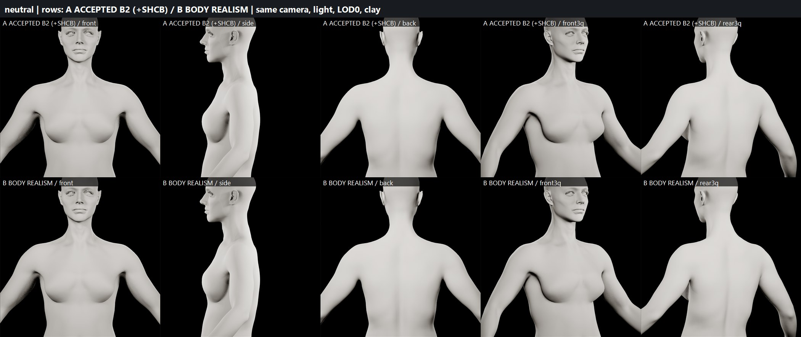
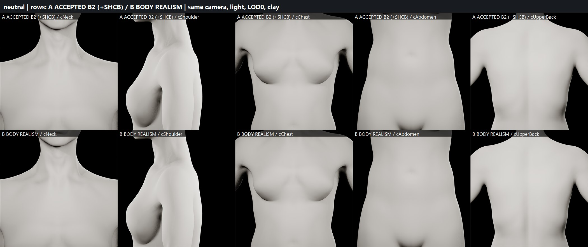
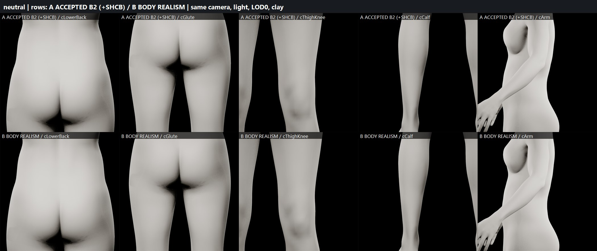

# B2 BODY REALISM — anatomical surface pass (2026-09-29)

Candidate: `/Game/Sphirus/CharacterLab/BodyRealism_20260929/` (`SKM_BR_BodyMesh`, `SKM_BR_FaceMesh`,
`ABP_BR_Body_PostProcess`, `ABP_BR_Face_PostProcess`). Not promoted.

## Final status

| Gate | Result |
|---|---|
| BODY REALISM SCULPT | **PARTIAL** — real, visible gains (neck/clavicle, back, knees, calves); chest/abdomen/arms deliberately subtle; procedural, not artist-sculpt grade |
| BODY PROPORTIONS | PASS |
| FACE IDENTITY | PRESERVED (0.0000 mm) |
| HEAD/BODY SEAM | PASS (LOD0 + runtime LODSync) |
| SHCB REBASE | PASS |
| SHOULDER DEFORMATION | PASS |
| FULL BODY DEFORMATION | PASS |
| LOD BEHAVIOR | PASS |
| SAVE/REOPEN | PASS |
| READY FOR CLOTHING / HAIR STAGE | YES |
| READY FOR USER APPROVAL | YES |
| PRODUCTION CHARACTER MODIFIED | NO |

## Baseline
Accepted B2 `MH_B2_PendingNativeWorkflow` (59d604a4…) + accepted SHCB (`.../HighElevCorrective/HelperFix/`), both untouched.

## Method (no Blender, no base-mesh overwrite)
The realism form is an always-on neutral morph `BR_Neutral` (curve fixed to 1.0 by a Modify Curve node in both
PostProcess copies) on copies of the SHCB meshes — native vertices, topology, UVs, weights, skeleton, DNA untouched and
the change is reversible. Authored procedurally on the welded HEAD+BODY neutral (= bind) surface: ~50 low-amplitude
landmark-anchored forms (torso in front/back/side projections with facing filters, limbs in bone-cylindrical
coordinates), light smoothing, then the broad low-pass component removed (detail layer → no silhouette/volume drift).
Face protected: head vertices above the collar (z > 149 cm) are 0; seam vertices share identical deltas.

## Neutral realism sculpt (v5)
Regions: SCM lower heads, supraclavicular hollows, clavicle, sternal notch, upper trapezius; acromion, deltoid
cap/heads, deltoid insertion; sternum, costal margin, breast upper-pole fill / lateral transition / inframammary;
linea alba, lower abdomen, oblique transition; erector valley, paraspinals, scapular plane, medial border, teres,
latissimus flow, lumbar valley, posterior iliac dimples; iliac crest, ASIS, gluteus medius, gluteal fold, glute
mass, sacral plane; quadriceps/vastus medialis/lateralis, IT band, hamstring, adductor; patella, patellar tendon
and parapatellar hollows, condyles, popliteal hollow; gastrocnemius heads, Achilles, tibial ridge, malleoli;
triceps/biceps, olecranon, cubital fossa, forearm masses, ulna, ulnar styloid.
Asymmetry: right side scapula +8 %, breast −5 %, glute +4 %, hip −3 %, deltoid +3 %, calf −4 % (skeleton centred).
Displacement (all moved vertices, n=16 494): mean 0.21 mm, p95 0.78 mm, max 2.57 mm.
Region mean/p95/max (mm): neck/clavicle 0.34/1.14/1.80 · shoulder 0.32/0.95/1.67 · chest 0.21/0.55/2.57 ·
abdomen 0.15/0.43/0.77 · upper back 0.50/1.50/2.12 · lower back/pelvis 0.38/1.50/1.93 · glutes 0.17/0.63/1.03 ·
thighs 0.19/0.43/1.13 · knees 0.27/0.89/2.05 · calves/ankles 0.17/0.69/1.60 · arms 0.12/0.43/1.40.

## Body proportion preservation (convex-hull circumference, before → after)
neck 39.67→39.79 cm (+1.2 mm) · chest 86.84→87.21 (+3.7 mm, 0.4 %) · underbust 73.88→73.73 (−1.6) ·
waist 71.54→71.55 (+0.1) · high hip 85.73→85.75 (+0.2) · hip 95.55→95.52 (−0.3) · thigh 42.67→42.76 (+0.9) ·
calf 18.81→18.94 (+1.2) · height 173.272→173.272 · shoulder width 43.95→44.11 (+1.6 mm). Silhouettes match in all
five neutral views (boards). HeadScale 1.0653988122940063.

## Anatomical review (boards `n5_*`)
Neck/clavicle: clavicles and supraclavicular hollows now read — clear gain. Shoulders: softer acromion/deltoid
read, subtle. Chest/ribcage: soft costal margin, upper-pole fill — subtle. Abdomen: very subtle (intended).
Back: paraspinal columns, erector valley and scapular planes — clearest gain. Pelvis/glutes: slightly clearer
gluteal fold and iliac dimples. Thighs: subtle. Knees: defined patella with tendon hollows — clear gain.
Calves: medial gastrocnemius head visible. Arms/elbows/wrists: subtle.
Honest verdict: the body reads more human at close range in the neck, back, knees and calves; elsewhere the
change is conservative. Artist-grade secondary anatomy (e.g. breast/abdomen soft-tissue nuance) would need a
manual sculpt pass.

## SHCB rebase
SHC_150/165/180 recomputed on the realism neutral (base = native + skinned BR_Neutral + upperarm_out helper shift),
helper nodes unchanged (+2.0/+3.0/+3.5 cm at 150/165/180), driver unchanged (0 up to 120°, 135° 0.50/0.44,
150/165/180 = 1.0). Neck-side wall at 180° L/R: SHCB 2.0/1.8 cm → BR 2.4/2.2 cm (original native 7.6/5.9).
**Disclosure:** during this pass a normal-orientation bug was found in the shared anatomy helper (inward normals):
in SHCA/SHCB the facing-filtered anatomical primitives were mirrored front↔back with inverted sign (the Taubin fold
smoothing and the helper fix were unaffected). The accepted SHCB assets were left untouched; the BR rebase uses the
corrected orientation.

## Deformation (boards `dfm_*`: neutral, arms forward, 150, 180, torso twist, crouch, deep squat, elbow flexion,
hip-flexion bend, back extension; front/side/rear 3/4, BEFORE vs AFTER)
No artifacts; deformation equivalent to accepted SHCB. 38-sample regression (idle, walk ×2, jog, sprint ×2,
crouch, jump ×2, full body ROM each 1 s + 16.2 s): fold-over edges total SHCB 1458 vs BR 1449 (mostly native
finger/foot folds), no systematic increase. 0 degenerate triangles, all finite.

## LOD (runtime LODSync: face LOD L, body LOD (0,0,1,1,2,2,3,3)[L])
BR_Neutral + rebased SHC projected to body LOD1–3 and face LOD1–7 (closest-point barycentric transfer); far LODs
(body 2–3, face 4–7) include the helper-equivalent term. Neutral realism mean 0.27/0.27/0.26 mm at sync 0/2/4;
180° correction 20.9/20.9/16.3 mm. No pop.

## Seam (93-sample LOD0 / runtime pairs, mean/max mm)
neutral 0.00017/0.00047 · 150° 0.00018/0.00039 · 180° 0.00018/0.00035 (= native). Sync 2 ≤0.00051, sync 4 ≤0.058 (native level).

## Face
Face identity region 0.0000 mm at every pose; no head vertex above the collar moved.

## Persistence
Save → close → reload: 7 morphs per mesh (face 865), BR_Neutral curve node, SHC drivers (165 target), helper
nodes, curve metadata, LODs, retarget fix, HeadScale persisted; post-reopen neutral/120/150/165/180/walk/deep squat
and LOD1/2 neutral/180 bit-identical to pre-reopen.

## Preservation
Accepted B2 59d604a4…, production MH_MainCharacter 45d4d909…: byte-identical. SHC/SHCA/SHCB assets untouched.
Changed: new BodyRealism set; BR_Neutral morph-curve metadata on the isolated ShoulderFix skeleton copies.

## Boards

Neutral (A accepted B2+SHCB / B body realism): 

Deformation: [neutral](boards/dfm_neutral.jpg) · [arms forward](boards/dfm_armsfwd.jpg) · [150°](boards/dfm_elev150.jpg) · [180°](boards/dfm_elev180.jpg) · [torso twist](boards/dfm_twist.jpg) · [crouch](boards/dfm_crouch.jpg) · [deep squat](boards/dfm_squat.jpg) · [elbow flexion](boards/dfm_elbow.jpg) · [hip flexion](boards/dfm_hipflex.jpg) · [back extension](boards/dfm_backext.jpg)

Data: [region_displacement.json](region_displacement.json) · [proportions_v5.json](proportions_v5.json) · [deform_eval.json](deform_eval.json) · [lod_eval.json](lod_eval.json) · [reopen_check_br.json](reopen_check_br.json) · [br_stats_v5.json](br_stats_v5.json)
