# Sphirus — FinalIdentity tabanından kontrollü benzerlik düzeltmesi

28 Eylül 2026. Blender HEAD ONLY / yerel düzeltme. **FACE SHAPE = PARTIAL.**

Çalışma tabanı istenen önceki **FinalIdentity** sürümüne geri alındı. Küçük bir yerel aday üretildi ve karşılaştırıldı. Teknik koruma kontrolleri geçti; ancak genel yüz benzerliğinin önceki FinalIdentity'den açıkça daha iyi olduğu sonucuna varılamadı. Aday kabul edilmedi ve yeni üretim tabanı olarak seçilmedi. Kullanıcının bu durumda durma talimatı uygulandı; kapsam genişletilmedi.

## Taban ve sürüm koruması

- Kaynak: `SourceAssets/Characters/SphirusFinalIdentity_20260928/Sphirus_FinalIdentity_EDITABLE.blend`.
- Taban katmanı: `SPH_FinalIdentity_Refinement`. **NeutralIdentity v5 kullanılmadı.**
- Kaynağın birebir kopyası: `SourceAssets/Characters/SphirusControlledLikeness_20260928/CHECKPOINT_FinalIdentity.blend`.
- Kaynak ve checkpoint SHA-256: `708b644484052e3301ce1f54ee3bf6e47a4681d80bd4604619f2ad81b7ebc881`.
- İnceleme adayı: aynı yeni klasörde `Sphirus_ControlledLikeness_EDITABLE.blend`; yeni key `SPH_Controlled_Likeness`, relative key `SPH_FinalIdentity_Refinement`.
- Adayın yeni key değeri 1 olarak kaydedildi. Yalnız bu key 0 yapılarak önceki FinalIdentity görünümü incelenebilir; tam başlangıç dosyası ayrıca checkpoint'te korunur. Çalışma tabanı kararı `BASELINE_DECISION.json` içindedir.
- v5, başarısız geçmiş/referans olarak tutuldu. Kayıtlı **2916 önceki dosyanın** SHA-256 kontrolü eşleşti. Önceki blend, FBX, eşleme ve doğrulama kayıtları bu koruma manifestinde yer alır.
- **86 üretim paketinin** dosya özeti eşleşti; **5420 korunan dosyada** boyut/zaman damgası farkı yok. Son kontrol, bu geniş envanter için içerik hash'i iddiası değildir. Üretim karakteri korunmuştur.

## Referans ve yöntem

Yalnız yeni `1-Fotoğraf-1.jpg` ön görünüş, `3-Fotoğraf-3.jpg` gerçek profil ve `2-Fotoğraf-2.jpg` bakır saçlı konsept kullanıldı. Ön/profil yapısal otorite; konsept yaş, kimlik ve karakter yönü içindir. Eski üretilmiş turnaround paftaları karar kaynağı yapılmadı.

20 yerel kontrol noktası kullanıldı. Kontrollerin her biri görünür anatomik işaretle ilişkilendirildi; kaynak vertex indeksi, referans piksel işareti, gerekçe, uygulanan vektör ve sınırlı etki yarıçapı `landmark_changes.json` içinde kayıtlıdır. Sonlu etki alanlı Wendland C2 enterpolasyonu, sabit glabella ve merkezi dudak-temas noktalarıyla uygulandı. Bu, elle yorumlanmış iki boyutlu referanslardan kontrollü üç boyutlu düzeltmedir; otomatik ya da kalibre fotogrametrik eşleme değildir. Referans kişiye ait milimetrik ölçüler uydurulmadı.

Ön/profil hizalama panoları yalnız orantılı iki boyutlu ölçekleme ve kaydırma kullanır. Perspektif ve baş pozu belirsizliği devam eder. Modelin önceki/yeni renderları aynı kamera, ışık ve malzemeyle alınmıştır.

## Yapılan yerel değişiklikler

- **Burun:** radix geriye doğru yaklaşık 0,65 mm; dorsal hat yerel olarak yaklaşık 0,45 mm öne; uç yaklaşık 0,45 mm öne ve 0,55 mm aşağı alındı. Üst köprü, supratip, kolumella ve alar bağlantılara daha küçük düzeltmeler yapıldı. Amaç, profil kök girintisi ve köprü/uç akışını ayırmaktı; tüm burnu tek yönde büyütmek değildi. Bunlar kontrol noktası vektörleridir; gerçek yüzey maksimumu aşağıdadır.
- **Orta yüz:** paranasal ve infraorbital destek noktalarına 0,25 ve 0,18 mm mertebesinde yerel destek verildi. Yanak kitlesi topluca şişirilmedi.
- **Ağız:** üst vermilionun iki yerel bölümü yaklaşık 0,20 mm geri alındı; ağız köşeleri yaklaşık 0,18 mm öne, yalnız 0,05 mm yana ve 0,06 mm yukarı düzeltildi. Merkezi dudak teması sabit kaldı. Amaç sıkılmış nötr izlenimini azaltmaktı; görünür sonuç çok sınırlı kaldı.
- **Çene geçişi:** yalnız mentolabial geçişte yaklaşık 0,15 mm yerel destek; mandibula ve ana çene zarfı korundu.
- **Göz/kaş:** göz açma, göz küresi taşıma veya ölçekleme yapılmadı. Bölge maskesindeki en büyük fark 0,0373 mm'dir ve infraorbital desteğin dar sınırında oluşur. Ana göz açıklığı ve kaş formu korundu.
- **Kranyum, tepe, global baş ölçeği ve boyun arayüzü:** değiştirilmedi. Gövde, göz küreleri ve diş geometrisi değiştirilmedi.

## Ölçülen deplasman

Önceki FinalIdentity key koordinatları ile yeni key koordinatları, aynı dünya dönüşümünde karşılaştırıldı. Birim mm. Bölge sınırları açıkça `validation.json` içinde tanımlıdır; bazı maskeler örtüşür. Ortalamalar, bölgedeki **değişmeyen vertexleri de** içerir. Baş toplamı yardımcı alt meshleri de içerir; bu küçük ortalamalar, benzerlik başarısının ölçüsü değildir.

| Bölge | Vertex | Maksimum (mm) | Ortalama (mm) | >0,01 mm değişen |
|---|---:|---:|---:|---:|
| Başın tamamı | 34657 | 0.710565805 | 0.001415847 | 560 |
| Kranyum / tepe | 2024 | 0.000000000 | 0.000000000 | 0 |
| Burun | 2619 | 0.710565805 | 0.013661371 | 351 |
| Ağız | 5057 | 0.200003386 | 0.001734702 | 127 |
| Orta yüz / yanak | 2194 | 0.179998577 | 0.001793013 | 68 |
| Çene / alt yüz | 1592 | 0.150009990 | 0.000698483 | 23 |
| Göz / kaş | 3495 | 0.037275255 | 0.000036890 | 5 |
| Boyun arayüzü | 1558 | 0.000000000 | 0.000000000 | 0 |

Toplam **34657 vertex** içinde **560** vertex 0,01 mm üzerinde, **155** vertex 0,1 mm üzerinde değişti; 1 mm üzerinde değişen yok. **33501** vertex koordinatı bit düzeyinde aynıdır. Kranyum 3 mm sert sınırının ve tüm bölgeler 4 mm durma sınırının altındadır. Global baş/tepe kısaltması yapılmadı.

## Teknik koruma kanıtı

- `TARGET_BODY`: tüm mesh/UV/ağırlık/key imzası ve key değerleri aynı; **deplasman 0 mm**; yeni body key yok.
- Baş vertex, edge, polygon, loop ve malzeme sırası; UV'ler; vertex grupları ve ağırlıkları; object dünya matrisi aynı. Karşılaştırılan önce/sonra özetleri `validation.json` içindedir.
- Önceki **866 baş key'inin** koordinatları ve relative-key ilişkileri korundu. Yalnız bir yeni key eklendi. İskelet rest matrisleri aynı.
- Mevcut mesh öznitelikleri aynı; vertex/polygon sırası değişmediği için kaynak indeks karşılığı korunuyor. Önceki harici source-index eşleme dosyaları da dosya koruma kontrolündedir. Yeni FBX veya Unreal eşleme denemesi yapılmadı.
- Sol/sağ göz küreleri ve dişler: **0 mm**. Baş ölçeği ve yönelimi aynı.
- **93 nötr seam çifti:** önce ve sonra maksimum **0.000242560811 mm**; artış yok. Bu nötr kontrol, animasyon seam testi değildir.
- Dondurulmuş Blender beden+baş toplam yüksekliği: önce/sonra **173.40184020996 cm**. Bu turda yeni bir Unreal native-body yüksekliği ölçülmedi.
- Nötr **64094 üçgende** yeni dejenere veya normale ters dönmüş üçgen yok. Üçgen alan oranı aralığı 0.864267–1.174078. Bu kontroller tam self-intersection, ifade veya RigLogic sertifikası değildir.

## Sanatsal inceleme ve durma kararı

**Benzerlik açıkça iyileşti mi? Hayır; genel kimlik düzeyinde açık iyileşme kanıtlanamadı.** Yakın profil görüntüsünde kök/sırt/uç hattında küçük bir yerel değişim okunuyor. Ön ve 3/4 yüz, önceki FinalIdentity'ye çok yakın kalıyor. Burun, ağız ve orta yüz hâlâ referans kadının özgül kimliğini yeterince taşımıyor; yüz hâlâ uyarlanmış MetaHuman izlenimi veriyor.

**Gerileme var mı?** İncelenen ön, gerçek profil, iki 3/4 ve detaylarda v5 tipi kranyum çökmesi, şaşkın göz, zayıflamış alt yüz ya da yaygın dudak/yanak şişmesi görülmedi. Bu, her küçük yüzey değişikliğinin daha iyi olduğu iddiası değildir. Özellikle burun ucu/alar akışı ve ağız karakteri hâlâ çözülmemiştir. Olgun alt yüz korunmuş olsa da referans göz/orbit ve ağız eşleşmesi tamamlanmış sayılmaz.

Bu nedenle yeni aday **üretim tabanı olarak kabul edilmedi**. Önceki FinalIdentity tabanı korunuyor. Kullanıcının “benzerlik açıkça iyileşmediyse dur ve söyle; geniş keşifsel sculpt'a devam etme” koşulu uygulanıyor. “Aynı kadın”, “yüz tamamlandı”, “Unreal/Conform/rig için hazır” iddiası yok.

## Kabul kapıları

| Kabul kapısı | Durum |
|---|---|
| FACE SHAPE | **PARTIAL** |
| METAHUMAN CONFORM | **NOT_RUN** |
| FACIAL DEFORMATION | **NOT_RUN** |
| BODY PROPORTIONS | **NOT_RUN** |
| BODY DEFORMATION | **NOT_RUN** |

NOT_RUN durumları son isteğin kapsam sınırıdır; editör erişim sorunu değildir. Bu tur Unreal, Conform, body parametreleri, ifade düzeltmesi, hair/clothing veya gameplay aşamasına geçilmedi. Önceki turların başarılı teknik sonuçları bu adaya yeni doğrulama olarak aktarılmadı.

## Karşılaştırma kanıtları

Model görüntüleri gerçek Blender geometrisi renderlarıdır. Önceki/yeni çiftleri aynı kamera ve ışık kullanır. Panolarda kırpma, orantılı 2D ölçekleme, kaydırma ve etiketleme vardır; AI rötuşu yoktur. Referans fotoğrafları kalibre çekimler değildir. Profil çizgisi yardımcısında gerçek önceki/yeni kontrol noktalarının izdüşümleri gösterilir; fark büyütülmez. Yeni Unreal görüntüsü yoktur.

### CONTROLLED LIKENESS | front

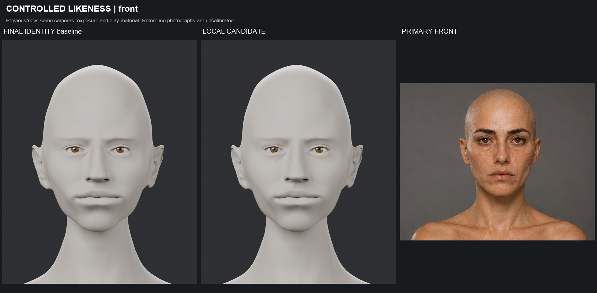

### CONTROLLED LIKENESS | left_side

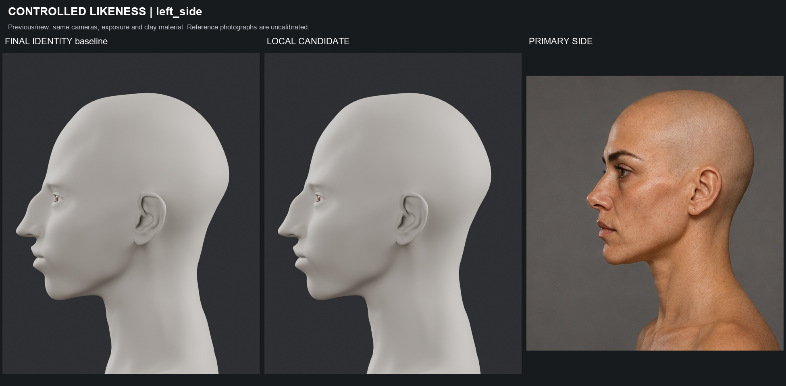

### CONTROLLED LIKENESS | Both 3/4 views

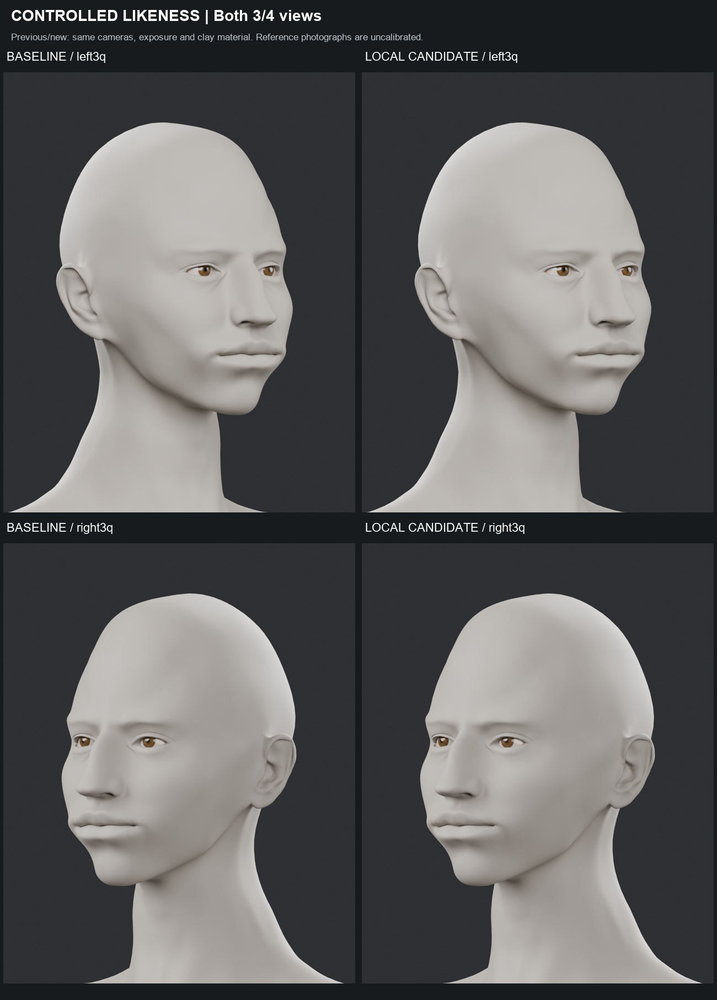

### ART DIRECTION | Mature identity retained

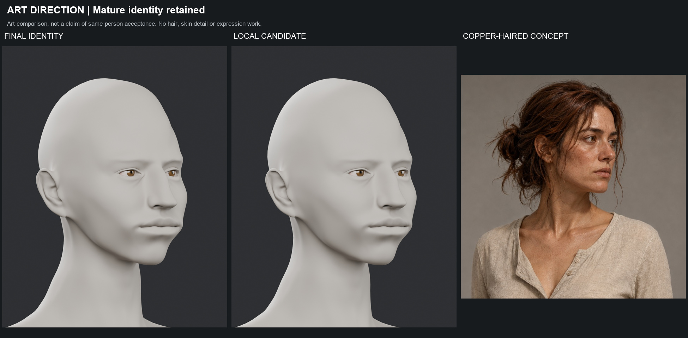

### LOCAL DETAIL | nose_profile

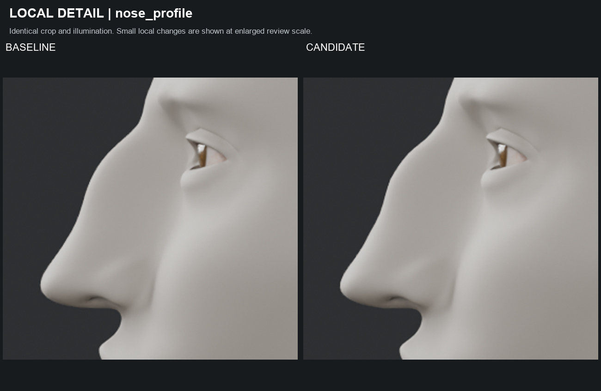

### LOCAL DETAIL | mouth

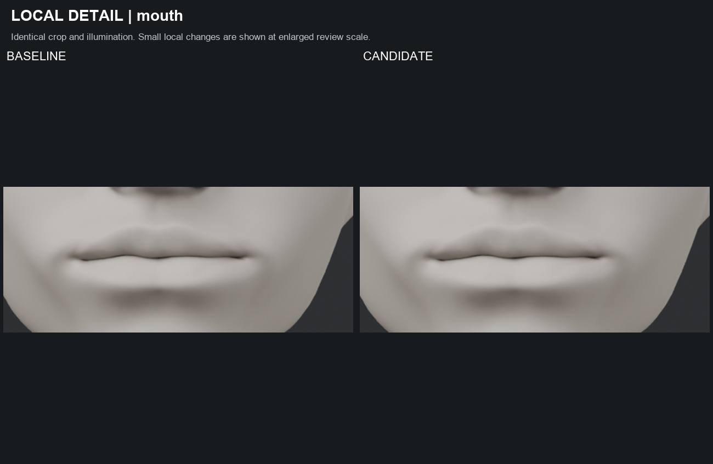

### LOCAL DETAIL | midface

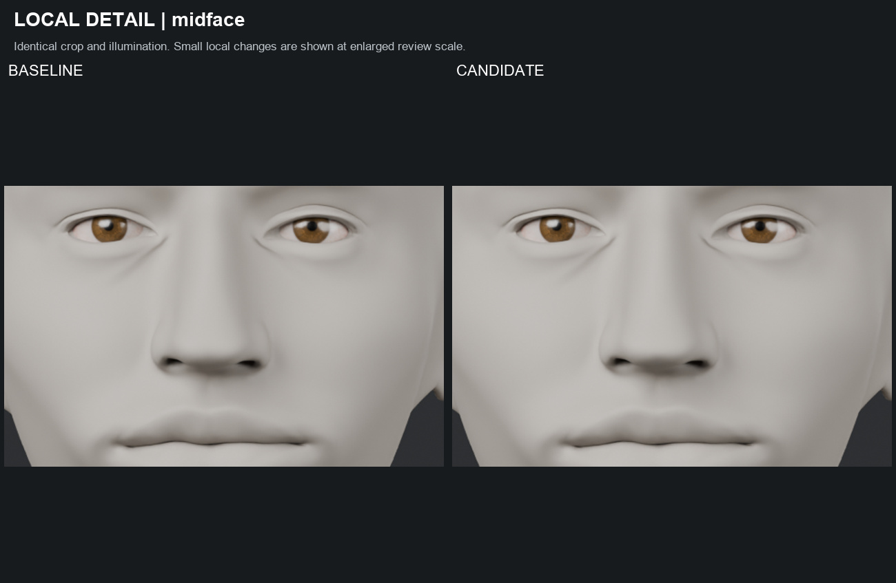

### FRONT | Eye-line alignment aid

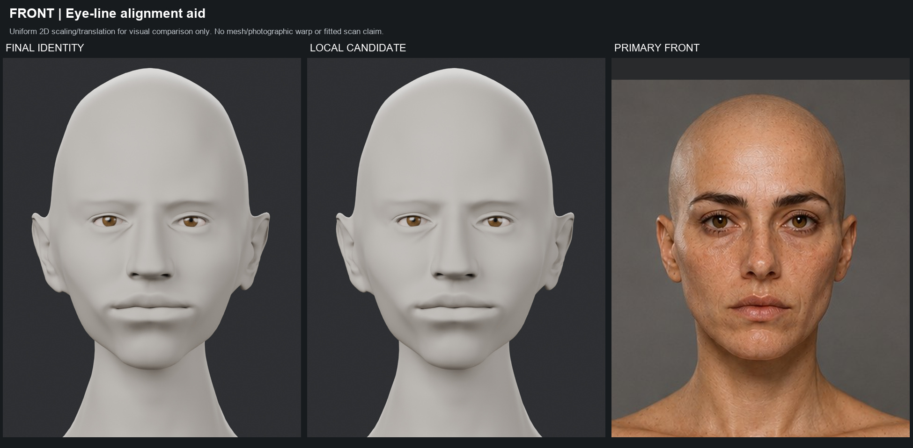

### SIDE | Eye-line alignment aid

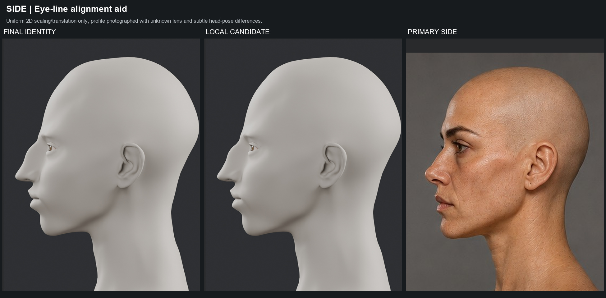

### LANDMARK AUDIT | left_side

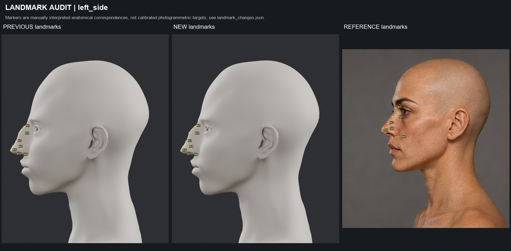

### LANDMARK AUDIT | front

### PROFILE DELTA | Orange baseline / cyan candidate

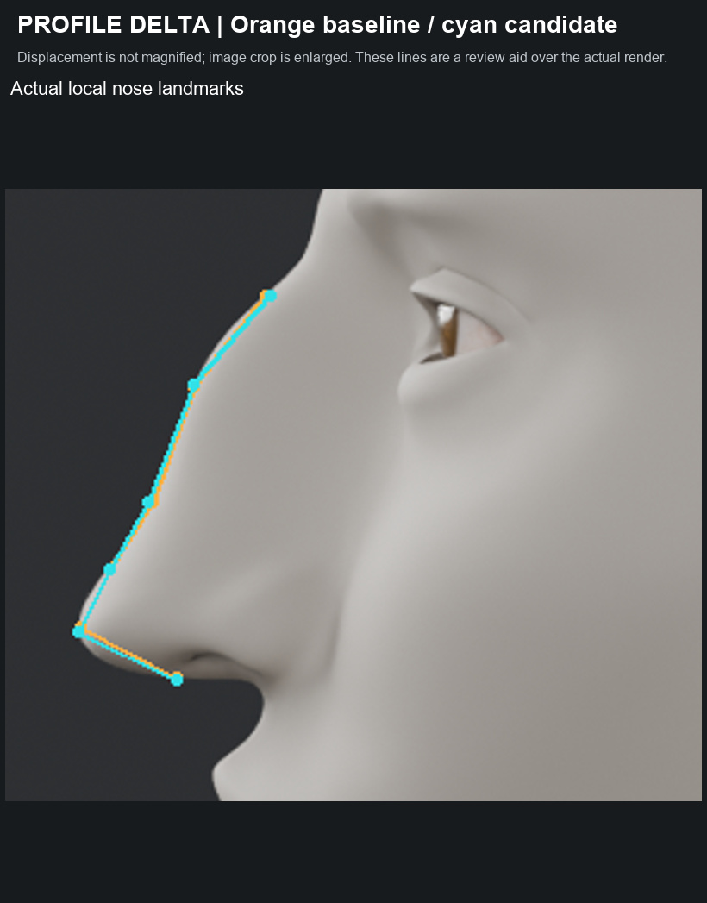

## Teknik kayıtlar

- [validation.json](validation.json)
- [landmark_changes.json](landmark_changes.json)
- [landmark_projections.json](landmark_projections.json)
- [preservation_final.json](preservation_final.json)
- [visual_review.json](visual_review.json)
- [boards_manifest.json](boards_manifest.json)
- [delivery_hashes.json](delivery_hashes.json)
- [BASELINE_DECISION.json](BASELINE_DECISION.json)

[Başlangıç FinalIdentity raporu](../character-final-identity-2026-09-28/TEKNIK_RAPOR.md) · [Başarısız v5 geçmişi — yeni taban değildir](../character-neutral-reference-2026-09-28/TEKNIK_RAPOR.md)
