# GD14: profesyonel karakter kimliği yeniden kurulumu (Identity Master)

Tarih: 2026-10-09. Durum: **KULLANICI ONAYI İÇİN DURDURULDU. Sonuç: PARTIAL.**
- Üretime geçirilmedi.
- Mevcut Unreal karakteri, GD11 / GD12 / GD13 kaynakları, gövde, kıyafet, saç, animasyon, locomotion, kamera ve haritalar değiştirilmedi.

Final aday: **GD14 W9.** E tabanı üzerinde iki aşamada yapıldı:
1. MetaHuman Creator landmark sculpt'ı.
2. Gerçek Blender sculpt fırçaları. Bu iki aşama büyük ve orta formları değiştirdi.

Ardından:
- MetaHuman'a residual geri beslemeli fit ile aktarıldı.
- Epic otomatik rigi uygulandı.
- Gerçek x19a cilt, e3n iris, M_SlightArch kaş, S_Thin kirpik ve h75c saçla Unreal'da değerlendirildi.

| | |
|---|---|
| Unreal test varlıkları (yalnız yeni klasör) | `/Game/Sphirus/CharacterLab/GD14_IdentityMaster_20261009/`. Ayrıntı aşağıda. |
| Düzenlenebilir MetaHuman kaynağı | `MHC/MHC_GD14_W9`. Riglenmemiş; MetaHuman Creator'da açılıp sculpt edilebilir. |
| Riglenmiş test kopyası | `MHC/MHC_GD14_W9_Rig`, DNA `MHC/DNA/MHC_GD14_W9_Rig_Head`. |
| Yüz test mesh'i | `Face/SKM_GD14_Face_w9`: 858 morph, kalıcı DNA bağlı, plugin yüz iskeleti + post-process ABP. |
| Groom bağları | `Face/Bindings/GB_GD14_*_w9*`: h75c saç (P yüz kaynağından), M_SlightArch kaş, S_Thin kirpik. Kaynak groom'lar yalnız referans olarak kullanıldı. |
| Blender Identity Master | `SourceAssets/Characters/GD14_IdentityMaster_20261009/GD14_IdentityMaster.blend`. İçerik: düzenlenebilir `GD14_Head`; salt-okunur `CMP_E_base` / `CMP_GD12` / `CMP_GD13`; 4 çözülmüş referans kamerası (arka planda panel); W2 ve C1 programları metin bloğu olarak. Yerel, ~6 MB; GitHub'a yüklenmedi. |
| Dışa aktarım | `export/GD14_W9_Head.glb`, `.obj`. Yerel. |
| Tam DNA sırası | `data/head_GD14_W9.npy` (33 845 vertex). Ayrıca Blender sculpt hali, fold onarımı öncesi hali ve W2 aşaması. |
| Yeniden üretim | `tools/build_gd14.sh`. Fırça aşaması yeniden çalıştırıldı: **0.0000 mm fark**. UE adımları sırayla listelendi. |

---

## 1. Karar özeti

**Ne düzeldi** (A1 / A2 / C panoları):
- Yüz sakin ve doğal. GD13'ün şaşkın/korkmuş gözleri, GD12'nin kapak kırışıkları ve iki modeldeki açık / çekik ağız yok.
- Yumuşak dokular düzeldi:
  - Üst göz kapağı oyuğu dolduruldu.
  - Elmacık altı çöküklüğü kalktı.
  - Kaş kemiği hafifledi.
  - Nazolabial geçiş yumuşadı.
- Burun ve dudak:
  - Burun ucu daha yuvarlak ve hafif aşağıda, köprü daha geniş ve yumuşak, kanatlar daha dar.
  - Üst dudak dışa döndü (eversiyon) ve dolgunlaştı; alt dudak daha dolu ve öne bakıyor.
- Teknik olarak temiz:
  - Yeni katlanma yok, ters üçgen yok.
  - Göz kapağı göz küresine yeni girmiyor.
  - Rig çalışıyor; boyun dikişi 0.000 mm.

**Ne olmadı:**
- Referanstaki kadın **net olarak yakalanmadı.** Aynı ışık ve kamerada W9, E'den görünür biçimde daha iyi ama hâlâ "başka, daha genç bir kadın" gibi okunuyor.
- Kalan farkın en büyük kısmı bu görevde sabit tutulması istenen yüzeylerden geliyor:
  1. **Kaş groom'u.** Referansta kaşlar koyu, yoğun, düz ve göze yakın. M_SlightArch ince, açık ve kemerli. Konum doğru; yoğunluk ve stil farklı.
  2. **İris.** Referansta ela / yeşilimsi kahve, e3n'de turuncu-kahve.
  3. **Cilt.** x19a referanstan daha açık ve pembe; çil yoğunluğu az. Dudak rengi bölgesi orijinal vermilion vertex'lerine bağlı.
  4. **Olgun yumuşak doku izleri.** Referanstaki alt kapak torbası ve hafif yorgun ifade. Yaşlandırma yasak olduğu için bilinçli olarak sınırlı tutuldu.
- Geometride dar kalan noktalar:
  - Üst vermilion yüksekliği (izleyici 13.1 px, referans 14.5).
  - Ağız genişliği hafif fazla (78.6 / 76 px).

**Dürüstlük notu.** Fırça sürücüsünde bir yön hatası buldum ve düzelttim. W3–W8 adaylarında Blender Draw / Inflate fırçaları **ters yönde** çalıştı: DNA üçgen sarımı içe bakıyor, normal'ler kafanın içine dönüktü. Sonuçlar:
- "Doldur" darbeleri oydu.
- "Öne al" darbeleri geri itti.

Hata, teknik doğrulamada bölge-bölge yön kontrolüyle yakalandı. W8 atıldı. Fırça aşaması düzeltilmiş sarımla ve tek, birleştirilmiş programla (C1) yeniden yapıldı: W9. Ara panolardaki W3–W8 bu yüzden niyeti temsil etmiyor (P5 / P6).

---

## 2. Önceki adayların teşhisi ve taban seçimi

| Aday | Neden başarısız (teşhis) |
|---|---|
| GD11 sonraki geçişleri (F4ab → F1H) | Küçük ve çok sayıda yerel op birikti: yumrular, kapak / ağız köşesi kıvrımları, kalıcı ifade izleri. Taban olarak kirlenmiş. |
| GD12 | Blender-only. Kapak indirme, çok küçük çizilmiş diyagnostik iristen kaynaklanan bir yanılgıydı. Yüzey fırçaları kapak kırışığı ve yumru bıraktı. UE kopyasında 42 katlanma ve **40 ters üçgen** var. |
| GD13 | Kontur eşleştirmeyi benzerlik saydı. Göz açıklığı piksel eşleştirmeyle büyütüldü. Sonuç: şaşkın / korkmuş gözler, açık ağız, sertleşmiş formlar. 46 katlanma, **14 ters üçgen**. |
| **E** (seçilen taban) | GD11'in MetaHuman-native, otomatik riglenmiş yüzü (`MHC_GD11_E`). En temiz anatomi; kontur bantları referansa en yakın (iki taraflı manuel noktalarla ön yanak ±0.5 mm). Sorunları form ve karakterdeydi: ağır kaş kemiği, derin üst kapak oyuğu, sivri kalkık burun ucu, ince üst dudak, kemikli yanak düzlemi. |

**Referans.** Kullanıcının 6 açılı sayfası birincil kaynak; GD13'te çözülmüş kameralar ve paneller kullanıldı. Bilinen tutarsızlıklar:
- Profil paneli ~%9 küçük.
- Profilde boyun duruşu farklı; çene altı yalnız çene yakınında kullanıldı.
- Ön panelde yüz kenarlarını saç örtüyor. Bu yüzden ön görüntüdeki "yüz 8 mm geniş" izlenimi saç kenarı. İki taraflı manuel noktalar genişliği ±0.5 mm doğruluyor (P3).
- Paneller yapay zekâ üretimi konsept görüntüsü gibi; mm değerleri yaklaşıktır.

---

## 3. Yöntem — gerçekte ne yapıldı

**1. Gerçek materyalli değerlendirme zinciri** (önce kuruldu; diyagnostik kil kimliği bozuyordu)
- Her aday için:
  - MHC kopyası → Epic otomatik rig → DNA ve kafa dışa aktarımı;
  - kalıcı DNA bağı;
  - h75c / M_SlightArch / S_Thin groom bağları;
  - x19a / e3n / GC k10 gövde kompozisyonu.
- Hepsi yalnız GD14 klasöründe.
- Çözülmüş referans kameraları aynı optik merkezli UE kameralarına çevrildi. Görüntü panel çerçevesine homografi ile **birebir** çarpıtıldı. E köşelerinin projeksiyonu UE renderına oturuyor.
- Ayrıca model için ayarlanmamış **sabit ortak kameralar** kullanıldı: 150 cm, fov 15, aynı lens.
- Işıklar:
  - `on` ışık: kimlik ışığı. Referansın yumuşak önden ışığına en yakın mod (P2).
  - `studyo` ışık: form ışığı. Yan anahtar ışık sertliği abartıyor.
- MetaHuman izleyicisi (göz kapağı / dudak eğrileri) yalnız yönlendirme için kullanıldı; ışığa duyarlı, benzerlik ölçüsü sayılmadı.

**2. Büyük / orta formlar — MetaHuman Creator landmark sculpt** (W2, `ops/W2.json`)
- MetaHuman Creator'ın kendi sculpt aracı Python API'si üzerinden kullanıldı: `translate_face_landmarks` + `commit_face_state`, hedefe yinelemeli.
- Değişiklikler:
  - kaş medial başı yukarı, glabella geri, kaş lateral / kuyruk aşağı;
  - üst kapak merkez +0.6 mm, lateral −0.2 mm, alt kapak −0.3 mm;
  - burun kanatları −2.2 mm/yan, uç aşağı / öne, kolumella gizle;
  - ağız köşeleri yukarı, üst dudak dolgun, alt dudak pout azalt;
  - malar / bukkal dolgu;
  - çene açısı −1.5 mm/yan.
- **Çene öne alma ve uzatma yapılmadı** (kullanıcı 3 kez reddetmişti).
- Gerçek renderda bu aşama zayıf göründü (P4). Ayrıca sağ lateral kantusta katlanma bıraktı; 3. adımda onarıldı.

**3. Gerçek Blender sculpt fırçaları** (`tools/gd14_bsculpt.py`, program `ops/C1.json`)
- Arka plan Blender'ında 3B görünüm yok. Bu yüzden **GUI oturumunda** gerçek Blender fırça varlıkları kullanıldı: Draw, Inflate/Deflate, Smooth, Grab.
- Uygulama: `bpy.ops.sculpt.brush_stroke`, `override_location=True`. Her darbe öncesi görünüm yüzey normaline çevrildi.
- **Açıkça:** darbeler serbest el / tablet ile çizilmedi. Her darbenin yeri, yarıçapı, gücü, yönü ve gerekçesi, gerçek render eleştirisinden benim tarafımdan seçildi ve programla çalıştırıldı.
- Simetri:
  - Blender X-ayna asimetrik yüzde boşa düşüyordu.
  - Her simetrik darbe, karşı yüzeye oturtulmuş açık bir ayna darbesiyle tekrarlandı.
- C1 içeriği (40 darbe + aynaları):
  - üst kapak oyuğu dolgusu, kapak kıvrımı (hafif), lateral kapak örtüsü;
  - alt kapak / infraorbital dolgunluk;
  - glabella ve malar sırt yumuşatma, elmacık altı dolgu, ön elmacık dolgunluğu;
  - kaş kemiği hafifletme;
  - burun köprüsü yan duvarları, uç lobülü, uç aşağı, kanatlar içe, kanat oluğu yumuşatma, kolumella;
  - üst dudak eversiyonu ve hacmi, vermilion sınırı ve Cupid yayı, filtrum sütunları;
  - alt dudak pout azaltma / alt yarı öne;
  - ağız ~1 mm dar, köşeler yukarı;
  - çene köşesi yumuşatma;
  - nazolabial yumuşatma.
- Her darbenin hedefi, ulaşılan mm ve bölge dışı etki `data/bs_W9S_log.json` içinde.

**4. Teknik katlanma onarımı** (`tools/gd14_foldrepair.py`)
- W2'nin lateral kantusta bıraktığı katlanmalar, küçük kürelerde E'ye yumuşak geçişli yerel karışımla giderildi (en çok 0.43 mm).
- Bu sanatsal bir şekil işlemi değil. Smooth fırçasıyla onarım denendi; kapak kenarını çökertti ve atıldı.

**5. MetaHuman'a aktarım** (`tools/gd14_fitfb.sh`)
- `fit_state_to_target_vertices` tek başına geniş, yumuşak değişiklikleri kaybediyor (elmacık altı dolgunun yalnız %18'i kaldı).
- İki residual geri besleme turuyla W9 aktarım hatası: ortalama 0.023 mm, p95 0.106, maks 0.773 mm.
- Otomatik rig bu durumu birebir koruyor: rigli mesh ile fit farkı 0.001 mm.

**Kullanılmayanlar:**
- Serbest el / tablet sculpt.
- Yüksek çözünürlüklü bağımsız sculpt + retopoloji + rig aktarımı. Gerekmedi: DNA topolojisi gereken formları üretebildi, rig ve morph'lar korundu. Bu yol test edilmedi.
- MetaHuman `BlendFaceRegion` (yalnız C++).
- PCA / kontur fit'i benzerlik aracı olarak (GD13 hatası).
- Materyal, iris, kaş stili, saç değişikliği: kapsam dışı bırakıldı (bkz. 7).

---

## 4. Aşamalar ve atılan ara sonuçlar

| Aşama | Ne | Sonuç |
|---|---|---|
| W0 | E kopyası, rig + gerçek materyal | Taban. Sert / erkeksi okuma kısmen stüdyo ışığından (P1, P2) |
| W1 | İlk MHC landmark seti (≤1.8 mm) | Gerçek renderda görünmez → atıldı |
| W2 | Daha güçlü MHC landmark sculpt (≤2.2 mm) | Hâlâ zayıf; kantus katlanması → yalnız ara taban |
| W3b–W8 | Blender fırça geçişleri + aktarım | **Ters yönlü fırça hatası** (bkz. 1) → atıldı (P5, P6) |
| W6 | Fold-onarımlı ara | Editör bellek çöküşü sırasında; W7 / W8 ile aşıldı |
| **W9** | Düzeltilmiş sarımla C1 + fold onarımı + aktarım | **Final** |

**Ayrıca:**
- Editör iki kez sayfa dosyası yetersizliğinden çöktü (~36 GB commit, `TryAddObjectToEdit`).
- Bekleyen işler temizlendi; zombi kabuk kalmadı.
- Sonrasında her ağır işten önce editör yeniden başlatıldı (`gd14_memguard.sh`).

---

## 5. Panolar

Kamera ve ışık:
- Tüm UE görüntüleri gerçek aday geometrisinin gerçek capture'ları.
- Referans satırlarında her aday **aynı** çözülmüş kamerayla çekildi. Kameralar E üzerinde çözülmüştür; aday başına kamera ayarı yapılmadı.

### A — Kimlik

**A1.** UE gerçek materyal, çözülmüş referans kameraları, `on` ışık, saçsız. Sütunlar: REF / E / GD12 / GD13 / GD14 (W9).

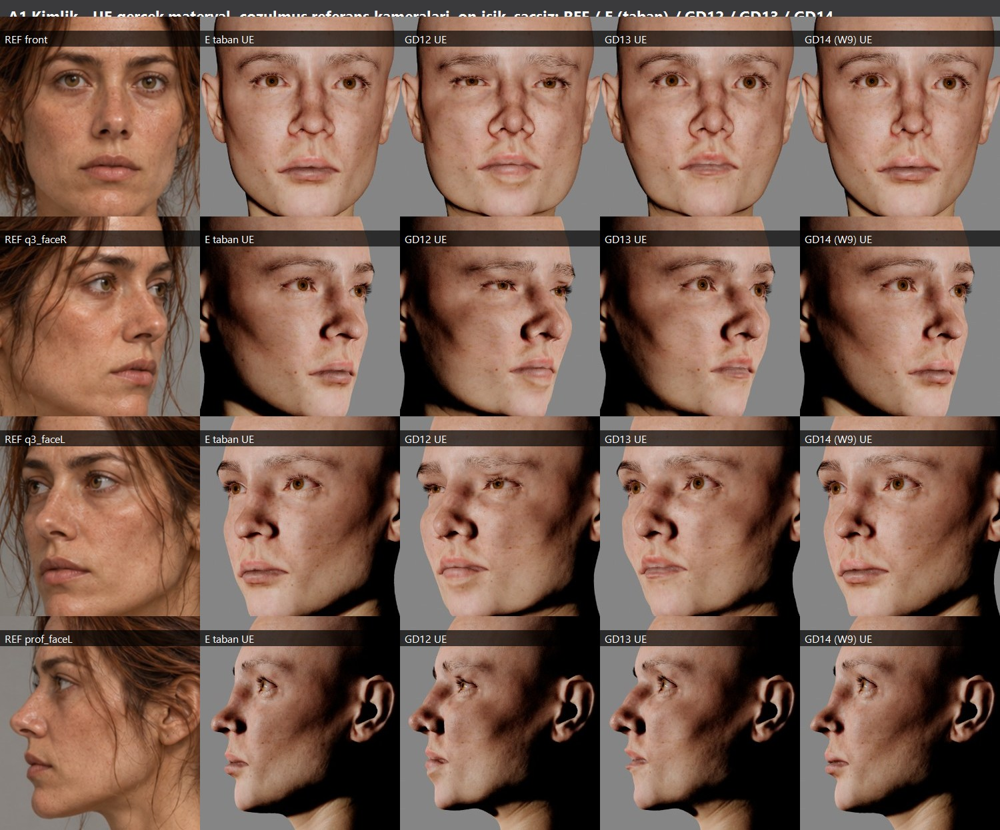

**A2.** Aynı, h75c saç + M_SlightArch + S_Thin ile.

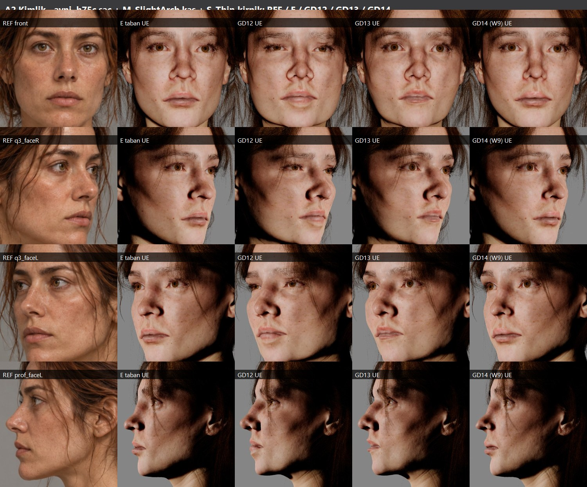

**A3.** Stüdyo ışığı (form).

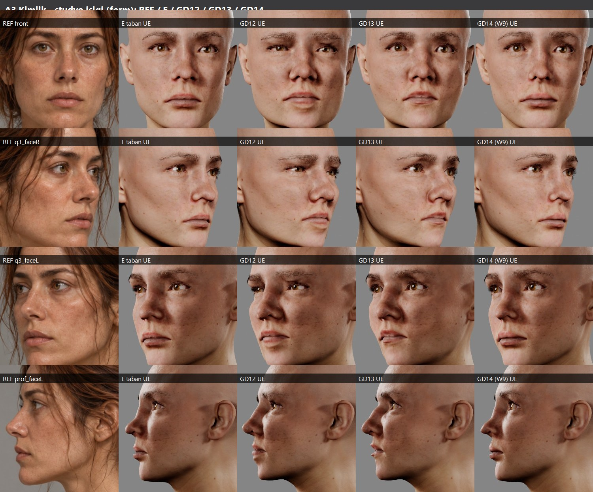

**A4.** Sabit ortak kameralar (aynı lens, model için ayarlanmamış).

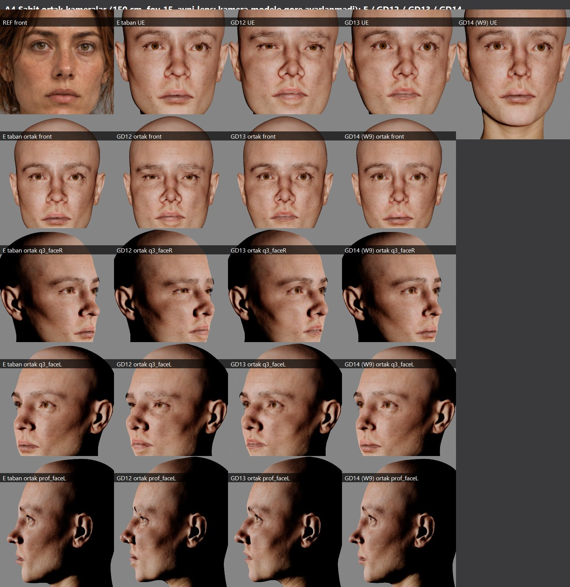

**A5.** Blender kil (render motorundan bağımsız kontrol, aynı çözülmüş kameralar).

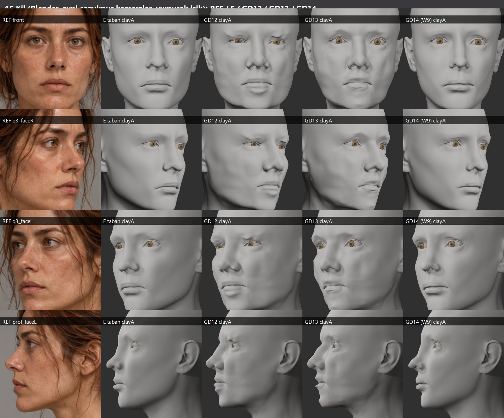

GD12 ve GD13 Unreal'da daha önce yoktu. Karşılaştırma için GD14 klasörüne test kopyası olarak aktarıldılar:
- **GD12:** ortalama 0.065 mm, maks 1.8 mm.
- **GD13:** ortalama 0.059 mm, maks 2.7 mm.

Orijinallerdeki ters üçgenleri MetaHuman modeli birebir üretemiyor. Bu yüzden UE kopyaları orijinalden biraz daha temiz; A5 ise orijinal geometriyi gösteriyor.

**Sanatsal değerlendirme:**
- **GD14:**
  - Dört aday içinde en sakin ve en doğal duran yüz.
  - Ön ve 3/4'te burun ucu ile üst dudak referans karakterine en yakın.
  - Profil siluet referansla çakışıyor (P8). Alın, burun sırtı, uç, subnazal, iki dudak ve çene hizalı; çene altı farkı profil panelinin boyun duruşundan.
- **GD13:** gözler hâlâ yuvarlak / şaşkın, ağız hafif aralık.
- **GD12:** kapaklar kırışık, alt kapak açıklığı izleyicide en dar (10.5–11.9 px; referans 14.9–15.2).
- **E:** sert kaş kemiği, kemikli yanak.

### B — Anatomik kil (5 açı × 2 ışık)

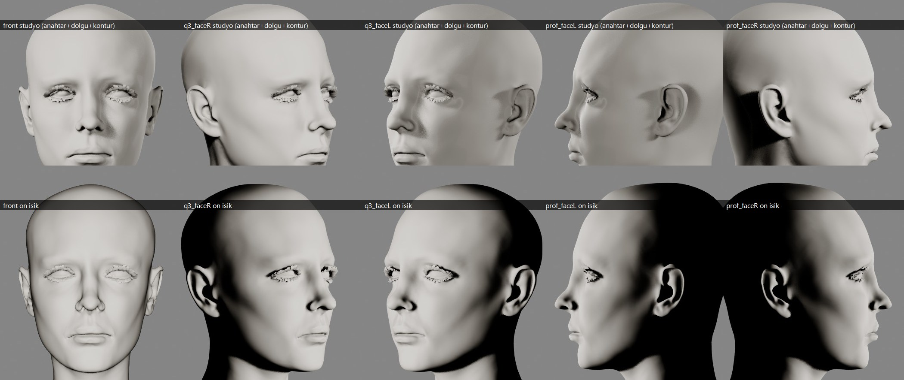

- Riglenmiş GD14 geometrisi; kaş / kirpik groom'u ve saç gizli.
- Göz çevresindeki beyaz "tüy", kafa mesh'inin kendi kirpik kartları (DNA `lashes` segmenti); kil materyali alıyor.
- Yumru, kırışık ya da çöküntü yok. Elmacık altı dolu ama şişkin değil; çene köşeleri yumuşak.

### C — Yakın planlar

Her şerit aynı pencerede **REF | E (taban) | GD14** gösteriyor (`on` ışık).

**C1.** Satır sırası:
1. göz / orbita (ön);
2. göz (3/4 sağ);
3. kaş / alın (ön, groom'lu);
4. kaş (3/4 sol, groom'lu);
5. elmacık / yanak (3/4 sağ);
6. elmacık / yanak (3/4 sol).

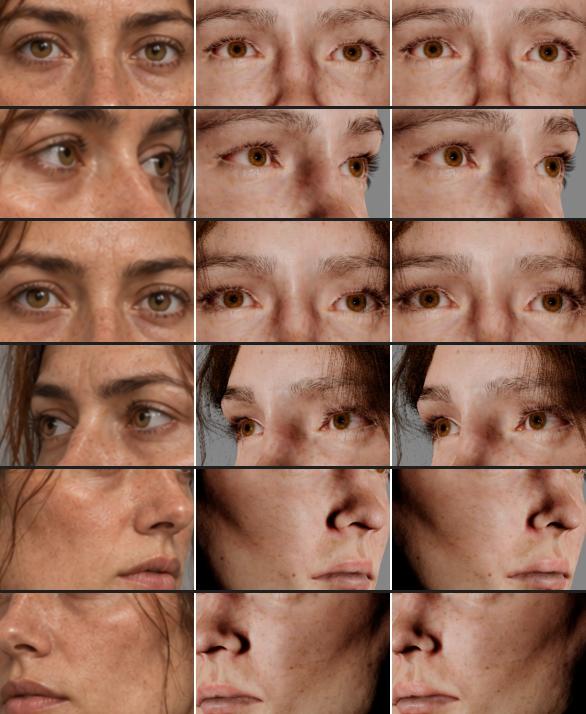

**C2.** Satır sırası:
1. burun (ön);
2. burun (profil);
3. dudak / ağız (ön);
4. dudak (3/4 sol);
5. çene / mandibula (ön);
6. çene (profil).

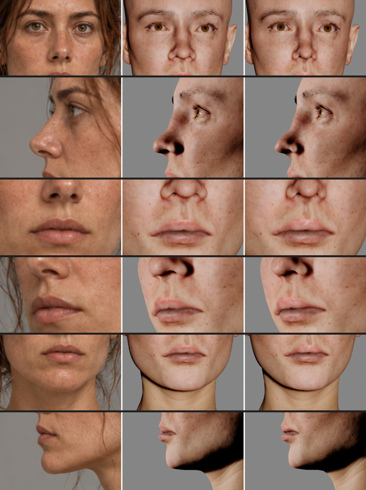

**Gözlem:**
- **Gözler:** badem formu ve açıklık referansa yakın; dinlenme ifadesi sakin. Referanstaki ağır lateral kapak ve alt kapak torbası daha belirgin.
- **Burun:** GD14 ucu E'den daha yuvarlak ve aşağıda, kanat kıvrımı yumuşak. Referansın ucu hâlâ biraz daha büyük ve dolgun.
- **Dudaklar:** GD14 üst dudağı dışa dönük ve eşit renkli; alt dudak dolgun. Referans dudakları daha koyu ve daha dolgun.
- **Çene:** uzatılmadı, öne alınmadı; köşeler yumuşadı.

### D — Gerçek materyal kimlik

**D1.** REF / GD14: x19a + çil, e3n iris, M_SlightArch, S_Thin, h75c; doğal nötr ifade.

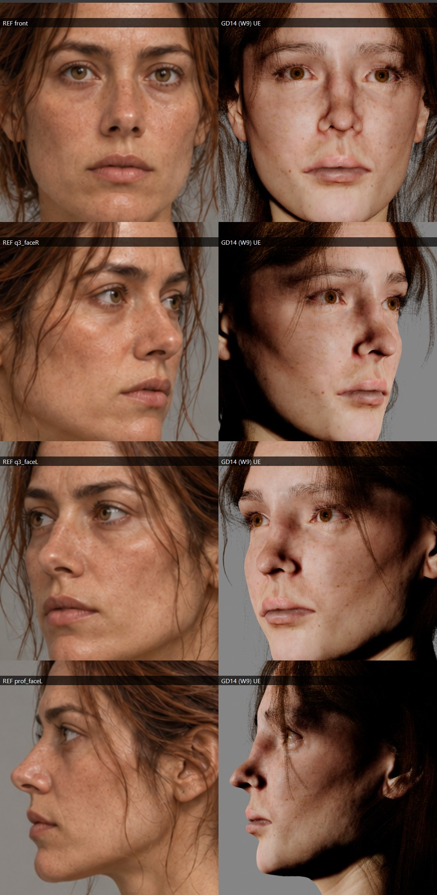

**D2.** GD14 yakın planlar (UE yakın kameraları). Sıra:
- göz ön / 3/4;
- kaş-alın (groom'lu);
- yanak 3/4;
- burun ön / profil;
- ağız ön / 3/4;
- çene profil / 3/4.

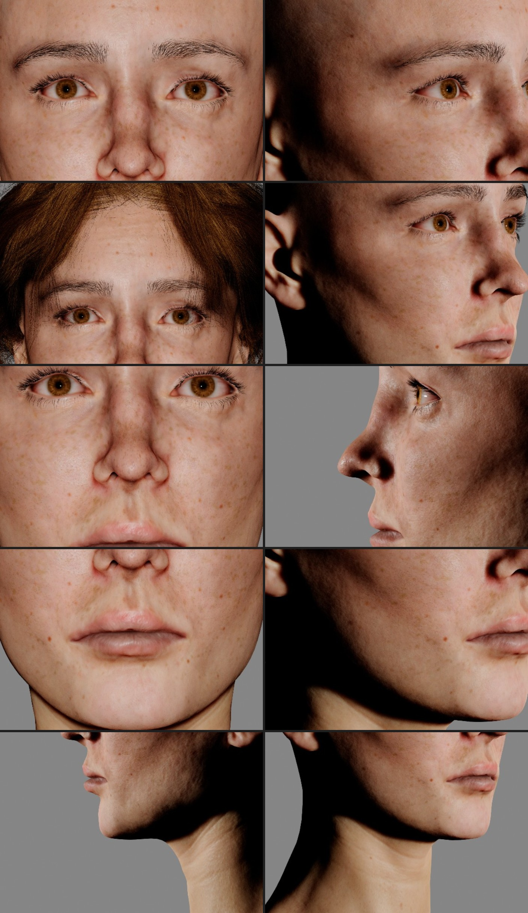

**Materyal bulguları** (geometri ile gizlenmedi):
- **Kaş:** groom yeni kafada doğru yerde; ön overlay'de kaş yüksekliği referansla aynı (P9). Yoğunluk, renk ve kemer farkı stil kararı.
- **İris:** e3n turuncu-kahve; referans ela / yeşilimsi.
- **Cilt:** x19a daha açık ve pembe, çil yoğunluğu düşük.
- **Saç:** h75c'nin gevşek telleri bu kafada alnın ve gözlerin önüne düşüyor (D2 kaş-alın karesi). Saç çizgisi ve şakaklar kapanmış. Kontrol edildi, değiştirilmedi.

### E — 3B deformasyon (GD14 − E, kafatası dahil)

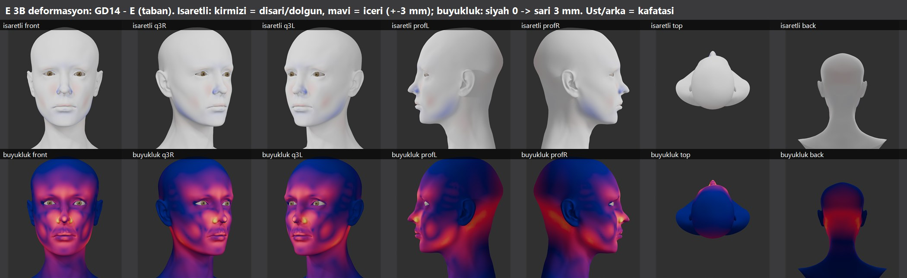

Renk anahtarı:
- İşaretli: kırmızı = dışarı, mavi = içeri, ±3 mm.
- Büyüklük: siyah 0 → sarı 3 mm; mor ≈ 0.3–0.6 mm.

Ölçümler:
- **En büyük değişim** burun ucu: 2.84 mm (uç aşağı + lobül). Ortalama yer değiştirme 0.54 mm.
- **Kafatası üstü** (z > 168 cm): ≤0.26 mm.
- **Oksiput:** ortalama 0.4 mm aşağı, maks 1.5 mm. **İstenmemiş bir yan etki.** MetaHuman landmark çözümünün global şekil uzayı tepkisi (W1 / W2'de oluştu; fırçalar dokunmadı).
- **Kulaklar:** ≤1.1 mm, p95 0.06. Çene açısı daraltmasının yayılımı.
- **Boyun dikişi** (açık kenar, 92 vertex): **0.000 mm**. Boyun arkası ≤0.01 mm.
- **Kafatası formu:** bilinçli olarak değiştirilmedi. Profil alın çizgisi referansla zaten çakışıyor.

### F — Teknik doğrulama ve rig

**F1.** RigLogic kontrol testleri (23 durum × 2 açı, saç gizli).

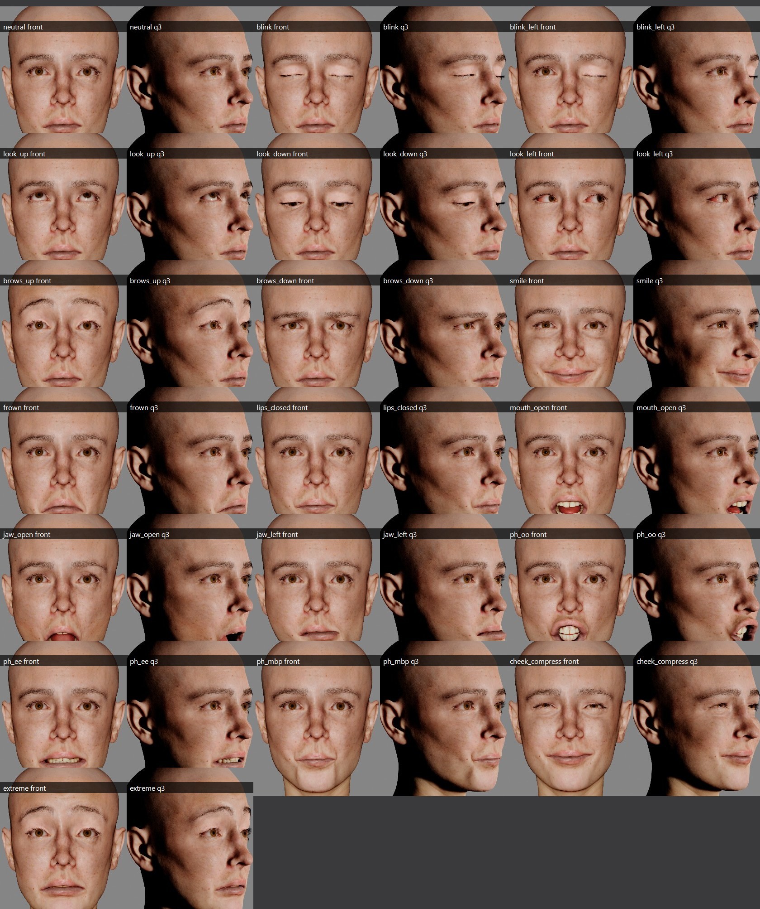

**F2.** Göz kapağı / göz küresi / kirpik yakın planları. Satırlar:
1. nötr | kırpma;
2. sol kırpma | aşağı bakış;
3. yukarı bakış | gülüş;
4. yanak sıkıştırma | uç ifade.

Her çiftte önce ön, sonra 3/4 görünüm.

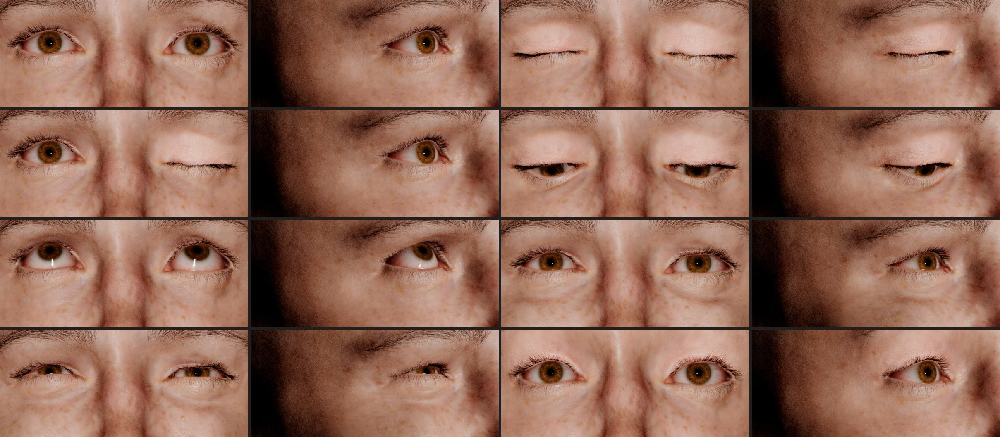

| Kontrol | E (taban) | GD14 W9 | GD12 | GD13 |
|---|---|---|---|---|
| Sonlu / vertex sayısı | ✔ 33 845 | ✔ 33 845 | ✔ | ✔ |
| Katlanmış kenar (dihedral > 120°) | 33 | **32 (0 yeni)** | 42 | 46 |
| Ters üçgen (E'ye göre) | 0 | **0** | 40 | 14 |
| Üçgen alan oranı (min–maks) | 1.00 | 0.47–1.97 (kapak kıvrımı çizgisi, burun ucu) | 0.06–3.58 | 0.09–3.44 |
| Kapak cildi göz küresi içinde (< 0.3 mm, sol / sağ) | 343 / 297 | 347 / 296 (+4 / −1; karünkül bölgesi, E'de de var) | 373 / 313 | 304 / 267 |
| Yer değiştirme simetrisi p99 | – | 0.47 mm | 1.65 mm | 1.55 mm |
| Boyun dikişi kayması | – | 0.000 mm | – | – |
| Aktarım (sculpt → MHC fit) | – | ort. 0.023 / maks 0.77 mm | ort. 0.065 / maks 1.80 | ort. 0.059 / maks 2.72 |
| Rig (rigli mesh ↔ fit) | 0.000 | 0.001 mm | – | – |
| Rig / ifade | ✔ | ✔ 23 RigLogic durumu çalışıyor | – | – |
| Kırpma / bakış | ✔ | ✔ kapaklar tam kapanıyor, göz küresi delinmesi görünmüyor; kirpikler kapakla gidiyor | – | – |

**İzleyici metrikleri** (ön, 1x panel px; yalnız yönlendirme, `data/tracker_metrics.txt`):

| | göz açıklığı sol / sağ | ağız genişliği | üst / alt vermilion | köşe − stomion |
|---|---|---|---|---|
| REF | 14.9 / 15.2 | 76.0 | 14.5 / 17.3 | +3.7 |
| E | 15.0 / 14.1 | 77.7 | 13.3 / 15.7 | +5.2 |
| GD12 | 11.9 / 10.5 | 77.1 | 13.4 / 18.5 | +5.4 |
| GD13 | 15.9 / 14.4 | 72.0 | 14.5 / 14.3 | +5.7 |
| **GD14 W9** | 15.7 / 15.1 | 78.6 | 13.1 / **16.5** | **+4.3** |

**Test edilmeyenler / NOT_TESTED:**
- Oyun içi (PIE): oyun ışığı, locomotion ve gövde animasyonuyla birlikte.
- Animasyon performansıyla dinamik yüz deformasyonu. Yalnız statik RigLogic pozları test edildi.
- LOD1+ görünümü ve LOD'larda groom bağ kalitesi.
- Yeni kafada saç simülasyonu ve dinamikleri.
- Hareket halinde kıyafet ve boyun.
- Üretim karakterine entegrasyon. Kasıtlı olarak yapılmadı.

---

## 6. Kabul kriterleri

| Kriter | Durum | Not |
|---|---|---|
| Kimlik net yakalandı | **FAIL** | Daha yakın ama "aynı kadın" değil. Kalan farkın büyük kısmı kaş groom'u, iris, cilt ve olgun yumuşak doku izleri |
| Üzgün / şaşkın / korkmuş / kızgın ifade yok | **PASS** | Sakin nötr; köşe çekmesi ve kaş açısı izi yok |
| Hacimler tutarlı | **PASS** | Bağlantılı hacimler; yumru, oyuk, kırışık yok; 0 yeni katlanma |
| Doğal gözler | **PARTIAL** | Badem, açıklık referansa yakın, sakin. Ağır lateral kapak ve alt kapak torbası referanstan zayıf; iris rengi farklı (materyal) |
| Yumuşak, etli yanaklar | **PASS** (sanatsal kabul kullanıcıda) | Elmacık altı dolu, malar yumuşak; ne kemikli ne şişkin |
| Burun ve dudak oranları referansa yaklaşıyor | **PARTIAL** | Uç, köprü, kanat ve alt dudak yaklaştı. Üst vermilion yüksekliği ve ağız genişliği yaklaşmadı |
| Alt yüz sert / köşeli / çökük değil | **PASS** | Çene uzatılmadı / öne alınmadı; köşeler yumuşak |
| Açılar arası tutarlılık | **PASS** | Tek geometri; profil siluet referansla çakışıyor |
| Gerçek renderda belirgin iyileşme | **PARTIAL** | E'ye göre görünür ama ölçülü; GD12 / GD13'e göre doğallıkta açık üstünlük |
| GD11 / 12 / 13'ten neden daha iyi | **açıklandı** | §2 ve A panoları; teknik tablo |
| **Genel** | **PARTIAL** | Kullanıcı onayı bekleniyor; üretime geçirilmedi |

---

## 7. Kullanıcı kararları — bir sonraki en büyük kaldıraçlar

1. **Kaş groom'u.** Referansa göre koyu, yoğun, düz ve göze yakın bir kaş. Geçmişte kaş değişiklikleri reddedildiği için M_SlightArch'a dokunmadım. Seçenekler:
   - groom yoğunluğu ve rengi (MI);
   - kaynak proxy ile kaşı ~2–4 mm indirmek (yüzü değiştirmeden).
2. **İris tonu.** e3n → daha ela / yeşilimsi bir varyant.
3. **Cilt ve dudak rengi.** x19a sıcaklığı ve çil yoğunluğu. Dudak rengi maskesi yeni vermilion hacmine göre.
4. **Saç.** h75c gevşek tellerinin bu kafada alnı kapatması: saç binding / gevşek kilit ayarı.
5. **Geometri** (istenirse bir tur daha): üst vermilion yüksekliği, ağız ~1 mm dar, lateral üst kapak ağırlığı.

## 8. Üretim güvenliği

- **Yeni varlıklar** yalnız `/Game/Sphirus/CharacterLab/GD14_IdentityMaster_20261009/`: MHC 55, Face 66, Studio 2.
  - Bu klasör dışında GD14 süresince değiştirilen `.uasset` / `.umap` yok (dosya zaman damgası taraması).
  - Ara ve atılmış varlıklar (W0–W8, `_f1` / `_f2` fit ara adımları, Probe, GD12 / GD13 karşılaştırma kopyaları) aynı klasörde bırakıldı. Silinmedi; temizlik kullanıcı kararı.
- **GD11 / GD12 / GD13** kaynakları ve varlıkları yalnız okundu.
- **Lookdev `qa_config.json`** GD14 öncesi haline geri yüklendi.
- **Editör kapatma:** runner bir quit işinden sonra yanıt vermedi; editör süreci sonlandırıldı (projede yeniden başlatmada kullanılan yöntem).
  - Atılanlar yalnız bellekteki kirli paketler: kil capture'ın bilinen yan etkisi `M_QA_Clay` (disk dosyası değişmedi, 2026-09-28) ve geçici QA haritası.
  - Autosave geri yükleme verisi kenara alındı; bir sonraki açılışta geri yükleme önerilmeyecek.
- Unreal karakteri, gövde, kıyafet, saç, animasyon, locomotion, kamera ve haritalara dokunulmadı.
- **Üretime otomatik geçiş yok.**

## 9. Dosyalar

- `boards/`: A–F panoları.
- `boards/process/`: süreç ve atılan ara sonuçlar.
  - P1: E ilk gerçek materyal (stüdyo ışığı).
  - P2: ışık testi.
  - P3: ön kenar overlay'i (saç kenarı yanılgısı).
  - P4: MHC landmark W2.
  - P5: ters fırça dönemi W4 / W5.
  - P6: E / W8 / W9 düzeltme.
  - P7: dudak / göz E / W8 / W9.
  - P8 / P9: W9 profil / ön overlay.
- `data/`:
  - teknik kontroller (`checks_*.json`, `W9_checks.txt`);
  - izleyici metrikleri;
  - fit / rig sadakati;
  - UE kamera dönüşümü;
  - yakın plan pencereleri;
  - C1 darbe günlüğü;
  - yön kalibrasyonu.
- `ops/`:
  - `W2.json` (MHC landmark);
  - `C1.json` (final fırça programı);
  - `calib_dir.json`;
  - `history_inverted_W3_W8/` (ters sarımla çalışmış eski programlar; yalnız kayıt).
- `tools/`: zincirin tüm script'leri (`build_gd14.sh` dahil).
