# SPHIRUS — GD15 | Referans Benzerliği ve Anatomik Kimlik Sonlandırma

Tarih 2026-10-09 · En iyi aday **G15** · Genel sonuç **PARTIAL**: GD14 W9'dan daha benzer, ama kimlik henüz "açıkça yakalandı" düzeyinde değil.

Üretim karakteri değiştirilmedi. GD14 W9, GD11 / GD12 / GD13 kaynakları, B2 gövde, kıyafetler, Chaos şort, saç kaynakları, locomotion, kamera ve haritalar korundu. Tüm yeni UE varlıkları yalnız `/Game/Sphirus/CharacterLab/GD15_IdentityMaster_20261009` içinde (test varlıkları; terfi edilmedi). Kullanıcı onayı için duruldu.

---

## 0. Kısa özet

Aynı ışık, aynı kamera, aynı lookdev ile **GD15 her dört açıda GD14 W9'dan referansa daha yakın**. Değişen anatomi:

- **Burun:** Daha uzun. Uç lobülü daha yuvarlak ve dolgun. Burun delikleri önden daha az görünüyor.
- **Gözler:** Üst kapak irisin üstünü kısmen örtüyor. Bakış daha sakin, daha badem.
- **Dudaklar:** Belirgin Cupid's bow. Üst vermilion W9 kalınlığında, alt dudak daha dolgun.
- **Kaş:** Göze göre yüksekliği referansa ±0.5 mm oturdu.
- **Ön yanak:** Malar yağ yastığı ve orta yanak daha dolgun.

Değişim büyüklüğü (W9 → GD15) ortalama 0.52 mm, p95 1.8 mm, en çok 2.7 mm.

Değişmeyenler: siluet ve büyük kafa formu bilerek değiştirilmedi. Ölçümde çene/yanak siluetleri referansa zaten ~1 mm içindeydi. Çene uzatılmadı, sivriltilmedi.

**Kalan farklar:**
- Referansın olgun ve yumuşak yüz okuması.
- Alın / kaş kemeri okuması.
- Kaşın kalınlık ve yoğunluğu (kütüphane groom'u).
- h75c saç tutamlarının alnı ve kaşları örtmesi (saç kaynağı korunduğu için değiştirilmedi).

Materyal (lookdev) etkisi geometri başarısı olarak sayılmadı. **B** panosu bunu ayrı gösterir.

---

## 1. Kaynaklar, yöntem, güvenlik

- **Birincil referans:** kullanıcının 6 görünüşlü orijinal sayfası (GD13 panel kesimleri). Çözülmüş referans kameraları kullanıldı: UE yakalamaları aynı optik merkezle referans paneline bükülür (warp).
- **Belirsizlik:**
  - Ön panelde baş −5..−10° döner.
  - Profil paneli ~%9 küçüktür ve boyun pozu farklıdır.
  - Saçın örttüğü kenarlar kontur ölçümüne alınmadı.
- **Aday başına yeniden ölçekleme veya kamera ayarı yapılmadı.** Ortak kameralar 150 cm, fov 15'tir.
- **İş akışı:**
  1. MetaHuman Creator bölge-preset blend'i.
  2. MHC landmark sculpt.
  3. Gerçek Blender sculpt fırçaları (GUI oturumu, dışa doğru düzeltilmiş winding, yön kalibrasyonu, açık aynalı vuruşlar).
  4. Göz küresi üzerinde kapak rotasyonu.
  5. Yumuşak doku dolgusu.
  6. Teknik onarımlar.
  7. Artık geri beslemeli MHC fit (2 tur).
  8. Epic auto-rig.
  9. UE gerçek materyal doğrulaması.
- **Her aşamada adaylar gerçek görsellerle karşılaştırıldı, daha iyi olmayanlar elendi** (bkz. §3.7).
- **Güvenlik:**
  - Tüm adımlar yeni adlar yazar; mevcut adlar korumayla reddedilir.
  - GD15 başladığından beri GD15 klasörü dışında hiçbir `.uasset/.umap` değişmedi (dosya zaman damgalarıyla doğrulandı).
  - `M_QA_Clay` diskte değişmedi; editör bellekte kirlettiği için kayıt yapılmadan kapatıldı.
  - `qa_config.json` GD14 öncesi yedeğe geri yüklendi.

---

## 2. Kontrollü ayrıştırma: materyal ve geometri

| Durum | Geometri | Lookdev |
|---|---|---|
| A | GD14 W9 | eski (x19a cilt, e3n iris, M_SlightArch kaş, h75c) |
| B | GD14 W9 (aynı geometri) | **referans lookdev** |
| C | **GD15 G15** | B ile birebir aynı |

Referans lookdev:
- **Kaş:** M_FlatThick, MI_Hair tabanlı koyu kumral/kahve `MI_GD15_BrowS_auburnDark`. Groom, kaynak-proxy ile 0.7 mm yükseltildi; yüz değişmedi.
- **İris:** h6, sıcak altın-ela, limbal halka korunuyor.
- **Cilt:** sıcak ton s1, f5 dokusu:
  - kümeli çiller;
  - dusky-rose vermilion;
  - kapak kenarı pembeliğinin giderilmesi;
  - üst dudak derisindeki yeşilimsi "sakal gölgesi"nin temizlenmesi;
  - hafif göz altı gölgesi.
- **Saç:** h75c değişmedi.

**B1 / B2:** A → B arasındaki büyük fark materyaldir (renk, çil, kaş, iris). B → C arasındaki fark yalnız geometridir.

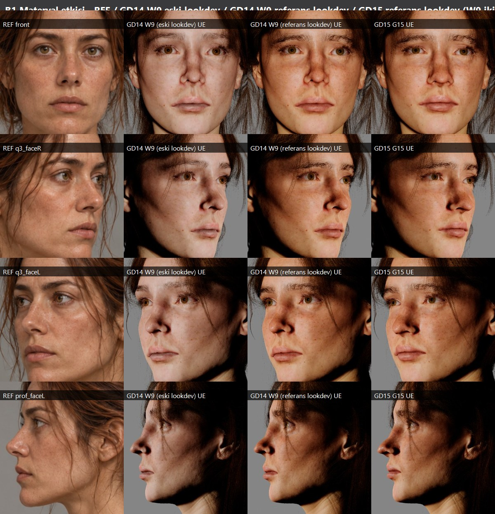
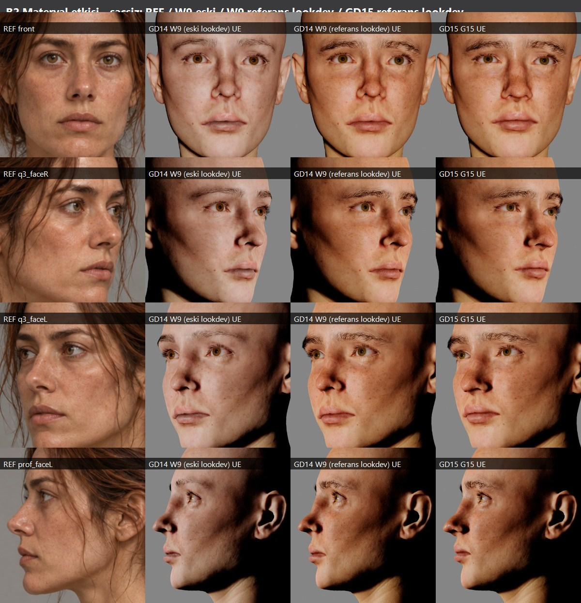

---

## 3. Anatomik çalışma

### 3.1 Burun (en büyük kimlik etkeni)

MetaHuman bölge-preset kütüphanesi (29 preset × burun bölgesi) kil ve UE'de referansla karşılaştırıldı. **Sunita (1.0)** burun bloğu seçildi. Sonuç:
- radix → sırt eğrisi düz, kemik/kıkırdak geçişi yumuşak;
- uç lobülü daha uzun ve yuvarlak;
- alar oluklar daha yumuşak;
- burun delikleri önden gizli.

Profil bant rms (panel px):
- radix / üst sırt: 4.3 → 3.1;
- alt sırt / uç: 1.7 → 2.8 (uç artık biraz fazla öne; bkz. §7).

Kanıt: `process/08_BURUN_*`, D2.

### 3.2 Dudak / ağız

**Etta** ağız preset'i 1.0 / 0.8 / 0.6 / 0.5 ağırlıklarında denendi. Hepsinde üst dudak fazla yüksek ve şişkin okundu. UE'de aynı ölçekte üst vermilion ölçüldü: REF ≈ 35 px, W9 ≈ 30 px, Etta 0.5 ≈ 50 px. Kil, geometrik dudağın referanstan büyük olmadığını gösterdi. Fark, x19a vermilion renginin eski vertekslere bağlı olmasından ve şeklin değişmesinden geliyordu.

Çözüm: üst ve alt dudağa ayrı ağırlık, stomion hattında yumuşak geçiş (`gd15_mouthsplit.py`):
- **üst 0.2 / alt 0.45**;
- üst dudak ince ve belirgin yaylı;
- alt dudak dolgun;
- dudaklar yapay şişirilmedi veya büzülmedi.

Bölge blend'lerinin ağırlıkta tam doğrusal olduğu doğrulandı (0.00 mm). Etta 0.3 ve tam 0.5 elendi.

Kanıt: `process/02_*`, `process/03_*`.

### 3.3 Göz, orbita, kapak

- MHC kapak landmark'ları (L1).
- Fırçalar:
  - lateral hooding;
  - alt kapak yastığı;
  - santral kapak katlantısı;
  - üst kapak çizgisi.
- **Göz küresi üzerinde üst kapak rotasyonu LR2: 1.1 mm.** Kapak kendi küresinde kalır, kantuslarda 0'a iner.
- LR1 (0.7 mm) ve LR2 karşılaştırıldı. 3/4 açılarda referansın ağır kapağına en yakın olan LR2 seçildi. Ön açıda iris örtüsü referanstan biraz fazla (§7).
- İkinci alt-kapak çanta vuruşu ile infraorbital kıvrım kırışık çizgisi gibi okudu ("yaşlandırma"). Bu yüzden kaldırıldı (`process/09_*`).
- Göz bölgesine preset blend uygulanmadı: 72 kapak üçgeni ters dönüyordu.

### 3.4 Kaş — kritik düzeltme

İlk varsayım "referans kaşı daha aşağıda" idi. Bu yüzden kaş derisi Grab fırçasıyla 1.5 mm indirilmişti. Çözülmüş ön kamerada piksel ızgarası ölçümü bunun ters olduğunu gösterdi. Kaş merkez çizgisi → göz bebeği (ızgara px, 1 px ≈ 0.16 mm):

| | Mesafe |
|---|---|
| **REF** | 100 |
| W9 | 93 |
| indirilmiş aday | 88 |
| **G15** | **103** |

- İndirme vuruşları geri alındı (deltası izole edilip çıkarıldı).
- Kaş groom'u **yüze dokunmadan** kaynak-proxy yöntemiyle 0.7 mm yükseltildi. Bu, stilin kendi kaynak kafası Legacy02'nin GD15 kopyasıdır; lateral kazanç ~2.3×. u15 (1.5 mm) fazla geldi.
- Kalan fark: referans kaşı daha kalın, daha düz ve yoğun. Kütüphane groom'u bunu tam vermiyor.

Kanıt: `process/06_*`, D1.

### 3.5 Yanak, zigoma, alt yüz

- Sabit çözülmüş kameralarla kontur bantları ölçüldü. GD14 W9'un alt yüz silueti referansa zaten ~1 mm içindeydi (ön alt yanak +0.7 mm, çene gövdesi +0.6 mm).
- Bu yüzden "dar alt yüz" okuması siluet değil, **iç form ve gölgedir**: referansta öne dolgun, yuvarlak malar/orta yanak kütlesi var; modelde düz ön yanak düzlemi.
- Uygulanan ön yanak yumuşak doku dolgusu (SF3):
  - malar yağ yastığı +1.4 mm;
  - orta yanak "elma" +1.0 mm.
- Ölçüm (gonial / masseter / lateral yüz / çene sınırı): **0.0 mm** değişim. Çene açısı genişletilmedi, kas eklenmedi.
- Bölge-preset yanak kütüphaneleri (2 × 29) ölçüldü. Etkileri ≤ 1 mm ve tek bir yükseklikle sınırlıydı; kullanılmadı.
- 3/4 kontur bant rms:
  - uzak yanak: 3.5 → 2.7;
  - uzak çene: 3.1 → 2.2.

Kanıt: `process/04_*`, `process/05_*`, `process/11_*`, C1–C3.

### 3.6 Çene

Yalnız çene yastığı +0.5 mm öne. Uzatma ve sivriltme yok. Profil çene yastığı rms 3.3 → 2.7.

### 3.7 Elenenler / başarısız yaklaşımlar

| Yaklaşım | Neden elendi |
|---|---|
| Göz bölge preset blend'i | 72 ters kapak üçgeni |
| Etta 0.5–1.0 ağız | Üst dudak fazla yüksek |
| Alt-kapak çanta + infraorbital kıvrım | Kırışık okuması |
| Kaş derisi indirme | Yanlış yön |
| Bölge-preset yanak blend'leri | Etkisiz |
| Alt yüz siluet genişletme | Gereksiz; siluet zaten eşleşiyor |
| Konum düzleştirme ile ağız köşesi onarımı | Yeni kıvrımlar |
| u15 kaş yükseltme | Fazla |

---

## 4. Teknik onarımlar

- **Ağız köşesi:** preset blend kommissürdeki küçük üçgenleri eziyordu (alan oranı 0.056). Blend yer değiştirmesi köşede yerel ortalamayla rijit yapıldı (`gd15_rigidcorner.py`). Sonuç: min alan oranı 0.295, ters üçgen 1.
- **Kantus:** yerel geri karıştırma.
- **Kalan durum:** 8 sınırda kıvrım (121–166°): sağ kommissür ×3, burun eşiği ×4, sağ lateral kantus ×1. Renderlarda ve 19 ifade testinde pano çözünürlüğünde görünmüyor.

---

## 5. Aktarım ve rig

- **MHC fit + 2 artık geri besleme:** sculpt'a ortalama 0.018 mm, p99 0.19 mm, en çok 0.58 mm.
- **Auto-rig:** ok. DNA blendshape'li, **858 morph**, `ABP_Face_PostProcess`, kalıcı DNA bağı.
- Rig sonrası mesh = fit durumu (0.001 mm).
- **Boyun bağlantısı:** açık sınırdaki 92 verteks 0.0003 mm. Gövde kaynağı değişmedi.

---

## 6. Panolar (hepsi gerçek yakalama / render; boyama yok)

**A — Kimlik (aynı ışık ve materyal): REF / GD14 W9 / GD15**

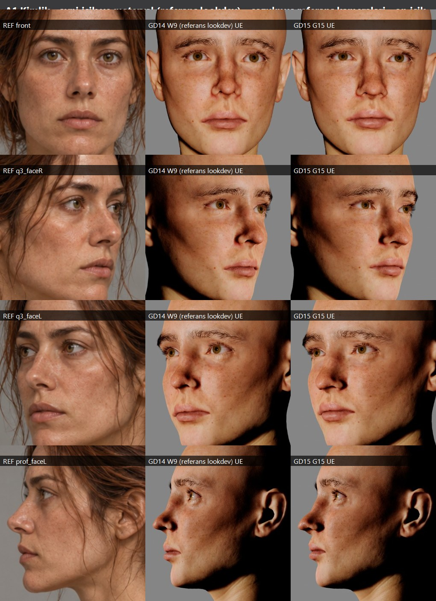
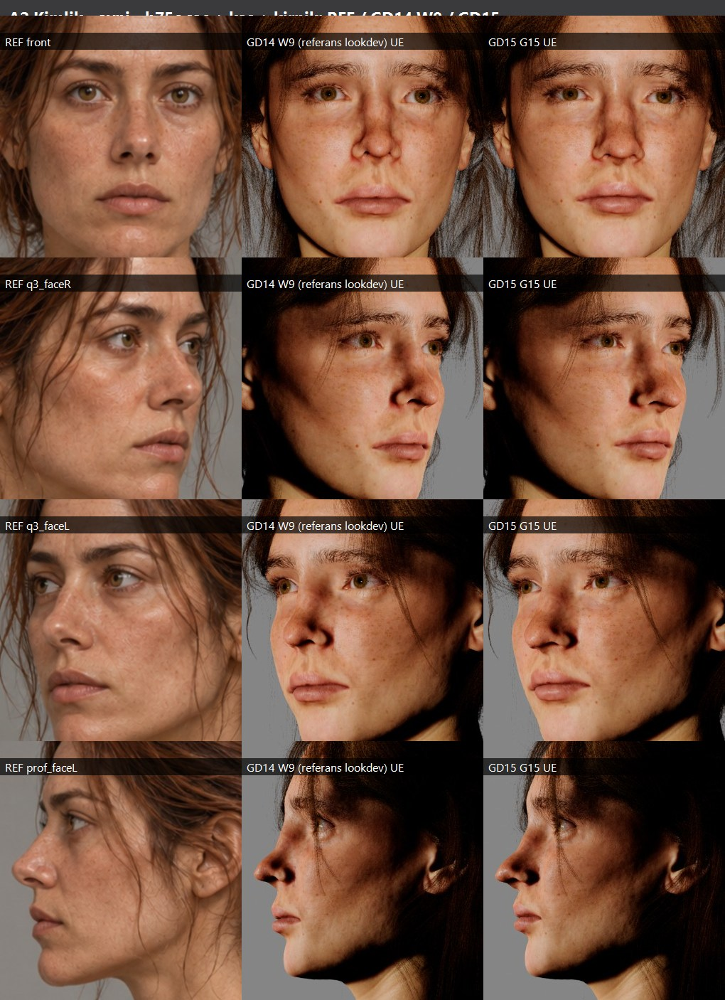
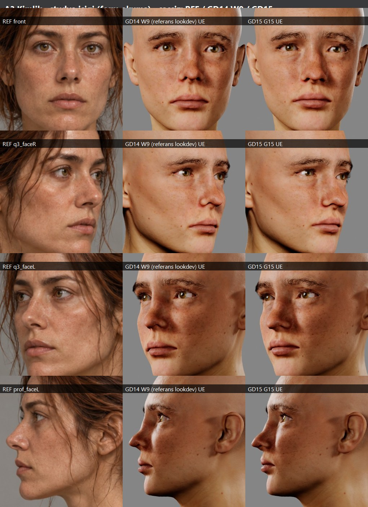
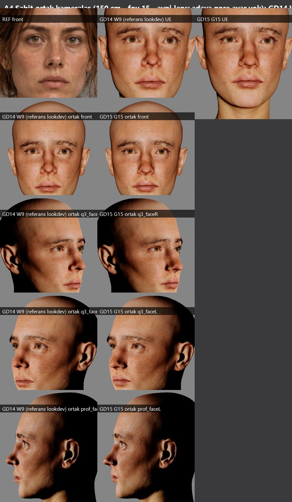

**B — Materyal etkisi:** yukarıda (§2).

**C — Anatomik kil:** UE'de 5 açı × 2 ışık (W9 ve GD15), Blender'da çözülmüş kameralar.

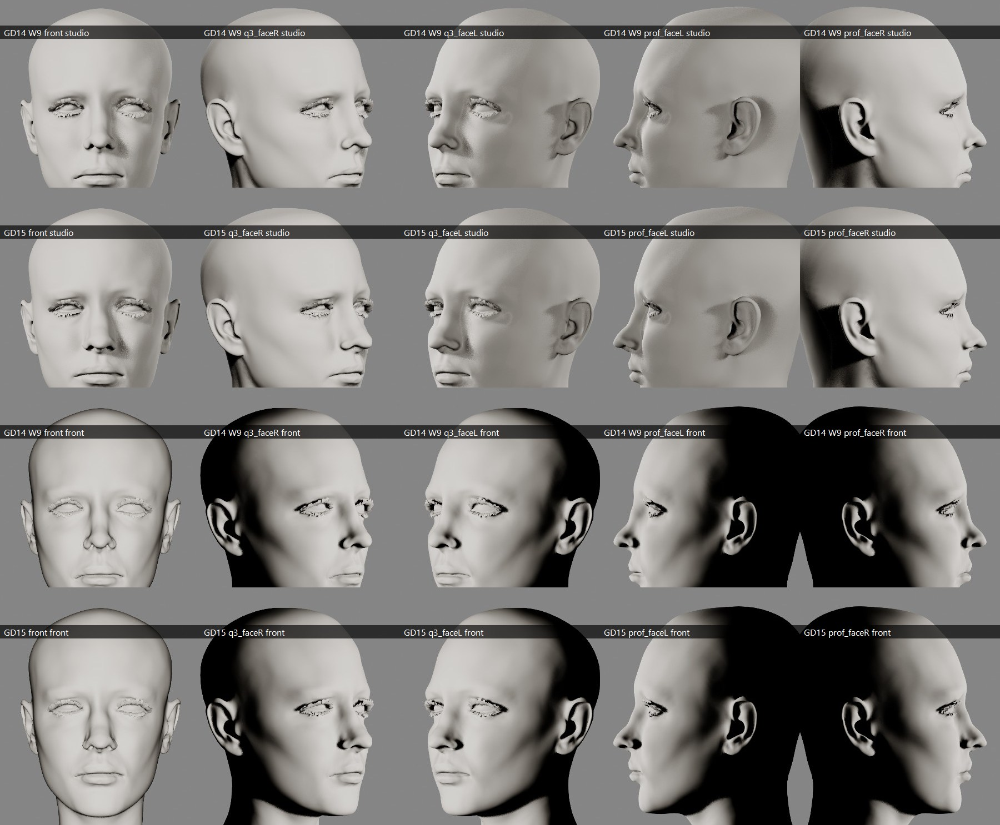
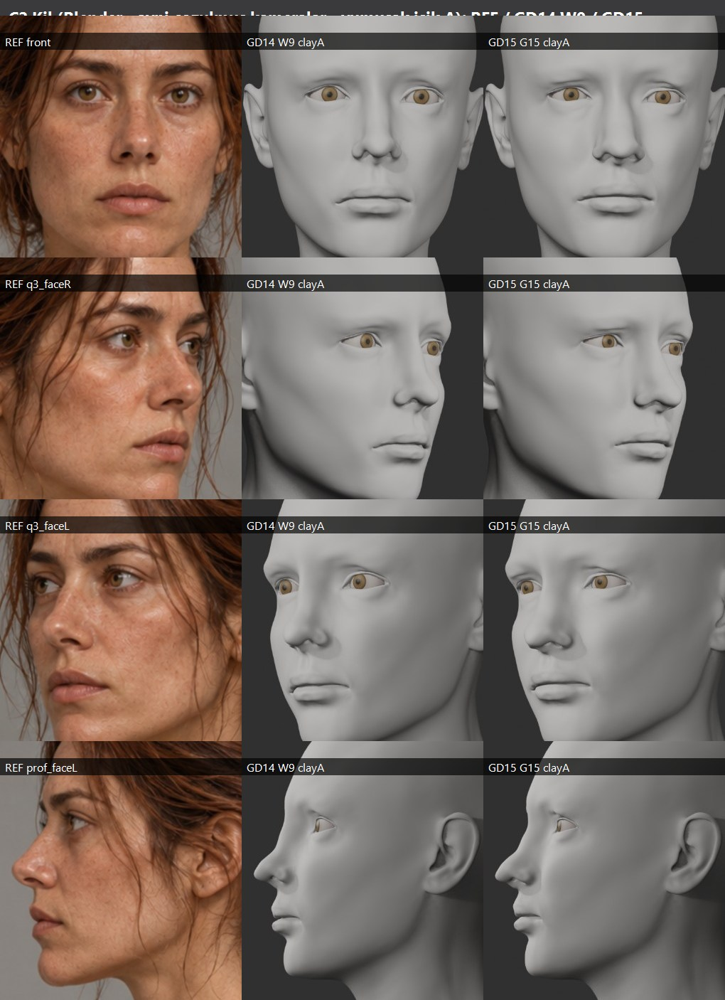
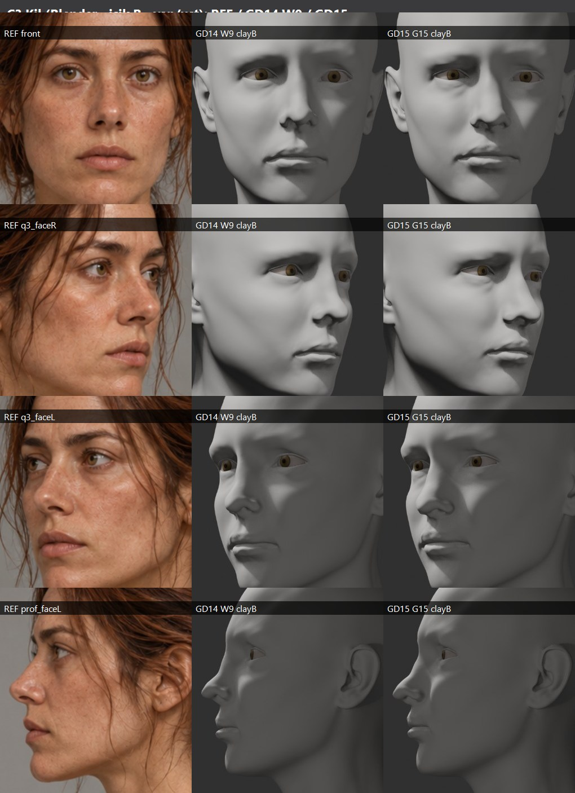

**D — Yakın planlar:** göz, kaş, orbita, yanak, burun, dudak, çene, profil.

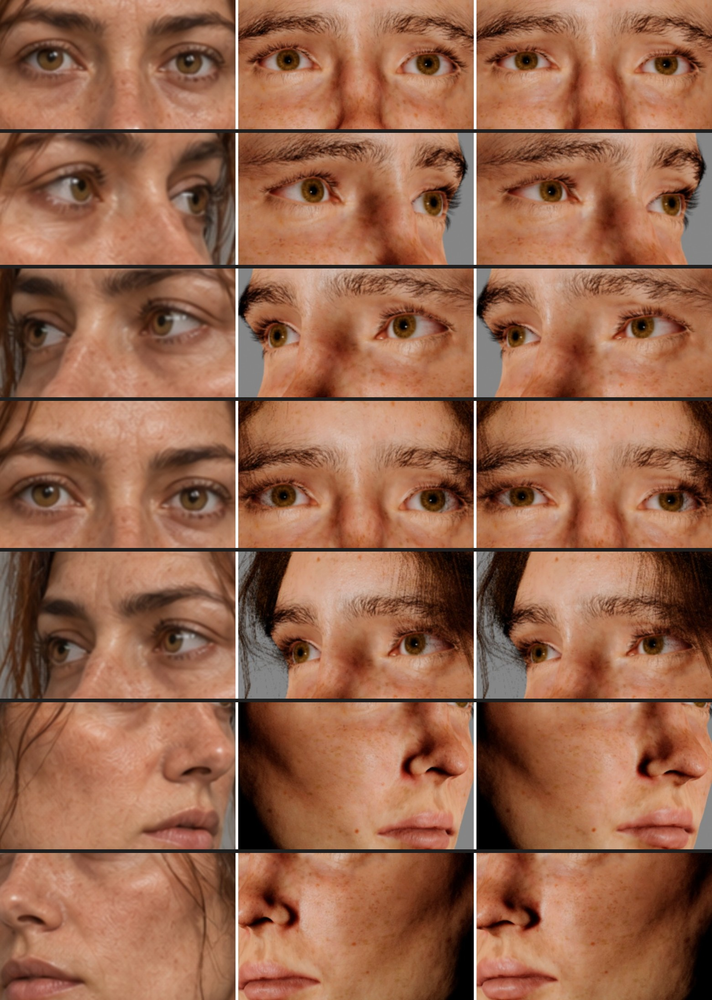
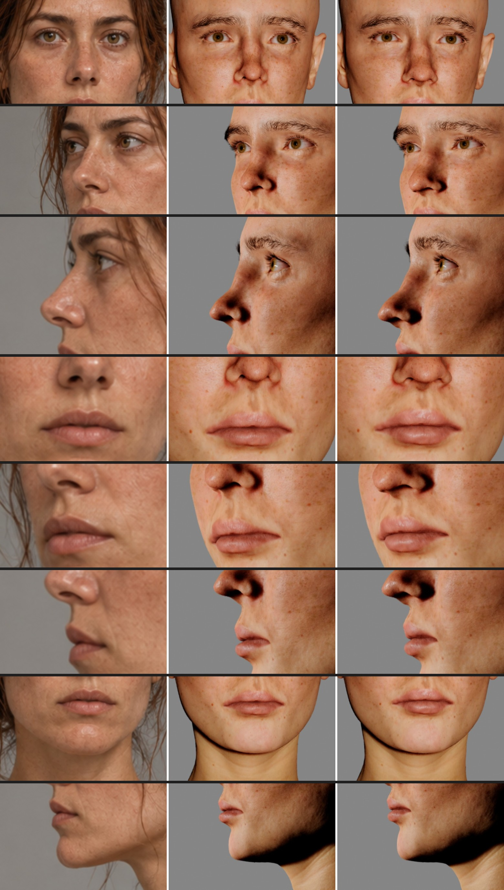
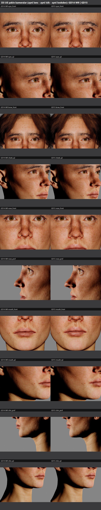

**E — GD14 W9 → GD15 3B deformasyon:** değişim burun, üst kapak, ağız ve ön yanakta. Kafatası ve ense ≈ 0.

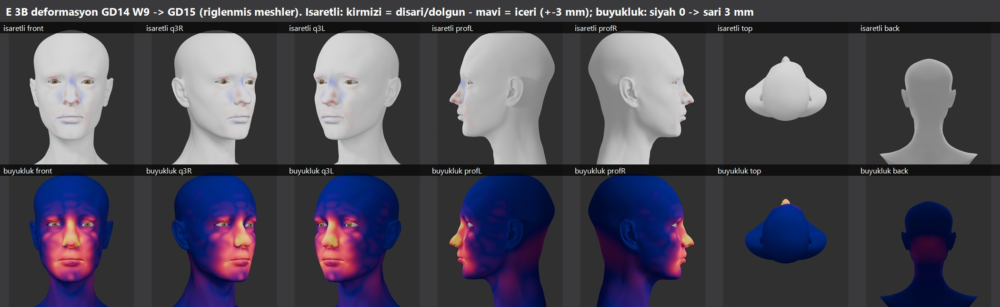

**F — Motor doğrulaması:** RigLogic ifadeleri, göz kırpma / kapak, LOD 0–3.

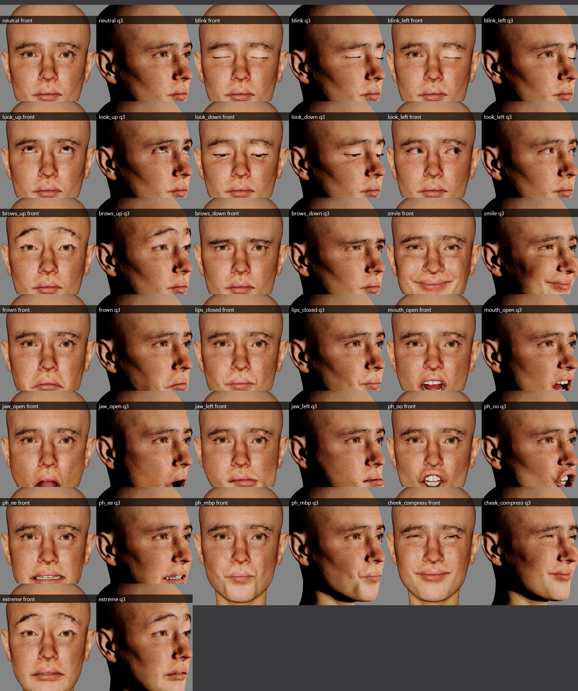
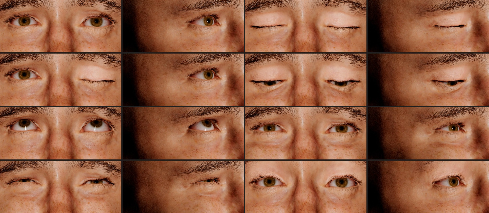
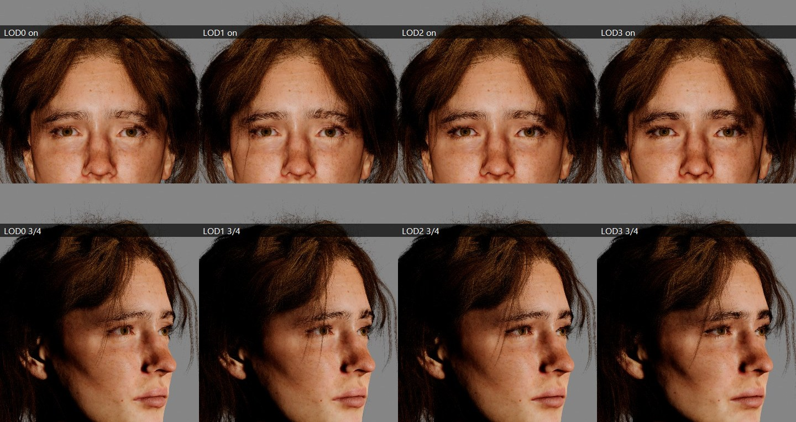

Süreç kanıtları `process/` klasöründe: kapak, dudak ve yanak varyantları, kontur overlay'leri, kaş ızgaraları, cilt f4/f5, preset kütüphaneleri.

---

## 7. Sanatsal doğrulama: "Aynı koşullarda GD14 W9'dan daha mı benzer?"

| Açı | Cevap | Gerekçe |
|---|---|---|
| Ön | **Evet** | Burun uzunluğu ve ucu, sakin kapak, dudak yayı, kaş yüksekliği. Ama yüz hâlâ referanstan genç ve köşeli okuyor. |
| Sağ 3/4 | **Evet** | Burun ucu hacmi, dolgun ön yanak, kapak. |
| Sol 3/4 | **Evet** | Burun, dudaklar, yanak geçişi. |
| Profil | **Kısmen** | Burun ucu yuvarlaklığı daha yakın. Alt sırt-uç biraz fazla öne (bant 1.7 → 2.8 px). Dudak/çene benzer. |

**Kazanımlar:**
- burun kimliği;
- sakin göz;
- dudak yayı / oranı;
- kaş yüksekliği;
- yumuşak ön yanak;
- cilt (çil, sıcaklık, temiz üst dudak);
- iris.

**Kayıplar / riskler:**
- Ön açıda iris örtüsü referanstan biraz fazla.
- Profilde burun ucu biraz fazla projeksiyonlu.
- Ağız köşesinde 3 sınırda kıvrım.

**Açık kalanlar:**
- Referansın olgun ve yumuşak genel okuması: alın/kaş kemeri, şakak, alt yüzün yumuşaklığı.
- Kaş kalınlığı/yoğunluğu: özel groom gerekir.
- h75c tutamlarının alnı/kaşları örtmesi: saç kaynağı değişikliği kullanıcı kararıdır. W9'da da aynı.
- Burun yan duvarlarındaki koyu gölge: malzeme/ışık kaynaklı, W9'da da aynı; base color dokusunda yok.

---

## 8. Kabul kriterleri

| # | Kriter | Sonuç |
|---|---|---|
| 1 | Kimlik açıkça yakalandı | **PARTIAL** — her açıda W9'dan yakın, ama "açıkça o kadın" değil |
| 2 | Büyük formlar daha yakın | **PARTIAL** — kontur rms 16 banttan 13'ünde iyileşti; kafa/çene büyük formu bilerek korunmuş |
| 3 | Gözler doğal, sakin, karakteristik | **PARTIAL** — sakin, blink tam; ön açıda örtü biraz fazla |
| 4 | Kaş formu ve konumu | **PARTIAL** — konum ±0.5 mm PASS; form/yoğunluk kütüphane sınırı |
| 5 | Burun ve dudak kişiye özgü | **PARTIAL** — en büyük kazanım; preset tabanlı ve profil ucu fazla |
| 6 | İnandırıcı yanak ve zigoma dokusu | **PARTIAL** — ön yanak dolgusu doğru yönde ama ince |
| 7 | Cilt, çil, iris, saç tutarlı | **PARTIAL** — cilt, çil ve iris tutarlı; saç alnı örtüyor |
| 8 | GD14'ten daha yüksek benzerlik | **PASS** (aynı lookdev, aynı kameralar; nihai karar kullanıcının) |
| 9 | Teknik güvenlik | **PASS** test edilenlerde; PIE ve animasyon NOT_TESTED |
| 10 | Gerçek renderlarla savunulabilir | **PASS** |

---

## 9. Teknik testler

| Test | Sonuç |
|---|---|
| Mesh bütünlüğü (33 845 v, DNA sırası), normal/winding | PASS |
| Kıvrım / ters üçgen | PARTIAL (8 sınırda kıvrım, 1 ters üçgen; görünür değil) |
| Göz küresi – kapak | PASS (görünür penetrasyon yok; kapak içi sayımı 360/300, E'de 343/297) |
| Kirpik / kaş / saç penetrasyonu | PARTIAL (kaş/kirpik deriyi izliyor; h75c tutamları kaşın üstünden geçiyor) |
| DNA uyumu, 858 morph | PASS |
| Göz kırpma ve ifadeler (19 RigLogic durumu × 2 açı, statik) | PASS |
| Boyun bağlantısı | PASS |
| LOD 0–3 | PASS (görsel); LOD 4–7 **NOT_TESTED** |
| Gövde animasyonu + saç simülasyonu | **NOT_TESTED** |
| PIE (ayrı test karakteri) | **NOT_TESTED** — yakalamalar sırasında C: boş alanı 3.4 GB'a düştü. ~1 GB'ın altında editör/rig çökmesi kayıtlı olduğundan risk alınmadı. |
| Üretim karakteri değişmedi | PASS |
| Yeniden üretim (`build_gd15.sh --blender-stage`) | PASS (saklı G15S'e 0.000 mm) |

---

## 10. Dosyalar

- **Blender Identity Master:** `SourceAssets/Characters/GD15_IdentityMaster_20261009/GD15_IdentityMaster.blend`
  - düzenlenebilir `GD15_Head`;
  - salt-okunur karşılaştırma kafaları: GD14 W9, GD15 riglenmiş, C8L;
  - referans panelli çözülmüş kameralar;
  - op programları metin bloğu olarak.
- **Export:** `export/GD15_Head.glb` / `.obj`
- **Kaynak veri:** `data/` (G15S sculpt, G15 MHC fit, rig sonrası), `ops/`, `tools/`
- **UE varlıkları** (`/Game/Sphirus/CharacterLab/GD15_IdentityMaster_20261009`):
  - `MHC/MHC_GD15_G15` (düzenlenebilir MetaHuman durumu)
  - `MHC/MHC_GD15_G15_Rig`
  - `Face/SKM_GD15_Face_g15`
  - `MHC/DNA/MHC_GD15_G15_Rig_Head`
  - `Looks/*` (MI ve dokular)
  - `Grooms/*` (kaş/kirpik kopyaları, BrowSrc proxy)
  - Eski adaylar silinmedi.
- **Yeniden üretim zinciri:** `tools/build_gd15.sh` (UE adımları belgeli; Blender aşaması çalıştırılabilir) ve `tools/gd15_final15.sh` (fit → rig → look → yakalamalar).
- **Sayısal özet:** `data/gd15_summary.json`, `data/contour_bands_W9_vs_GD15.json`, `data/checks_G15_mhc.json`

---

## 11. Not — disk alanı

C: sürücüsünde boş alan **~3.4 GB**. `Saved/Codex/CharacterLookdev_20260930/captures` klasörü **58 GB** (birçok geçişin ham yakalamaları). Hiçbir şey silinmedi. Sonraki rig, PIE veya yakalama işinden önce yer açılması önerilir.

**Durum:** kullanıcı onayı bekleniyor. Üretim karakterine aktarım yapılmadı.
