# SPHIRUS — Concept Refinement Pass 2

> GitHub kapsamı: rapor, 12 karşılaştırma panosu ve teknik kayıtlar. Blender/FBX dosyaları yerel teslim klasöründedir. [Önceki Pass 1 raporu](../character-shape-2026-09-27/TEKNIK_RAPOR.md) korunmuştur.

27 Eylül 2026. **Başlangıç: tamamlanmış Pass 1; teslim: Pass 2 / son iç aday v5.**

Yüz ve beden, birinci geçişe göre belirgin biçimde daha olgun ve fiziksel olarak daha sağlam bir konsept yorumuna taşındı. Kontrollü bir MetaHuman Conform **şekil denemesi** için hazır olarak değerlendirildi. Bu, nihai yüz rig'i veya oyun içi deformasyon onayı değildir. **MetaHuman Conform ve Unreal import çalıştırılmadı.**

## Korunan başlangıç ve teslimler

`Sphirus_ShapeTargets_EDITABLE.blend`, `TARGET_BODY`, `TARGET_HEAD` ve mevcut `SPH_Concept_Form` temel alındı. Orijinalden yeniden başlanmadı. Önceki dosyanın birebir kopyası `CHECKPOINT_Pass1_EDITABLE.blend` olarak alındı; SHA-256: `5f5ec8d47bbcdd5559c9aaff2e5da10877e397d789d23c94d2693e4143422d7c`.

Yerel teslim klasörü: `SourceAssets/Characters/SphirusIdentityPass2_20260927/`.

- `Sphirus_IdentityPass2_EDITABLE.blend`: orijinal, Pass 1 ve yeni form birlikte korunur.
- `Sphirus_IdentityPass2_NeutralTargets.blend`: temiz nötr BODY/HEAD, gözler ve dişler; armature içermez.
- `ConformTargets/SM_SPH_P2_BodyTarget.fbx` ve `SM_SPH_P2_HeadTarget.fbx`.
- `Auxiliary/`: ayrı sağ/sol göz ve diş hedefleri; `ReferenceOnly/`: tam baş topolojisi.
- Her bileşen için kaynak vertex/polygon indeks eşlemesi, dışa aktarım manifesti ve dosya hash'leri.

Yeni `SPH_Concept_Identity_P2`, önceki `SPH_Concept_Form` anahtarına göreli bir katmandır. **Pass 2:** ikisi 1; **Pass 1:** Form=1, P2=0; **orijinal:** ikisi 0. Eski ifade anahtarları değiştirilmedi. Orijinal korunmuş dosyalar ve 14 önceki girdi kaydı hash kontrolünden geçti; 86 Unreal kaynak paketinin hash'i aynı.

## Yüz ve başta yapılan ikinci geçiş

Göz kürelerinin konumu ve boyutu korunarak kapak açıklığı daraltıldı; üst orbital/kaş yapısı, glabella ve burun kökü birlikte güçlendirildi. Küçük ve yuvarlak göz algısı azaltıldı. Burun sırtı ve projeksiyonu artırıldı, uç daha az kalkık hale getirildi; burun–üst çene bağlantısı derinleştirildi. Elmacık ve göz altı geçişi sağlıklı hacmini koruyarak belirginleştirildi. Ağız genişliği, dudak düzlemi/projeksiyonu ve filtrum çevresi yeniden dengelendi. Çene ucu, alt yüz uzunluğu ve mandibula geçişi güçlendirildi; aşırı kare çene yapılmadı. Şakak/kafatası dolgunluğunda kontrollü düzeltme yapıldı, tepe yüksekliği korundu.

Nötr göz kapağı formuna eski düzeltme anahtarlarını katma denemesi reddedildi: küçük katlanmalar üretiyordu. Son sürümde eski anahtarlar nötr forma gömülmez; kapak dokusu sabit göz merkezinin çevresinde yeniden şekillenir. Mevcut göz çevresi yardımcı yüzeyleri uyumlu hareket ettirildi; yeni kirpik/kaş veya saç üretilmedi.

## Bedende yapılan ikinci geçiş

Boyun yan hacmi, ense/trapez ve köprücük kemiği geçişi başı daha iyi destekleyecek şekilde düzenlendi. Eklem merkezleri taşınmadan omuz/deltoid ve üst kol–ön kol hacmi artırıldı. Alt kaburga, yan gövde ve üst karın bağlantısı güçlendirildi; bel çentiği azaltıldı. Göğüslerin öne projeksiyonu ve idealize yuvarlaklığı azaltılarak göğüs kafesiyle bütünleştirildi. Lateral kalça ve arka pelvis konturu yumuşatıldı; uyluk ve baldır hacmi gövdeye dengelendi. Eller/ayaklar yeniden tasarlanmadı.

İlk stres denemelerinde koltuk altı kıvrımında birkaç küçük üçgen yön değişimi bulundu. Kıvrımın içindeki ek hacim azaltıldı, deltoid ve kaburga hacmine yumuşak geçiş kuruldu. Ağırlıklar yeniden boyanmadı.

## Ölçülen değişiklik ve koruma

Aşağıdaki değerler kayıtlı mesh koordinatlarından ölçülmüştür; referans fotoğrafından türetilmiş anatomik ölçü iddiası değildir.

| Ölçüt | BODY | Tam HEAD |
|---|---:|---:|
| Pass 1 → Pass 2 en büyük vertex hareketi | 18.853271484 mm | 8.032169342 mm |
| Orijinal → Pass 2 toplam en büyük hareket | 34.018432617 mm | 12.250803947 mm |
| Vertex / üçgen | 32.334 / 60.816 | 34.657 / 64.094 |
| Topoloji, loop sırası, polygon düzeni | Aynı | Aynı |
| UV koordinatları ve katmanları | Birebir aynı | Birebir aynı |
| Skin ağırlıkları, vertex grupları | Aynı | Aynı |

Ayrı deri HEAD hedefi 24.414 vertex / 48.004 üçgendir; tam HEAD referansı göz/diş ve yardımcı bileşenleri de taşır. Kaynak indeks listeleri Pass 1 ile aynıdır. Başta 858 mevcut ifade anahtarı, Basis ve önceki Form dahil bütün eski anahtar koordinatları ve göreli ilişkileri korunmuştur. İskelet dinlenme matrisleri, mevcut referans pozları ve nesne dönüşümleri aynı; retopoloji, weld ve UV yeniden açma yoktur.

**Başlangıç ve son boy: 173.40184021 cm.** Blender dünya koordinatları metre, +Z yukarı / −Y ileri; FBX +X ileri / +Z yukarı, birim dönüşümü açık. Rastgele boy/ölçek değişikliği yapılmadı.

## Geçici beden pozları ve birleşim

Orijinal / Pass 1 / Pass 2 aynı 12 pozda karşılaştırıldı: idle, yürüyüş, koşu, crouch, kollar yukarı, kollar öne, omuz rotasyonu, dirsek bükümü, kalça bükümü, geniş duruş, derin diz bükümü ve gövde dönüşü. Son sürümde hem orijinale hem Pass 1'e karşı **yeni dejenere üçgen: 0; karşıt üçgen normali: 0**. Görsel kontrolde büyük yeni yapısal bozulma görülmedi.

93 baş–gövde eşleşmesi korunur. Nötr birleşim azami farkı **0.000242560811 mm**, 12 poz içindeki en büyük fark **0.000731524080 mm**; önceki 0,001 mm altı tolerans korunur. Ham referans skinning'inde uç omuz/dirsek/diz bükümlerinin hacim kaybı üç sürümde de bulunur. Bunlar final MetaHuman düzeltmeleriyle test edilmelidir. Bu ölçüm bütün olası yüzey kesişmelerini veya sürekli animasyonu kanıtlamaz.

## İfade kontrolü — sınırlı sonuç

Mevcut anahtarlarla blink, brows up/down, smile, mouth open, jaw open, lip purse ve funnel denendi. **Durum: PARTIAL_SANITY_CHECK.** Bunlar FBX düzeltme şekilleridir; RigLogic'in yüz eklemi sürücüleri olmadan tam göz kapanması veya tam çene açılması oluşmaz. Eski ifade verisinin korunması, yeni nötr şekle uyarlanmış final yüz rig'i anlamına gelmez.

| Ham ifade | Pass 1 yön uyarısı | Pass 2 yön uyarısı | Pass 1'de olmayan ek uyarı |
|---|---:|---:|---:|
| blink | 6 | 19 | 13 |
| brows_up | 0 | 0 | 0 |
| brows_down | 0 | 0 | 0 |
| smile | 6 | 5 | 0 |
| mouth_open | 2 | 1 | 0 |
| jaw_open | 0 | 0 | 0 |
| lip_purse | 10 | 10 | 0 |
| lip_funnel | 14 | 10 | 0 |

Blink probunda **13 ek küçük üst kapak üçgeni uyarısı** kaldı (toplam 19; önceki toplam 6). Bu açık bir sonraki-aşama riskidir; “ifade uyumu geçti” olarak işaretlenmedi. Diğer yedi probda ek yön uyarısı yok. Final göz küresi teması, kapak kapanması, dudak teması ve çene hareketi MetaHuman yüz sistemiyle yeniden değerlendirilmelidir.

## FBX geri alma ve MetaHuman hazırlığı

Altı FBX yeniden içeri alındı: vertex sayıları, loop/polygon topolojisi, UV katmanları ve UV değerleri aynı. En büyük dünya konumu farkı **0.000136571398 mm**, UV farkı **0**. Ölçek/yön korunur. Nötr teslimde 0 armature, 5 görünür hedef mesh ve 0 eksik görsel dosyası doğrulandı.

Epic'in güncel From Template belgesi, Unreal FBX çıkışının üçgenleme ve UV sınırında ayrılmış vertex içerdiğini; bu durumda **Match Vertices by UVs** seçeneğini açıklar. Bu nedenle korunan UV ve kaynak indeksleri sonraki testin temelidir; vertex sayısının aynı olması tek başına MetaHuman kabul garantisi değildir. Kurulu sürümde seçenekler ve şablon eşleşmesi ayrıca kontrol edilmelidir. [Epic — From Template](https://dev.epicgames.com/documentation/metahuman/metahuman-creator-from-template-tool-in-unreal-engine).

## Sanatsal değerlendirme ve sınırlar

Ön, gerçek yan, arka, ön/arka 3/4, siyah silüet ve dokusuz kil görünümleri incelendi. Göz açıklığı–kaş ilişkisi, burun/orta yüz derinliği ve çene yapısı Pass 1'e göre anlamlı ölçüde olgunlaştı. Boyun/omuz desteği, daha dengeli göğüs projeksiyonu ve daha az kum saati biçimindeki gövde konseptin aktif yetişkin karakterine yaklaştı. Değişim yalnızca kozmetik veya bel inceltmesi değildir.

**Görsel karar: kontrollü Conform şekil testi için hazır aday.** Kaynak MetaHuman'ın bazı kafatası/yüz özellikleri hâlâ okunur; birebir portre veya fotogrametrik benzerlik iddiası yoktur. Konsept giyimli ve kalibre edilmemiştir; altındaki anatomi tutarlı bir 3B yorumdur. Nihai görsel kimlik kabulü ve yüz deformasyonu, Conform sonrası karşılaştırmada tekrar ele alınmalıdır. Bu geçişte DNA oluşturma, Conform, Unreal import, saç/Groom, kıyafet, cilt/tekstür üretimi, oyun sistemi veya animasyon düzenlemesi yapılmadı.

## Kanıt dosyaları

- [v5_validation.json](v5_validation.json)
- [expression_validation.json](expression_validation.json)
- [fbx_roundtrip.json](fbx_roundtrip.json)
- [preservation_check.json](preservation_check.json)
- [neutral_delivery_check.json](neutral_delivery_check.json)
- [artistic_review.json](artistic_review.json)
- [target_manifest.json](target_manifest.json)
- [delivery_hashes.json](delivery_hashes.json)

## Karşılaştırma görselleri

Tüm görüntüler gerçek Blender mesh renderlarıdır. Konsept sütunu kullanıcının sağladığı görselden kırpılmıştır. Yapay zekâ ile yeni sonuç fotoğrafı üretilmemiştir.

### Yüz: Pass 1 / Pass 2 — ön, yan, 3/4

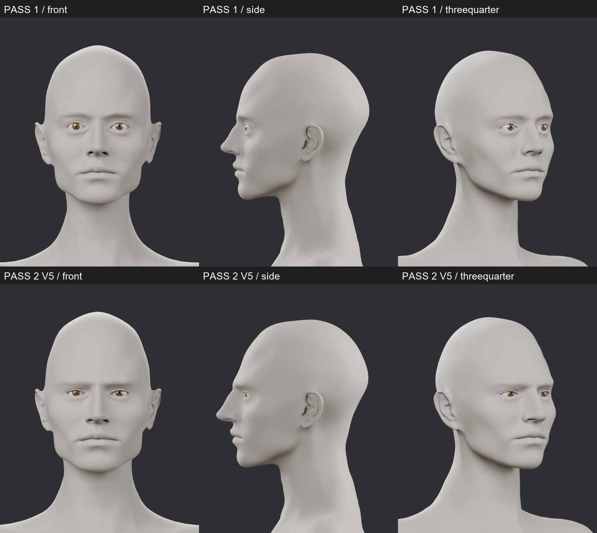

### Beden: Pass 1 / Pass 2 — ön, yan, 3/4

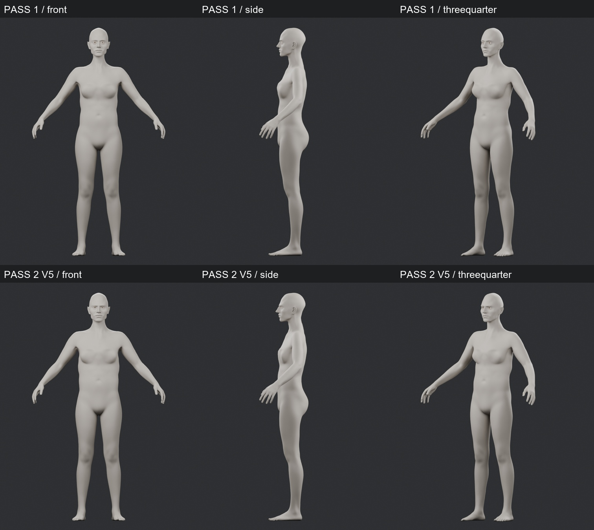

### Yüz: orijinal / Pass 1 / Pass 2 / ana konsept

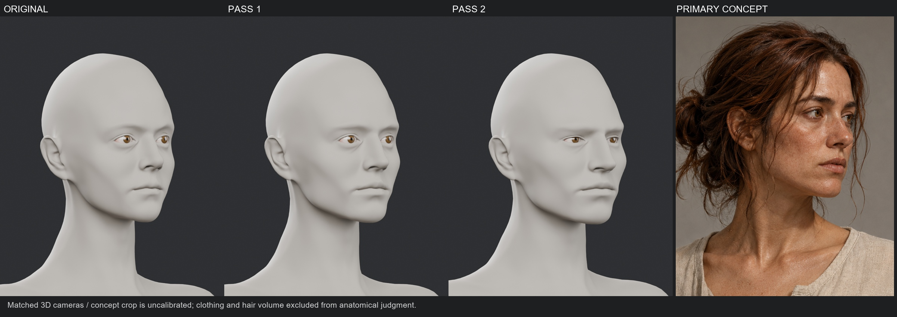

### Beden: orijinal / Pass 1 / Pass 2 / ana konsept

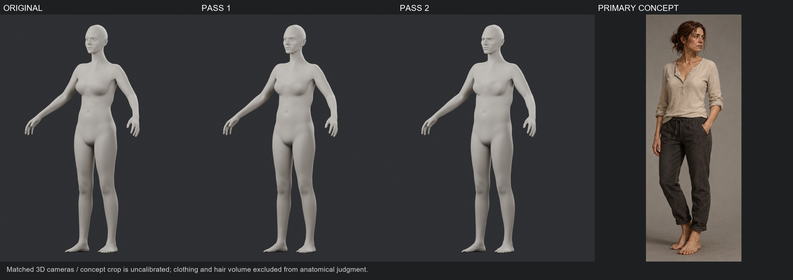

### Beş açıdan tam beden

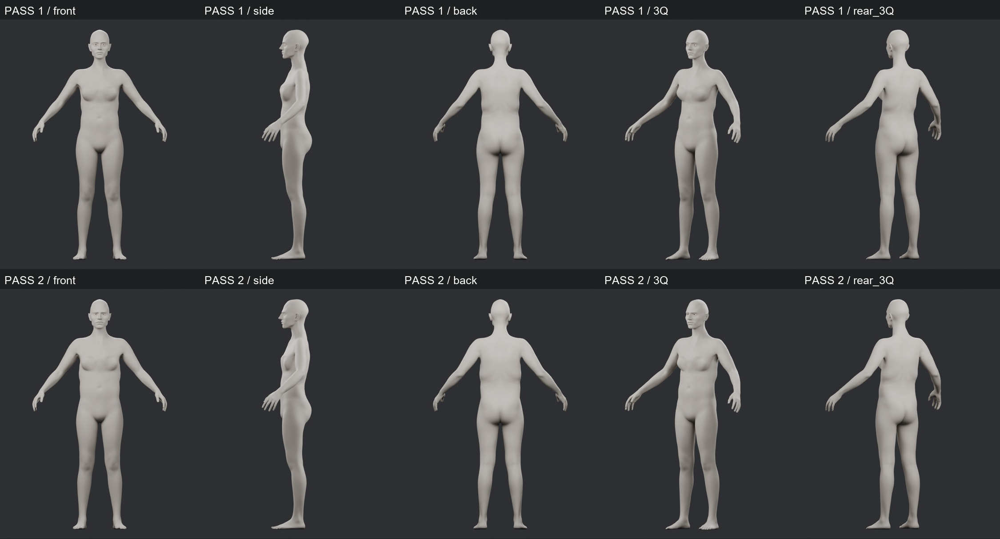

### Tamamen dokusuz kil yüz karşılaştırması

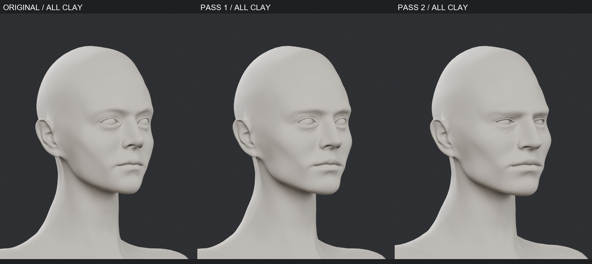

### Siyah silüet karşılaştırması

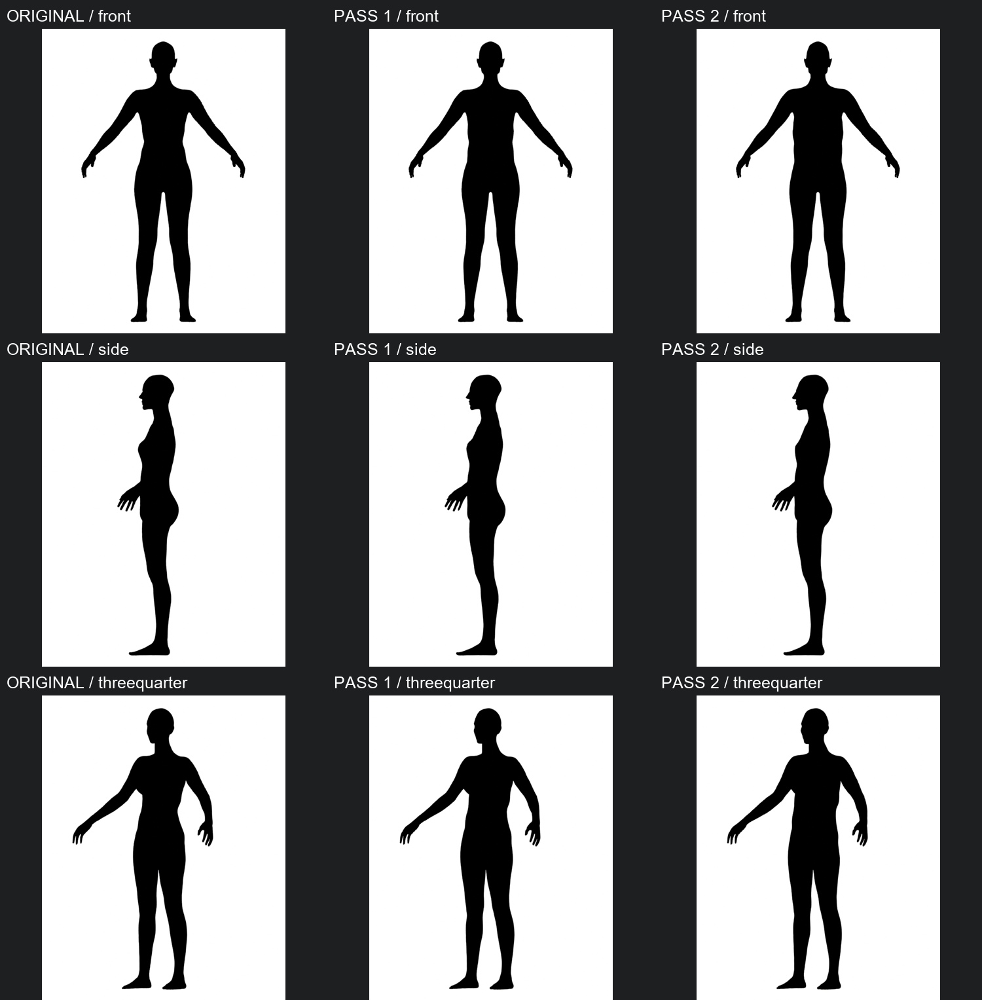

### Üç sürüm: idle / walk / run / crouch

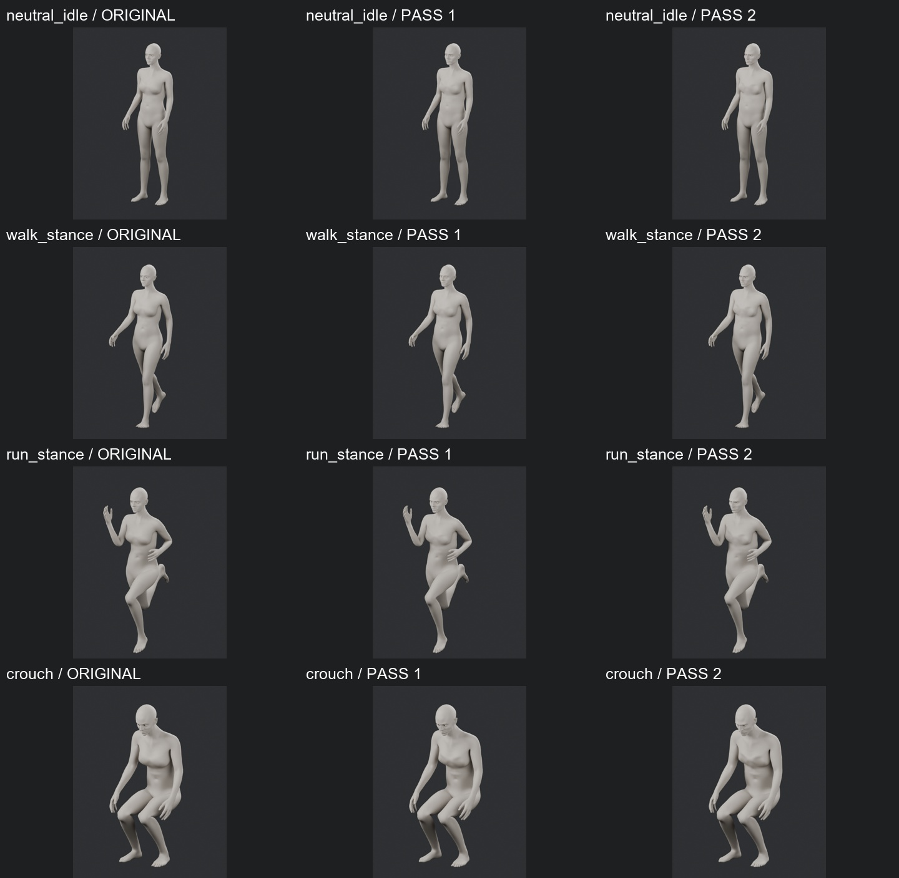

### Üç sürüm: omuz ve dirsek stres pozları

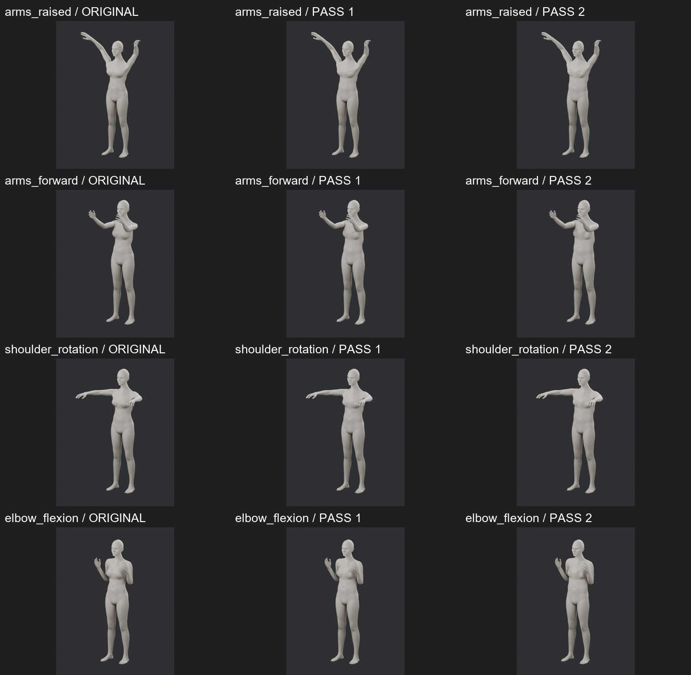

### Üç sürüm: kalça / geniş duruş / diz / gövde dönüşü

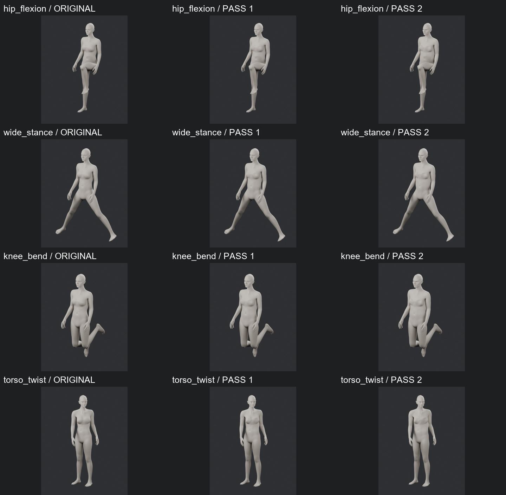

### Ham düzeltme anahtarları: blink / kaş / smile — PARTIAL

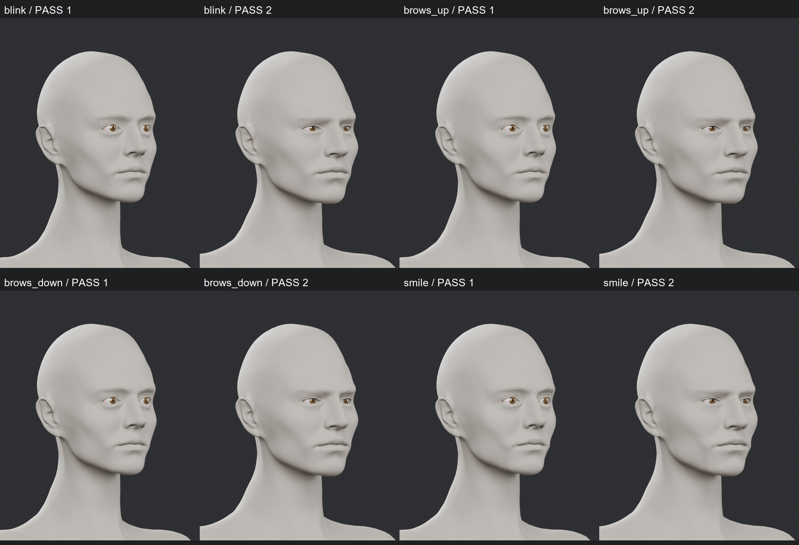

### Ham düzeltme anahtarları: ağız / jaw / purse / funnel — PARTIAL

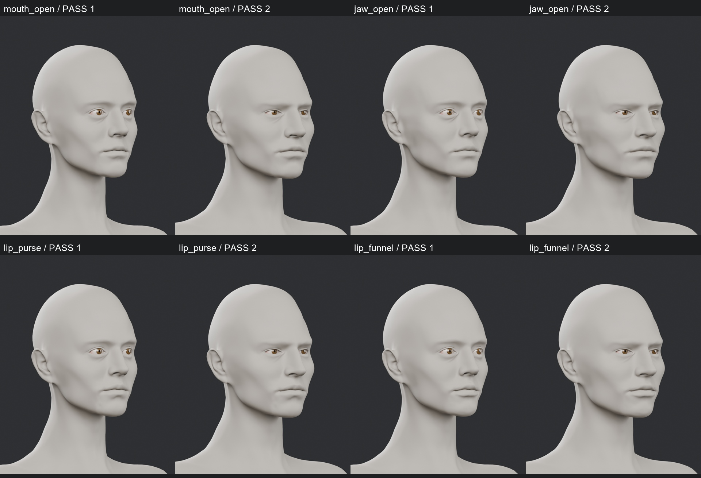
