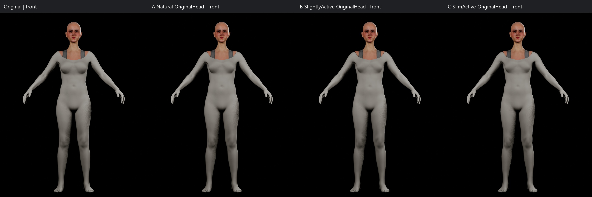
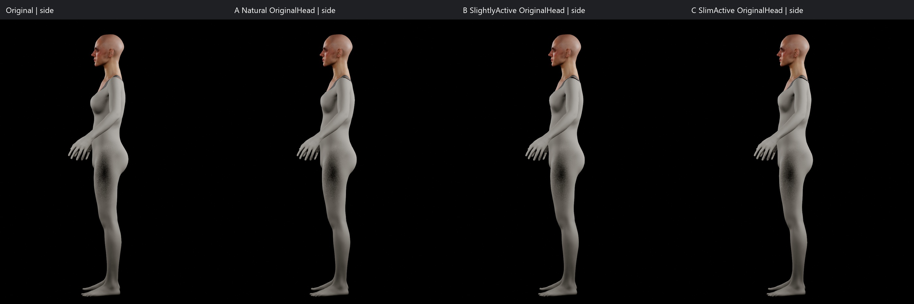
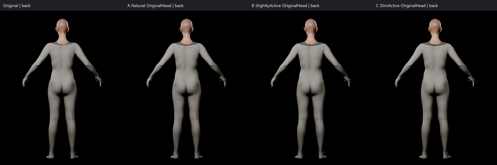
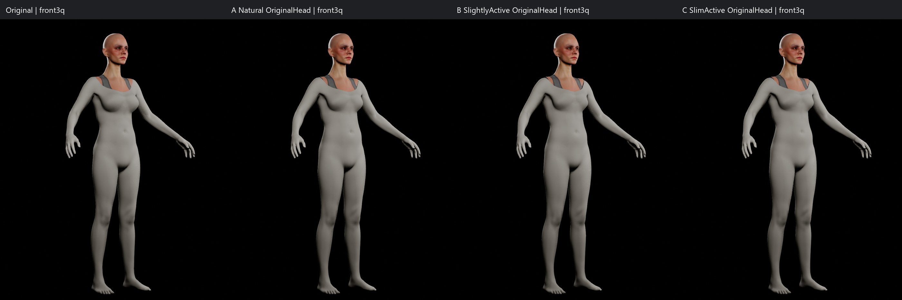
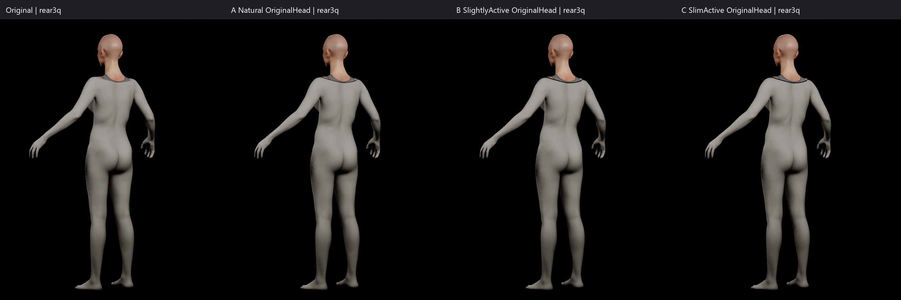
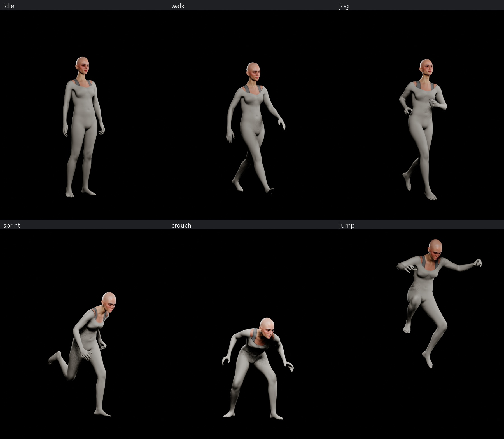
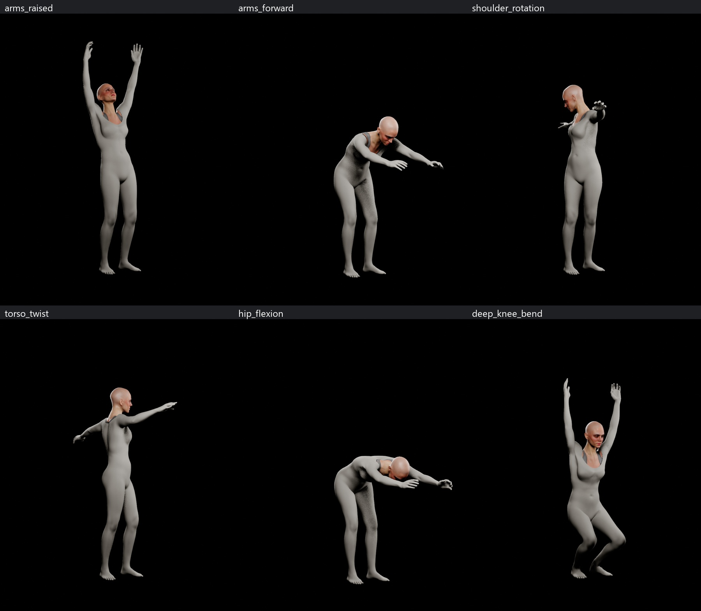

# Sphirus — Native beden adayları, özgün yüz korunması

**Sonuç: üretime kabul edilen yeni beden yok. Görev tamamlanmış sayılmıyor. Özgün kullanıcı MetaHuman’ı değiştirilmedi.**

Kaynak `/Game/Character/MainCharacter/MH_MainCharacter` kullanıldı. Önceki FinalIdentity, v5, ControlledLikeness ve ReferenceTarget denemeleri kimlik kaynağı olarak kullanılmadı. Çalışma yalnız `/Game/Sphirus/CharacterLab/NativeBody_20260928` altında ve kaydedilmeyen geçici QA dünyasında yürütüldü.

## Durum

| Kapı | Sonuç |
|---|---|
| BODY PROPORTIONS | PARTIAL — üç native aday üretildi; B yalnız görsel ön seçim |
| BODY DEFORMATION | PARTIAL — sınırlı LOD0 poz taraması yapıldı; birleşim ve kayıt sorunu çözülmedi |
| FACE IDENTITY | PRESERVED — kaynak ve özgün baş geometrisi aynen korunuyor |
| Yeni bedenin üretime alınması | YAPILMADI |
| Nötr baş/beden birleşimi | FAIL |
| Kaydedilmiş adayın geometri sürekliliği | FAIL |

FACE MODIFIED = NO (sanatsal işlem ve kaynak karakter açısından). Canlı native beden önizlemesinin başa yaydığı değişiklikler **reddedildi**; bu önizlemelere “yüz korundu” onayı verilmedi.

BLENDER BODY SCULPT = NO. CUSTOM BODY CONFORM = NO. PRODUCTION GAMEPLAY MODIFIED = NO. Head-Only Conform, yüz heykelleme, yüz rig yenileme, ifade kalibrasyonu, saç ve kıyafet üretimi yapılmadı.

## Beden adayları

Özgün toplam mesh boyu **173.401840 cm**. Native Height kısıtı 172.276337 cm; bu alanın değeri baş dahil ölçülen toplam boy ile aynı değildir. Boy, uzuv uzunlukları ve boyun kısıtları bilinçli olarak korunmuştur.

A: daha yumuşak, doğal doku; bel oyuntusu azaltıldı, pelvis geçişi ve uzuv hacimleri ölçülü dengelendi.

B: hafif aktif; bel/ribcage ve kol/bacak ilişkisi en dengeli görünen ön seçim. Üst gövde genişliği ve kas etkisi sınırlı tutuldu. Eski BodyE’nin +1.00 kaslı yönüne dönülmedi. Ancak teknik kapılar nedeniyle **final olarak seçilmedi**.

C: daha ince aktif; A/B’ye göre daha düşük doku ve uzuv hacmi. Bu görevin doğal ve sağlıklı beden hedefinde B kadar dengeli bulunmadı; fazla incelmeye devam edilmedi.

Karar eski referansları birebir kopyalamaya dayanmaz. Arka gövde native MetaHuman sisteminden gelir. Elle göğüs, sırt, kalça veya bacak modellemesi yapılmadı.

Tüm adayların yayımlanan ana karşılaştırmalarında **aynı özgün baş**, aynı kamera/FOV, aydınlatma, A-pozu ve kilitli LOD0 kullanıldı. Malzeme farkı: gövdede geçici QA kili, başta özgün malzemeler. Bu bir kıyafet veya skin üretimi değildir. Her kamera ayrı işte 180 kare bekletilerek çekildi; ilk toplu çekim yordamında tekrar eden açılar saptandı ve o görüntüler kabul kanıtı olarak kullanılmadı.

## Parametreler

Değerler editörden okunan native kısıtlardır. Çevre/uzunluk alanları cm; Fat, Muscularity ve Masculine/Feminine model parametreleridir. Pasif kısıtlar açıkça belirtilmiştir. Bunlar taramadan çıkarılmış kesin antropometrik ölçüler değildir.

| Native parametre | Özgün | A Doğal | B Hafif aktif | C İnce aktif |
|---|---:|---:|---:|---:|
| Height | 172.2763 | 172.2763 | 172.2763 | 172.2763 |
| Chest | 89.6431 | 88.8000 | 88.3000 | 87.8000 |
| Bust Span | 24.3738 | 24.3738 | 24.3738 | 24.3738 |
| Underbust | 70.6328 | 72.0000 | 72.0000 | 71.8000 |
| Waist | 66.2791 | 70.0000 | 69.0000 | 68.5000 |
| Rise | 76.4936 (pasif) | 76.5152 (pasif) | 75.9819 (pasif) | 75.7628 (pasif) |
| Inseam | 73.5379 | 73.5379 | 73.5379 | 73.5379 |
| Hip | 94.9479 | 94.5000 | 94.0000 | 93.0000 |
| High Hip | 76.3829 | 79.0000 | 78.5000 | 78.0000 |
| Neck Base | 31.8550 | 31.8550 | 31.8550 | 31.8550 |
| Neck | 35.6234 | 35.6234 | 35.6234 | 35.6234 |
| Thigh | 47.7672 | 49.0000 | 49.0000 | 48.0000 |
| Knee | 32.3069 | 32.3069 | 32.3069 | 32.3069 |
| Calf | 32.1902 | 33.0000 | 33.0000 | 32.4000 |
| Front Interscye Length | 32.3926 | 32.3926 | 32.3926 | 32.3926 |
| Upper Arm Length | 31.8361 | 31.8361 | 31.8361 | 31.8361 |
| Lower Arm Length | 25.1640 | 25.1640 | 25.1640 | 25.1640 |
| Bicep | 25.2761 | 26.0000 | 26.5000 | 25.7000 |
| Elbow | 20.8141 | 20.8141 | 20.8141 | 20.8141 |
| Wrist | 13.1187 | 13.1187 | 13.1187 | 13.1187 |
| Neck to Waist | 35.8855 | 35.8855 | 35.8855 | 35.8855 |
| Across Shoulder | 29.1234 | 29.3000 | 29.5000 | 29.3000 |
| Shoulder Height | 146.9647 (pasif) | 146.9759 (pasif) | 146.9195 (pasif) | 146.9922 (pasif) |
| Shoulder to Apex | 26.0964 | 26.0964 | 26.0964 | 26.0964 |
| Neck Length | 8.2943 | 8.2943 | 8.2943 | 8.2943 |
| Forearm | 20.4736 (pasif) | 20.7000 | 21.0000 | 20.6000 |
| Hand Circumference | 19.1273 | 19.1273 | 19.1273 | 19.1273 |
| Fat | 0.4052 | 0.2500 | 0.0500 | -0.1500 |
| Masculine/Feminine | 0.0313 | 0.1500 | 0.1500 | 0.1500 |
| Muscularity | -1.2010 | -0.6500 | -0.2500 | -0.3500 |

## Koruma ve engelleyici bulgular

1. Kaynak MetaHuman dosyası checkpoint ile SHA-256 düzeyinde **birebir aynı**. CharacterLab dışındaki 22.178 Content dosyasının boyut/tarih kayıtlarında fark yok. Bu ikinci denetim metadata karşılaştırmasıdır; tüm projenin içerik hash denetimi olarak sunulmuyor.
2. A/B/C’nin yüz katsayı hash’i, HeadScale, cilt/göz ayarları ve dışa aktarılan baş DNA hash’i özgün kopyayla aynı kaldı. `CommitFaceState` çağrılmadı.
3. Buna rağmen `SetBodyConstraints` ve `CommitBodyState`, kurulu UE 5.8 native uygulamasında `UpdateFaceFromBodyInternal` üzerinden canlı baş mesh’ini de güncelliyor. A’da 150 cm üstü baş örneklerinde maksimum **1.627589 mm**, B’de **1.669049 mm**, C’de **1.563675 mm** hareket ölçüldü. Arka kafa/boyunda render bozulmaları da gözlendi. Yalnız DNA hash eşitliği yüz geometrisi korunmuş demek değildir.
4. B’yi düzenleme sisteminden çıkarıp kaydedilmiş durumdan yeniden açmak başı birebir geri getiriyor; fakat beden mesh’ini de eski gövde DNA’sından tekrar yüklüyor. Yeniden açılan geometri hem başta hem bedende **0 mm fark** gösterdi; dolayısıyla bu işlem yeni bedenin kalıcı teslimi sayılamaz. Parametre kaydının varlığı tek başına geometri sürekliliği kanıtı değildir.
5. Özgün başı hiç değiştirmeden yeni B gövdesiyle birleştiren tanı kombinasyonunda, başlangıçta eşleşen **93 sınır örneği** için maksimum **6.792291 mm**, ortalama **4.575759 mm** birleşim farkı ölçüldü. Kemiklerin konumunun eşleşmesi bu yüzey açıklığını ortadan kaldırmaz.
6. Canlı native mesh rebuild sonrasında FBX normal sınırları vertex bölünmesine yol açtı; ham FBX vertex sırası/hash eşitliği iddia edilmedi. Malzeme+UV eşleştirmesinde **34.343/34.343 baş**, **32.334/32.334 beden** örneği eşleşti. Topoloji yeniden tasarlanmadı, UV elle değiştirilmedi. Geometri raporunda ham hash farkları saklandı.

Kurulu kaynak kodunda beden düzenleme UI akışı eski beden rig/DNA durumunu geçersiz kılıyor. Ancak gerekli `RemoveBodyRig` işlemi bu ortamın Python API’sinde dışa açık değil; UI’daki genel “Remove Face Rig” akışı yüz rig’ini de kaldırıyor. Bu yüzden yüzü koruma şartını aşarak rig silme/yeniden üretme, engine eklentisi değiştirme veya custom body conform uygulanmadı. Kaydedilmiş native beden durumu ile üretilmiş beden DNA/mesh önbelleğini tutarlı güncelleyen, yüzü ve birleşimi koruyan destekli işlem doğrulanmadan final kabul yapılamaz.

## Sınırlı deformasyon taraması

B’nin native oluşturulmuş gövde mesh’i + özgün baş ile Body ve Face PostProcess çalıştırıldı. Bu yalnız tanı kombinasyonudur; seçilmiş final değildir. Idle/walk native uyumlu kliplerden, jog/sprint/crouch/jump daha önce hazırlanmış QA retarget kliplerinin yeni tanı kopyalarından, bölgesel testler native BodyROM’dan alındı. Hiçbir kaynak animasyon veya gameplay animasyon mantığı değiştirilmedi.

| Örnek | Görsel gözlem / sınır |
|---|---|
| Idle | Belirgin büyük uzuv çökmesi görülmedi; birleşim kapısı açık |
| Walk | Tek yakalanan örnekte büyük kopma görülmedi; çevrim ve ayak teması onaylanmadı |
| Jog | Tek örnek; büyük kopma görülmedi |
| Sprint | Tek örnek; omuz/gövdeye dair tam çok-açılı kabul yok |
| Crouch | Gövde/koltuk altı sıkışması ve koyu gölgelenme; ek açılardan inceleme gerekli |
| Jump | Havada tek kare; iniş ve süreklilik test edilmedi |
| Arms raised | Kollar yukarı; gross kopma görülmedi, koltuk altı kapsamı sınırlı |
| Arms forward | İleri uzanma + gövde fleksiyonu; sıkışma ek inceleme gerektiriyor |
| Shoulder rotation | Tek ROM örneği; kopma görülmedi |
| Torso twist | Tek ROM örneği; kopma görülmedi |
| Hip flexion | Gövde/kalça fleksiyonu örneği; arka açı kabulü yapılmadı |
| Deep knee bend | **NOT_TESTED yeterli derinlikte:** 20.5 s ROM örneği kısmi diz bükümü gösterdi, derin squat değil |

Baş/beden `head` kemiği örneklerde sayısal tolerans içinde eşleşti. Bu yalnız kemik bağlantısı kontrolüdür; mesh birleşimi, bütün animasyon aralığı, diğer LOD’lar, ayak teması, gameplay veya facial expression sertifikasyonu değildir. Nötr birleşim başarısız olduğu için bu tarama final deformasyon kabulüne çevrilmedi.

## Görsel kanıt

Her sütunda aynı özgün yüz kullanılmıştır. Baş/beden birleşim sorunu gizlenmemiştir.

## Teslim / temizlik durumu

Orijinal karakter korunuyor. A/B/C parametre adayları ve tanı mesh’leri CharacterLab içinde tutuluyor; **hiçbiri üretim karakterinin yerine geçirilmedi**. QA sahnesi özgün baş/beden görüntüsüne geri alındı.

Geçmiş denemelerin silinmesi kullanıcı tarafından “işlem tamamlandıktan sonra” istendi. Kabul edilmiş son beden bulunmadığından bu koşul henüz sağlanmadı; eski denemeler silinmedi. Rapor ve kanıt yayımlanması işin tamamlandığı anlamına gelmez.

Sonraki teknik iş: desteklenen native beden rig/DNA güncelleme yolunu, özgün yüz korunması ve birleşim toleransıyla birlikte izole aday üzerinde doğrulamak. Yüzü değiştirerek, gizli bir custom conform uygulayarak veya kıyafetle açıklığı saklayarak kabul yapılmamalıdır.
