# Sphirus — Neutral Reference Identity / ara kontrol noktası

**Bu rapor tam görev kabulü değildir.** Son başarılı FinalIdentity başından devam edilerek beş yerel baş adayı üretildi; v5 düzenlenebilir inceleme adayı olarak saklandı. Benzerlik için henüz PASS verilmedi. Yeni Head-only Conform ve native MetaHuman gövde düzeltmesi bu turda çalıştırılamadı.

## Referans yetkisi

- Yeni Fotoğraf 1: önden, yüz geometrisinin birincil yapısal referansı.
- Yeni Fotoğraf 3: gerçek yan görünüş, yüz geometrisinin birincil yapısal referansı.
- Yeni Fotoğraf 2: bakır saçlı konsept, kimlik/yaş/ifade ve sanat yönünün birincil referansı.
- Önceki üretilmiş turnaround paftaları bu turu yönlendirmedi.

Fotoğraflar kalibre tarama değildir. Deplasmanlar gerçek eski/yeni mesh verisinden ölçüldü; fotoğraflardan kesin milimetre ölçüsü türetilmedi.

## Korunan başlangıç ve yeni dosyalar

Başlangıç: `Sphirus_FinalIdentity_EDITABLE.blend`, `SPH_FinalIdentity_Refinement`. Orijinale dönülmedi. Birebir dosya yedeği: `CHECKPOINT_FinalIdentity.blend`. Önceki kayıtlı Unreal karakteri ile rigli Head/Body paketleri ayrıca `checkpoint/UnrealSaved` altında hash eşleştirmeli kopyalandı. Bu, diskteki önceki kaydedilmiş durumu korur; erişilemeyen editörde bilinmeyen kaydedilmemiş değişikliklere ilişkin iddia değildir.

Yeni kaynaklar `SourceAssets/Characters/SphirusNeutralIdentity_20260928/` altında:

- `Sphirus_NeutralIdentity_EDITABLE.blend`: v5; yeni `SPH_Neutral_Reference_Identity` katmanı önceki katmana göre relatif.
- `Sphirus_NeutralIdentity_Neutral.blend`: yalnız baş hedefleri; inceleme adayı, sanatsal onay yerine geçmez.
- `HeadTargets/`: skin, iki göz ve diş FBX; kaynak vertex/polygon indeks eşlemeleri.
- `Sphirus_NeutralIdentity_v1`–`v5.blend`: iterasyonlar ayrı dosyalarda.

## Yapılan baş değişiklikleri

Tepe yüksekliği orbital çatının üzerinde yerel olarak azaltıldı; tüm baş ölçeklenmedi. Alın eğimi, lateral kranium ve şakak geçişi ayrı kontrol edildi. Göz kapaklarının dikey açıklığı/üst yayı artırıldı; göz küreleri ve dişler **0 mm** değişti. Kaş yayı ve glabella geçişi dengelendi.

Burun kökü derinliği, dorsum sürekliliği, uç yönü, alar bağlantı ve burun–üst dudak bağlantısı yeniden işlendi. İlk adayın fazla dışbükey sırtı reddedilip sonraki adaylarda düzeltildi. Yanak/infraorbital/maxilla desteği eklendi. Ağız köşeleri ve lateral dudak dokusu gevşetildi; cupid yayı ve alt dudak eğrisi düzenlendi. Alt çene konturu kısaltılıp çene ucu yuvarlatıldı. Üst boyun desteği artırılırken birleşim bölgesi sabit tutuldu.

Değişiklikler mevcut vertex konumlarında, yerel deformasyon alanları ve sınırlı yüzey yumuşatmasıyla yapıldı. Retopoloji, weld, UV düzenleme veya modifier uygulaması yok.

## Sanatsal değerlendirme — neden hâlâ PARTIAL

Ön, iki gerçek yan ve iki 3/4 görünüş incelendi. Kranyum/yüz dengesi, göz açıklığı ve alt yüz geçişinde görünür ilerleme var. Bununla birlikte burun ucu/alar akışı hâlâ referans kadar organik değil; ağız çevresinde yatay bant ve köşe sertliği sürüyor. Yanak–burun–ağız ritmi hâlâ yer yer generic MetaHuman karakteri taşıyor. **“Aynı kadın artık elde edildi” denmiyor.** Teknik doğruluk bu sanatsal eksikleri kapatmıyor. Sonraki çalışma v5 veya daha iyi karşılaştırılmış devam adayı üzerinden yapılmalı; rastgele yeni bir yüzle başlanmamalı.

## Ölçülen değişim ve koruma

Tüm baş vertexleri: maksimum **14.000239372 mm**, ortalama **1.779297709 mm**. En büyük değişim kranyum tepesindedir. Bölgeler örtüşebilir:

| Bölge | Maksimum mm | Ortalama mm |
|---|---:|---:|
| cranium | 14.000239 | 7.224524 |
| nose | 3.295494 | 2.162424 |
| mouth | 2.852853 | 1.661296 |
| midface_cheeks | 2.671515 | 1.607591 |
| jaw_chin | 3.980578 | 2.176917 |
| eyes_brow | 2.503366 | 1.240860 |
| neck_interface | 0.000000 | 0.000000 |

Topoloji, vertex/edge/polygon/loop sırası, UV, ağırlıklar, kaynak eşleme ve armature rest matrisleri korunmuştur. Önceki **866** baş anahtarının verisi aynı; yalnız yeni katman eklendi. Blender BODY tüm imzasıyla aynı, **0 mm**; yeni BODY anahtarı yok.

Nötr geometri: 64094 üçgen; yeni dejenere üçgen 0, ters normal yönüne dönen üçgen 0. 93 baş/gövde eşleme çiftinde maksimum fark **0.000242561 mm**, önceki tolerans korunuyor.

**Yükseklik değişti:** eski Blender referans birleşik yüksekliği yaklaşık 173.40184 cm; yeni yerel kranyum düzeltmesiyle **172.00183105 cm**. Gövde veya nesne ölçeği değişmedi; yaklaşık 1.4 cm fark baş tepesinden kaynaklanıyor. Bu, native MetaHuman son yüksekliği değildir. Native HeadScale yeniden hesaplanıp sonuç görüldükten sonra yaklaşık 173.4 cm hedefi yalnız temiz native Height kontrolüyle değerlendirilmeli; yüzü eski yüksekliğe geri germek doğru değildir.

## Ham ifade güvenlik ekranı — kalibrasyon değil

Yalnız önceki sekiz ham Blender corrective probu tekrarlandı. Hiçbir eski ifade anahtarı değiştirilmedi; QA destek eğrisi veya kalıcı ifade düzeltmesi yapılmadı. Bu anahtarlar RigLogic/joint sürüşü olmadan tam ifadeyi üretmez: örneğin blink probu tam göz kapağı kapanışını doğrulamıyor.

| Ham prob | Öncekine göre ek ters üçgen | Yeni probda toplam ters üçgen |
|---|---:|---:|
| blink | 0 | 7 |
| brows_up | 0 | 0 |
| brows_down | 0 | 0 |
| smile | 0 | 6 |
| mouth_open | 0 | 0 |
| jaw_open | 0 | 0 |
| lip_purse | 0 | 10 |
| lip_funnel | 0 | 13 |

Ek ters üçgen bulunmaması; kapak teması, dudak teması veya final RigLogic başarısı anlamına gelmez. Kalıcı ifade kalibrasyonu son kullanıcı talebi doğrultusunda ayrı aşamaya bırakıldı. Önceki funnel/wide ağız sorunları çözülmüş sayılmıyor.

## FBX dışa aktarım / geri okuma

Skin 24.414, her göz 802, diş 4.613 vertex. Tam referans baş 34.657 vertex. Bütün beş dosyada topoloji/loop vertex sırası aynı, UV farkı **0**. Maksimum dünya konumu geri okuma farkı **0.000120769102 mm**. Ölçek/orientasyon mevcut kanıtlanmış FBX ayarlarıyla korundu. BODY dışa aktarılmadı.

## Unreal erişim engeli ve Conform durumu

Editör çalışıyordu; pencere ilk gözlemde minimizeydi. Etkinleştirme `GetCursorPos failed: Erişim engellendi (0x80070005)` verdi. Pencere yeniden bulunup bir kez daha denendi; aynı hata sürdü. Kullanıcıya yerel oturumu açık ve Unreal'ı görünür bırakması için soru iletildi. Python remote execution mevcut ayarda kapalı; bunu açmak için güvenlik/bağlantı ayarı değiştirilmedi.

**Yeni Conform çalıştırılmadı. Yeni HeadScale yok. Yeni DNA/RigLogic yok.** Önceki `HeadScale=1.0675376653671265`, önceki 24.408/24.408 UV başarısı ve önceki seam sonucu yalnız tarihsel kanıttır; v5'e taşınmış bir PASS değildir. Aynı Head Only + UV matching + gözler/dişler + ROTATION_TRANSLATION + native neck adaptation adımları yeni sürüm araçlarına hazırlandı, fakat çalıştırılmış gibi sunulmuyor. Yeni başın sanat kontrolü de henüz tam kabul edilmedi.

## Native MetaHuman gövde

Bu turda native parametre **uygulanmadı**. Kayıtlı önceki değerler: Fat −0.90, Muscularity +1.00, Masculine/Feminine +0.35; önceki native toplam yükseklik yaklaşık 173.369354 cm. Bunlar yeni sanat yönünün kabul edilmiş cevabı değildir.

Erişim açıldığında düşük kaslı/yeniden yumuşak doku içeren adaylar mevcut native gövdeden karşılaştırılmalı; üst kol/uyluk/baldır kontrollü azaltılmalı, omuz genişletilmemeli, native sırt korunmalıdır. Hazırlanmış A/B sayısal denemeler **uygulanmamış öneridir** ve görüntüyle seçilmedikçe final parametre sayılamaz. Blender gövdesi üretim çözümü olarak kullanılmadı.

Yeni native body veya Unreal poz testi yok. Önceki LOD0 pose PASS bu yeni görevin BODY DEFORMATION kabulü yerine geçmez.

## Güvenlik ve açık durum

2706 önceki dosya hash ile aynı; 86 üretim paketi hash ile aynı; 5420 korunan gameplay dosyasında boyut/zaman farkı yok. Üretim karakteri aynı. Bu turda Unreal asset yazımı, gameplay/locomotion/kamera/input/level değişikliği yapılmadı. Saç, kıyafet ve materyal üretimi yok. Canlı editör dirty-package son kontrolü erişim nedeniyle NOT_TESTED; dosya kontrolü bunun yerine sunulmuyor.

| Kabul alanı | Durum | Kapsam |
|---|---|---|
| FACE SHAPE | **PARTIAL** | Yeni baş adayı daha dengeli; aynı kişi benzerliği henüz kabul edilmedi. |
| METAHUMAN CONFORM | **PARTIAL** | Önceki yöntem başarılı; yeni baş için NOT_RUN. |
| FACIAL DEFORMATION | **PARTIAL** | Kalıcı düzeltme bu tur dışında; yeni RigLogic testi yok. |
| BODY PROPORTIONS | **PARTIAL** | Yeni native yön uygulanmadı/görsel olarak seçilmedi. |
| BODY DEFORMATION | **PARTIAL** | Yeni native gövde/poz testi yok. |

Bu bir korunmuş ara kontrol noktasıdır; tüm görevin bittiği veya kullanıcının son kabul koşullarının sağlandığı iddia edilmiyor.

## Karşılaştırma kanıtları

Aşağıdaki model görüntüleri gerçek Blender geometrisi renderlarıdır. Önceki/yeni çiftleri aynı kamera ve ışık kullanır. Referans paftalarında yalnız orantılı 2D ölçekleme, kırpma, kaydırma ve etiketleme var; model görüntüsüne AI rötuşu yok. Hizalama panoları göz hattı/boyut karşılaştırması için görsel yardımcıdır, kalibre çekim veya kesin ölçüm değildir. Yeni Unreal görüntüsü yok.

### NEUTRAL IDENTITY | front

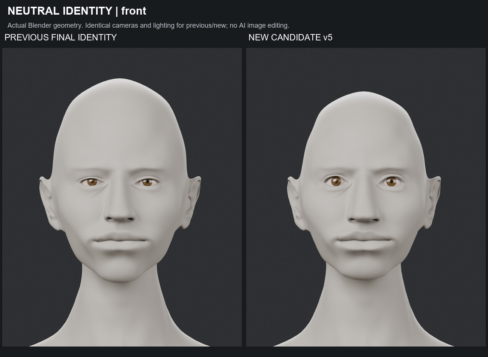

### NEUTRAL IDENTITY | left_side

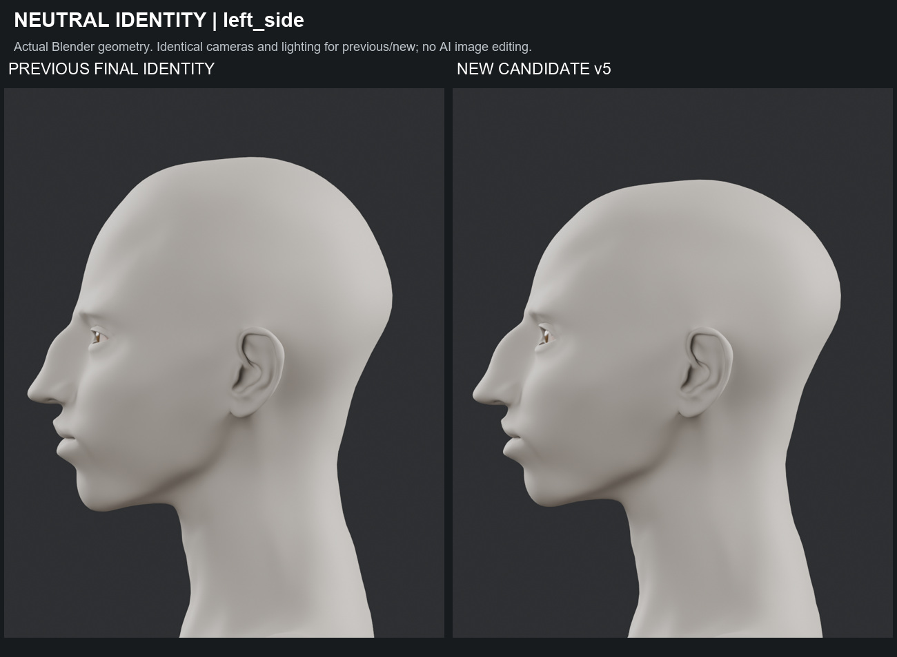

### NEUTRAL IDENTITY | right_side

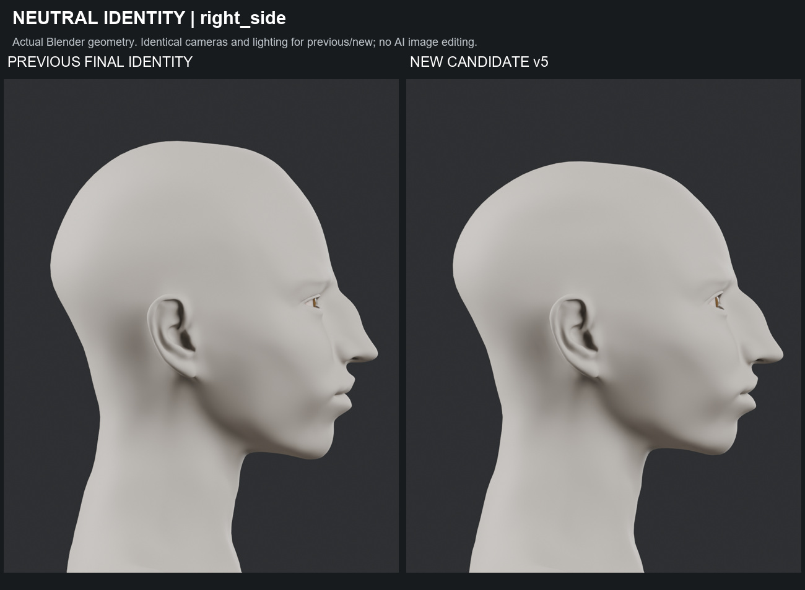

### NEUTRAL IDENTITY | left3q

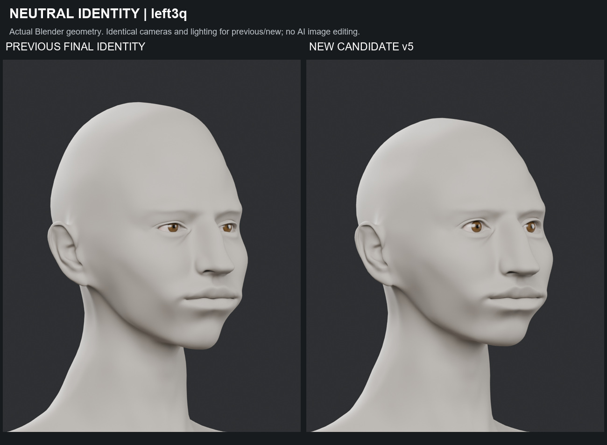

### NEUTRAL IDENTITY | right3q

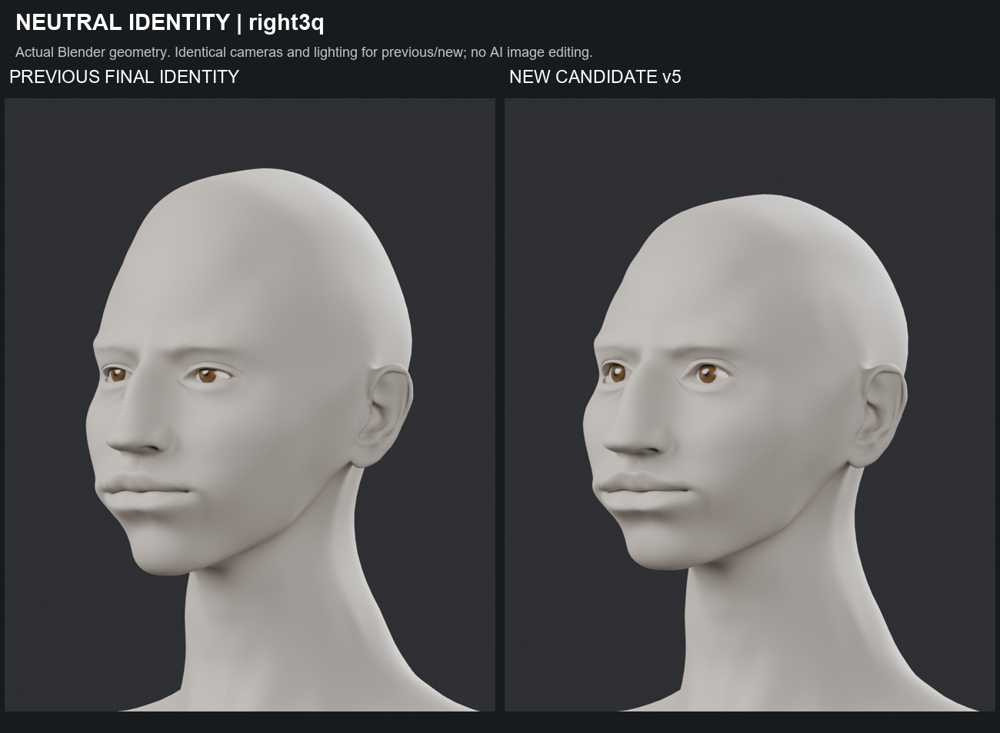

### STRUCTURAL REFERENCE | front

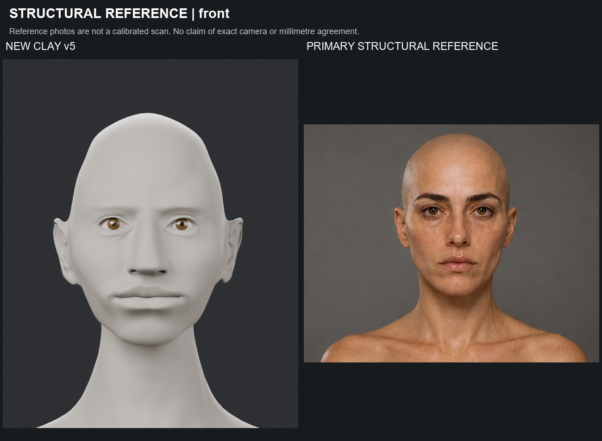

### STRUCTURAL REFERENCE | left_side

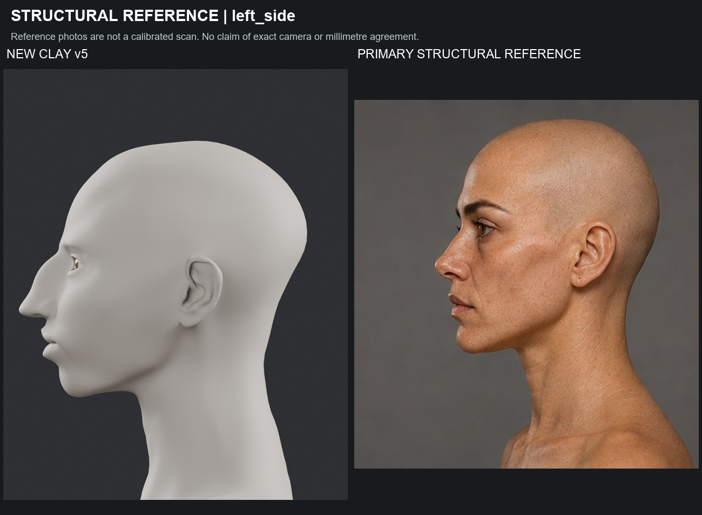

### Previous / new / reference — front alignment aid

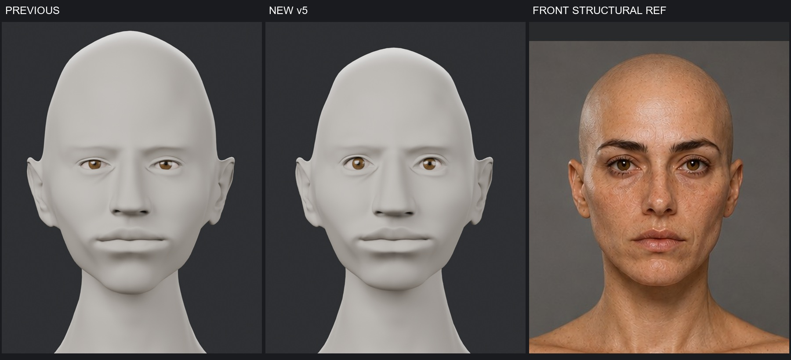

### Previous / new / reference — side alignment aid

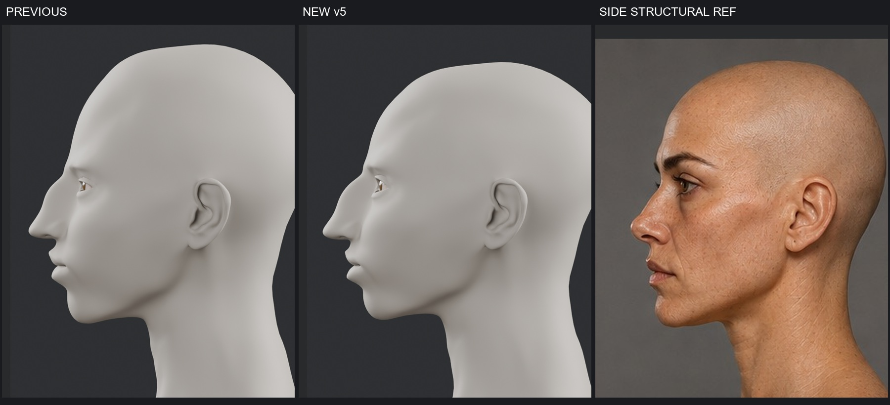

### ART DIRECTION | Concept comparison

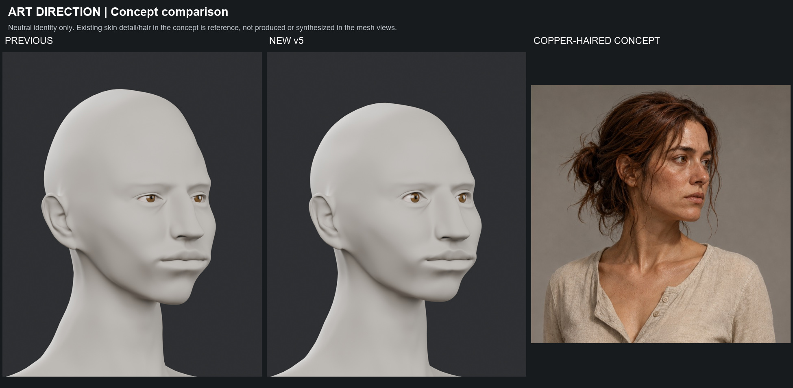

### DETAIL | nose_profile

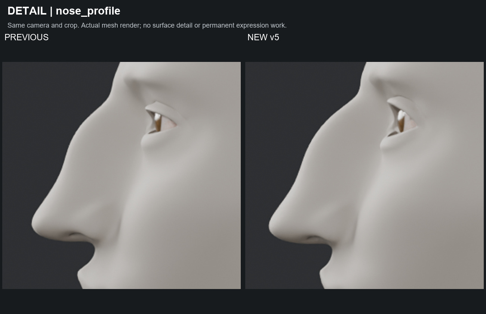

### DETAIL | mouth

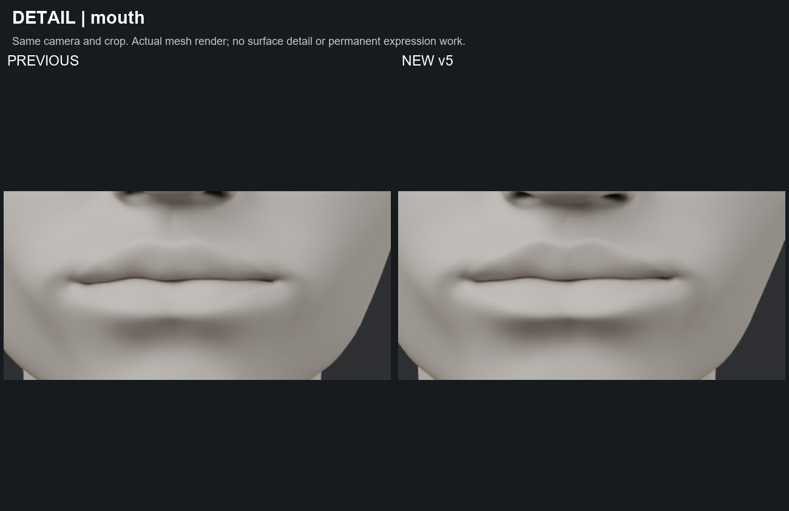

### DETAIL | midface

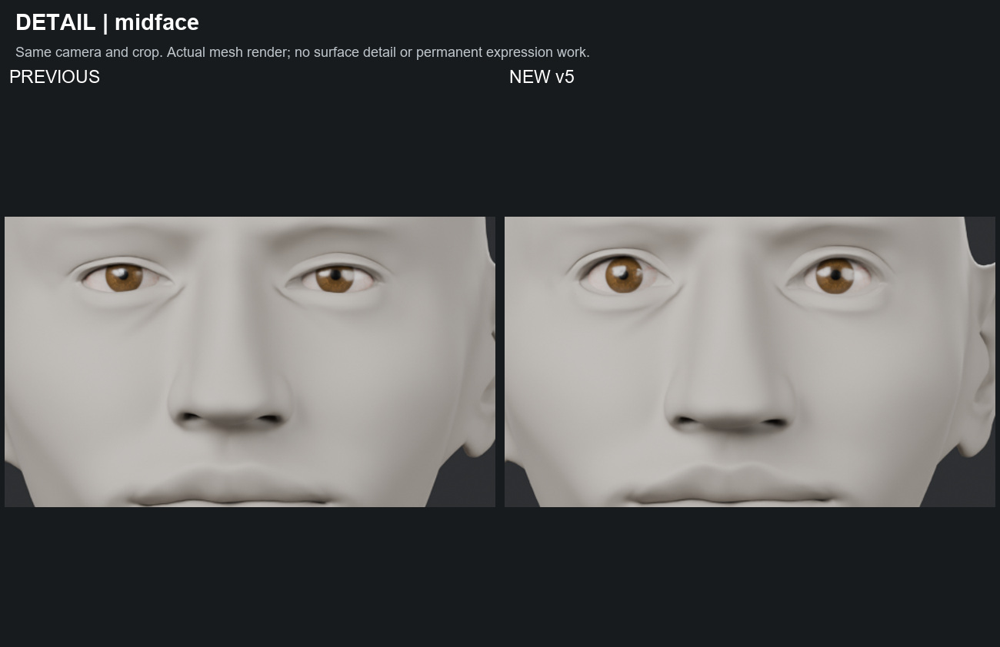

### HISTORY | Preserved identity progression

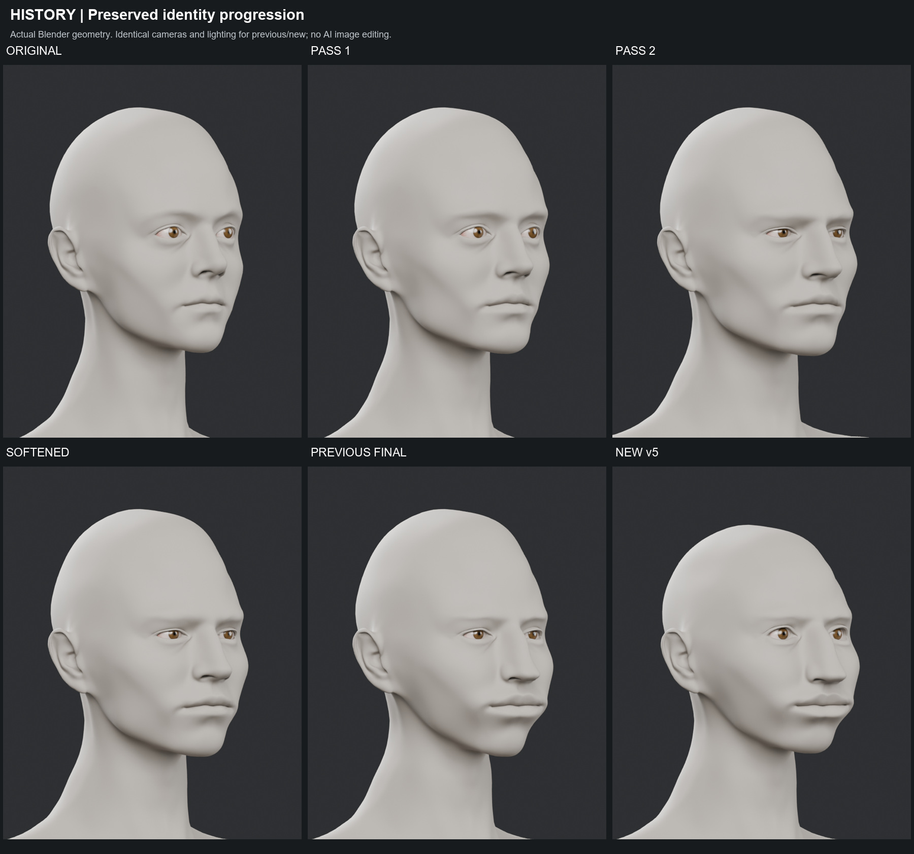

## Teknik kayıtlar

- [head_validation.json](head_validation.json)
- [v5_change_metrics.json](v5_change_metrics.json)
- [region_displacement.json](region_displacement.json)
- [head_fbx_roundtrip.json](head_fbx_roundtrip.json)
- [preservation_final.json](preservation_final.json)
- [saved_unreal_checkpoint.json](saved_unreal_checkpoint.json)
- [visual_review.json](visual_review.json)
- [unreal_access_blocker.json](unreal_access_blocker.json)
- [boards_manifest.json](boards_manifest.json)
- [delivery_hashes.json](delivery_hashes.json)

[Önceki FinalIdentity raporu](../character-final-identity-2026-09-28/TEKNIK_RAPOR.md)
