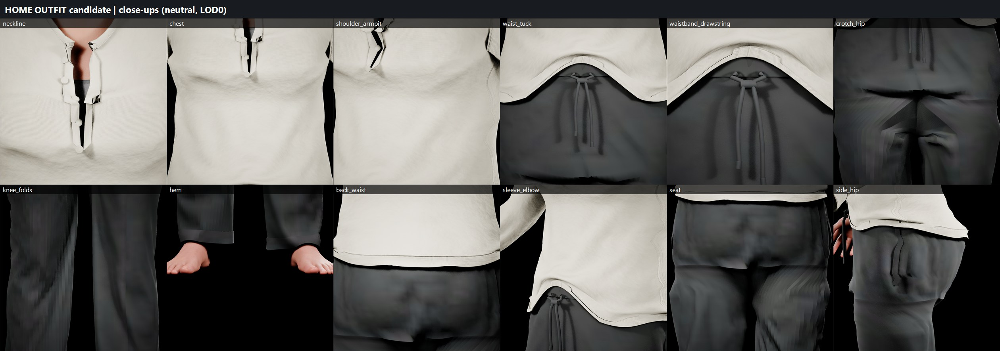
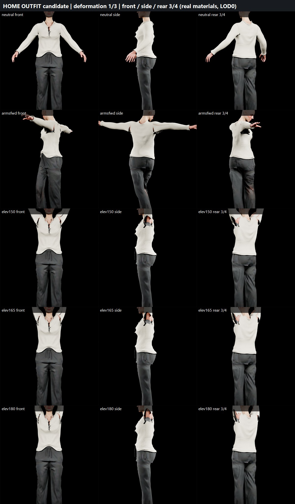
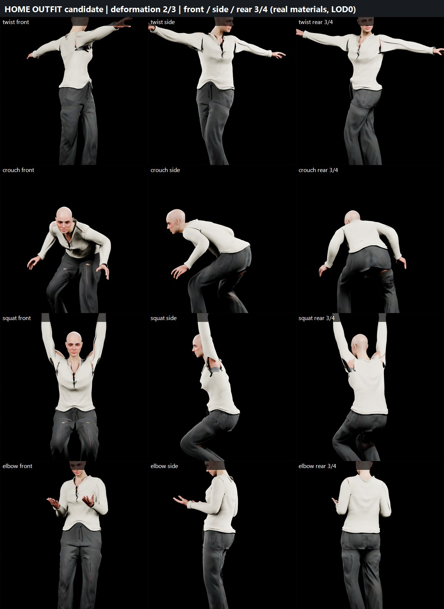
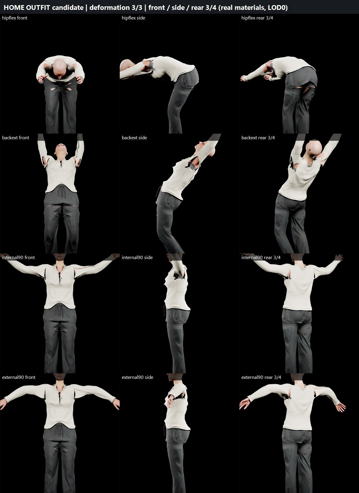
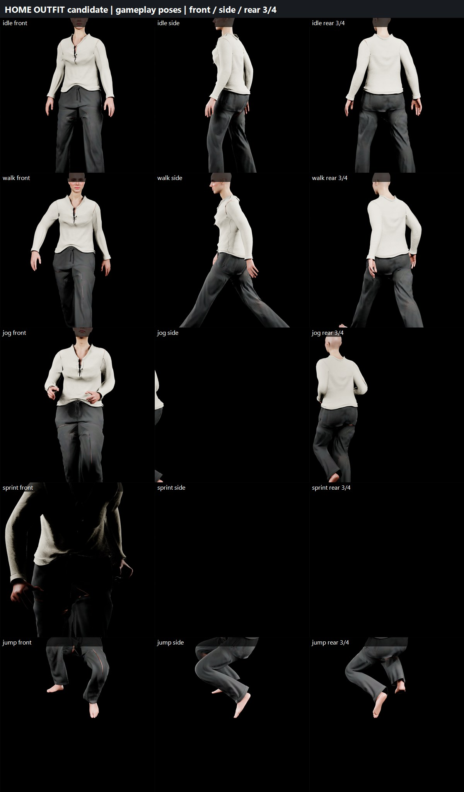
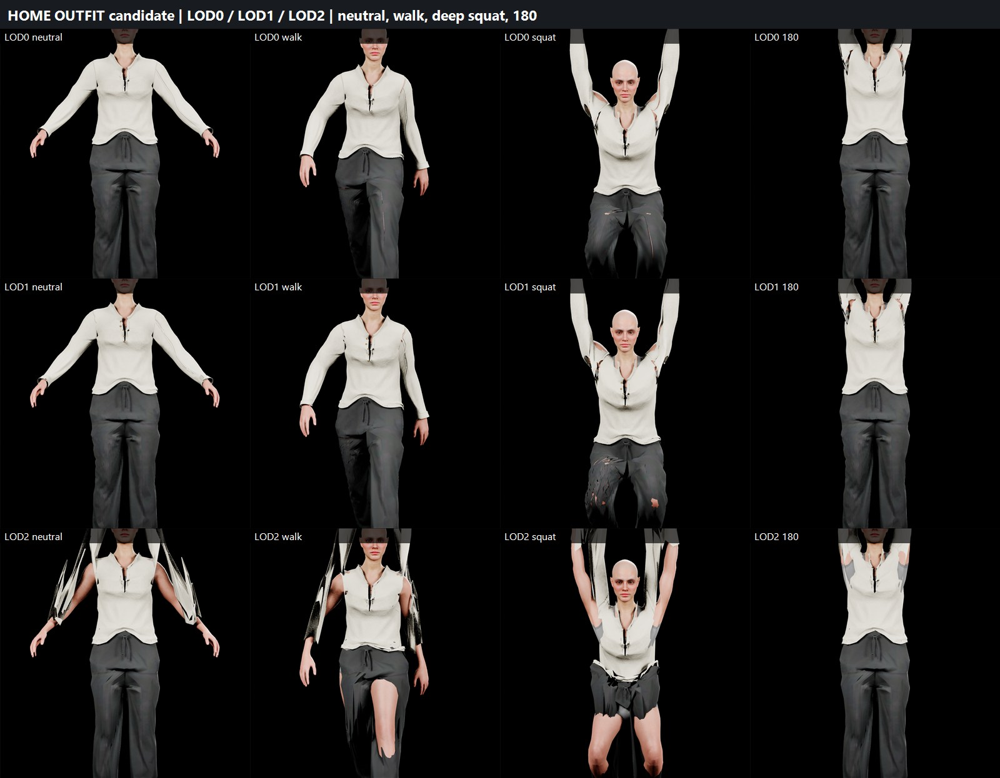
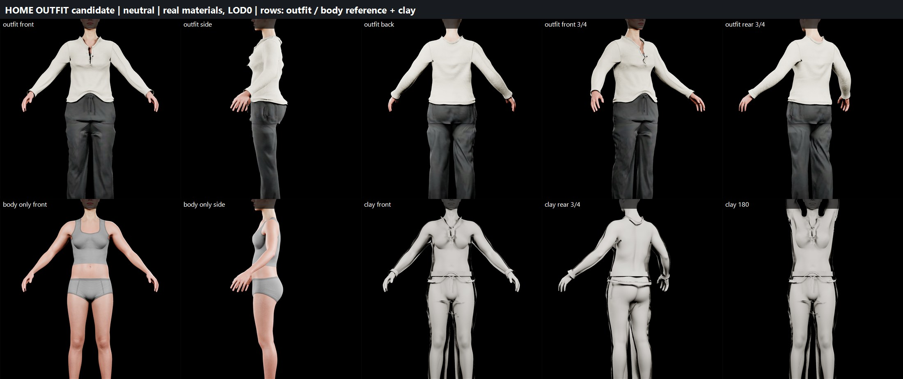
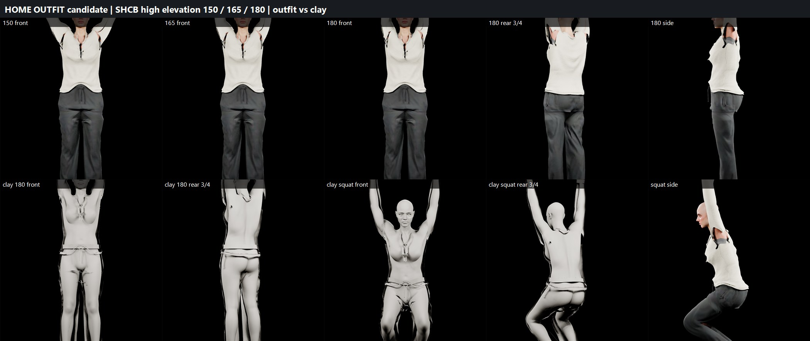

# SPHIRUS first production outfit candidate: home / everyday (2026-09-29)

Candidate: `/Game/Sphirus/CharacterLab/Outfit_Home_20260929/` (`SKM_Home_Henley`, `SKM_Home_Trousers`, `Materials/M_SPH_Textile` + 6 instances, `Textures/`). Not promoted; the production character `MH_MainCharacter` and its outfit asset are untouched.

Reference: the supplied clothing image (ivory Henley, charcoal drawstring trousers, barefoot) used for garment language only.

## Garment construction (Blender 5.2, `Tools/OutfitHome_20260929/blender_outfit_build.py`)
Pattern logic, not body inflation: the Henley is a front/back body shell (rings about the torso sections + ease) closed over a shared shoulder seam, with a round neck opening, centre-front placket slit and set-in sleeve tubes; the trousers are a waistband + hip shell joined to two leg tubes along a sagittal crotch seam. Ease: chest +10, waist +14, hem +20 (over the trousers), sleeve +12.5 -> cuff +3 cm; trousers waistband +7 (soft, drawstring), hip +12, thigh +13, hem 47 cm straight leg.
Drape: Blender cloth (trousers mass 0.10 / tension 60 / bend 2.5; Henley mass 0.3 / tension 30 / bend 1.5), body collision against the exact current BR neutral body (BR_Neutral applied), trousers as a second collider for the shirt, pinned neckline / shoulder seam (0.3) / knit cuffs / tucked centre front / waistband; 90 frames; post-sim Laplacian relax; then construction details built on the settled cloth (neck binding, placket strips, 5 buttons with holes, cuffs, hems, waistband double layer with gathers, eyelets, drawstring with knot and two hanging ends, side-seam pocket welts).
Body facts used: crotch z 76.5 cm, armpit z 128.1 cm, shoulder joint [16.212895851824065, -0.19856183407911526, 137.4996952244736].
- henley: 8573 verts / 16152 tris exported (LOD0); rest clearance to the body min 0.25 cm, p5 0.72, median 1.56, penetrating verts 0.
- trousers: 13687 verts / 19876 tris exported (LOD0); rest clearance to the body min 0.63 cm, p5 0.74, median 1.41, penetrating verts 0.
Thickness: main panels single layer (two-sided material); binding, placket, cuffs, hems, waistband boxed 0.16-0.22 cm; buttons 0.22 cm; cord radius 0.3 cm.

## Unreal assets
- `/Game/Sphirus/CharacterLab/Outfit_Home_20260929/SKM_Home_Henley.SKM_Home_Henley`: LOD0 [8573, 16151] (verts, tris), LOD1 (Blender decimate 50 %) [4442, 8075], engine LOD2; LOD0 16151 tris, 9861 verts / LOD1 8075 tris, 4992 verts / LOD2 1820 tris, 1610 verts; bones 342, unweighted verts 0 (LOD1 0); slots ['M_Henley', 'M_Henley_Trim', 'M_Buttons']; rejected non-manifold triangles 1.
- `/Game/Sphirus/CharacterLab/Outfit_Home_20260929/SKM_Home_Trousers.SKM_Home_Trousers`: LOD0 [13687, 19876] (verts, tris), LOD1 (Blender decimate 50 %) [7797, 9937], engine LOD2; LOD0 19876 tris, 14577 verts / LOD1 9937 tris, 8172 verts / LOD2 2483 tris, 2474 verts; bones 342, unweighted verts 0 (LOD1 0); slots ['M_Trousers', 'M_Trousers_Trim', 'M_Trousers_Trim', 'M_Drawstring']; rejected non-manifold triangles 0.
Skin weights: authored offline (closest point on the BR body -> barycentric blend of the body's own weights, 2 smoothing passes, 8 influences) and written per vertex; skeleton = the isolated ShoulderFix `metahuman_base_skel` copy, bind pose = the body mesh bind (`use_mesh_bone_proportions`). The garments follow the body through leader-pose (no own animation, no PostProcess ABP); the SHCB helper bones are inherited through `upperarm_out` weights. Chaos Cloth: not used (skinned garments; see the deformation section).
Materials: `M_SPH_Textile` (Cloth shading model, two-sided, MaterialAttributes): unique 2048 BaseColor / Normal / Roughness-AO per garment + tiling weave detail normal (jersey knit for the Henley, twill for the trousers, angle-corrected blend), tint, roughness multiplier, fuzz colour, cloth amount. Instances: MI_Home_Henley, _Henley_Trim, _Trousers, _Trousers_Trim, _Drawstring, _Buttons. Textures 8 (6 x 2048 unique, 2 x 512 tiles).
UVs: rectangular islands per panel (front/back torso, sleeves, binding, placket, cuffs, hem, buttons; hip front/back, legs, band, welts, hems, cord, crotch), 0.7 mm/px at 2048; seam stitch rows drawn along island borders in the unique maps.

## Body clearance / deformation (captured UE geometry: real skinning + BR morph + SHCB, garment vs body+head BVH)
### Deformation poses
| pose | Henley pen. verts (max cm) | Henley clearance p5 / median | stretch p99 | Trousers pen. verts (max cm) | Trousers clearance p5 / median | stretch p99 | shirt inside trousers |
|---|---|---|---|---|---|---|---|
| neutral | 0 (0.0) | 0.728 / 1.756 | - | 0 (0.0) | 0.744 / 1.453 | - | 2241 (2.01) |
| armsfwd | 1 (0.276) | 0.679 / 1.776 | 1.573 | 5 (0.473) | 0.709 / 1.432 | 1.186 | 2569 (2.973) |
| elev150 | 1 (5.609) | 0.701 / 1.778 | 1.927 | 0 (0.0) | 0.744 / 1.453 | 1.0 | 2241 (2.01) |
| elev165 | 1 (5.305) | 0.697 / 1.768 | 2.013 | 0 (0.0) | 0.744 / 1.453 | 1.0 | 2241 (2.01) |
| elev180 | 3 (6.751) | 0.688 / 1.753 | 2.069 | 0 (0.0) | 0.744 / 1.453 | 1.0 | 2241 (2.01) |
| twist | 2 (4.477) | 0.686 / 1.765 | 1.607 | 1 (0.106) | 0.715 / 1.433 | 1.216 | 2536 (2.998) |
| crouch | 23 (6.263) | 0.637 / 1.679 | 1.363 | 69 (0.875) | 0.589 / 1.427 | 1.529 | 148 (2.963) |
| squat | 23 (6.105) | 0.584 / 1.78 | 2.166 | 51 (1.168) | 0.582 / 1.411 | 1.457 | 0 (0.0) |
| elbow | 75 (1.322) | 0.604 / 1.665 | 1.313 | 0 (0.0) | 0.734 / 1.465 | 1.122 | 2412 (2.482) |
| hipflex | 15 (6.122) | 0.586 / 1.765 | 2.194 | 130 (2.17) | 0.64 / 1.426 | 1.425 | 1789 (2.967) |
| backext | 23 (6.261) | 0.586 / 1.766 | 2.2 | 7 (0.244) | 0.707 / 1.45 | 1.209 | 1726 (2.999) |
| internal90 | 0 (0.0) | 0.7 / 1.778 | 1.475 | 0 (0.0) | 0.744 / 1.453 | 1.0 | 2241 (2.01) |
| external90 | 0 (0.0) | 0.7 / 1.778 | 1.485 | 0 (0.0) | 0.744 / 1.453 | 1.0 | 2241 (2.01) |

### Gameplay poses
| pose | Henley pen. verts (max cm) | Henley clearance p5 / median | stretch p99 | Trousers pen. verts (max cm) | Trousers clearance p5 / median | stretch p99 | shirt inside trousers |
|---|---|---|---|---|---|---|---|
| idle | 56 (4.278) | 0.69 / 1.742 | - | 0 (0.0) | 0.748 / 1.458 | - | 2540 (2.832) |
| walk | 54 (6.688) | 0.696 / 1.738 | 1.199 | 0 (0.0) | 0.726 / 1.449 | 1.126 | 1839 (2.984) |
| jog | 70 (6.439) | 0.638 / 1.67 | 1.297 | 5 (0.172) | 0.703 / 1.451 | 1.268 | 2619 (2.983) |
| sprint | 68 (7.24) | 0.647 / 1.713 | 1.349 | 13 (0.554) | 0.688 / 1.438 | 1.292 | 2879 (2.995) |
| jump | 0 (0.0) | 0.667 / 1.709 | 1.55 | 11 (0.502) | 0.452 / 1.413 | 1.475 | - (-) |

### LOD1 / LOD2: NOT_TESTED (no evaluation file)
### Neutral
| pose | Henley pen. verts (max cm) | Henley clearance p5 / median | stretch p99 | Trousers pen. verts (max cm) | Trousers clearance p5 / median | stretch p99 | shirt inside trousers |
|---|---|---|---|---|---|---|---|
| neutral | 0 (0.0) | 0.728 / 1.756 | - | 0 (0.0) | 0.744 / 1.453 | - | 2241 (2.01) |

## SHCB compatibility (ShoulderFix helper bones inherited through body weights; SHCB itself untouched)
150 deg elevation: clean, the shoulder seam rides up with the SHCB clavicle/upperarm_out motion, no inside-out cloth. 165 / 180 deg: the underarm of the skinned Henley opens (visible body through the armpit gap, small inside-out patches at the sleeve root, evaluator max penetration 5.3-6.8 cm on 1-3 vertices at the neck-seam edge = boundary false positives, real underarm gap is the visible defect). Verdict: PARTIAL (150 PASS, 165-180 visible underarm artefacts). Fix path: Chaos Cloth on the sleeve root panel or an extra upperarm_out-driven corrective; not a body/SHCB change.

## Chaos / cloth simulation
Chaos Cloth is NOT used in the candidate: garments are fully skinned (offline weights), drape baked from the Blender cloth simulation. Reason: deterministic, cheap, no PIE/cloth asset required for review; the trade-off is the underarm opening at 165-180 deg and stiff hem/drawstring ends in motion. A Chaos Cloth pass (Henley hem + sleeves, drawstring ends, trouser legs below the knee) is the recommended next step after the silhouette is approved.

## UV / materials
UVs: non-overlapping rectangular islands per panel, 0.7 mm/px at 2048. Materials: one master `M_SPH_Textile` (Cloth shading, two-sided) + 6 instances; unique BaseColor/Normal/Roughness-AO per garment, tiling knit/twill detail normal, ivory tint / charcoal tint. Textures verified in-viewport after the row-order fix (no mirroring, stitch rows along seams, faint motif on the trousers). Verdict: PASS for review quality; the knit detail tile is slightly too regular at close range (visible in the neckline / chest close-ups).

## LOD
LOD0 Henley 16151 tris / Trousers 19876 tris; LOD1 (Blender 50 % decimate, own weights) 8075 / 9937 tris: silhouette and drape hold in neutral, walk, squat, 180. LOD2 (engine `regenerate_lod`, 12.5 %) 1820 / 2483 tris: sleeves and trouser legs break (spikes, open hems) -> LOD2 must be re-authored in Blender like LOD1. Verdict: PARTIAL (LOD0/LOD1 PASS, LOD2 FAIL).

## Performance
Total outfit LOD0 36027 tris / 2 skeletal meshes / 6 material instances / 8 textures (6 x 2048, 2 x 512). No cloth sim cost, no extra bones, no PostProcess ABP. Within a normal third-person hero budget; not profiled in a real level (NOT_TESTED for frame cost).

## Preservation
Package hashes before/after: B2 pending body 59d604a404ba, production body cc17c8b434d9, production outfit d4d07c6e4d50, skeleton 7c70d7a26da0, BR body e204fa5299d0: unchanged. Checkpoint of the candidate folder before asset mutation: `Saved/Codex/OutfitHome_20260929/checkpoint_pre_assets/`.

## FINAL STATUS
| item | status |
|---|---|
| HENLEY | PASS (visual, neutral + gameplay); underarm at 165-180 see SHCB |
| TROUSERS | PASS |
| FIT | PASS (0 penetrations neutral; 0.7 cm p5 clearance; shirt hem over the waistband, no tuck-through) |
| CLOTH DEFORMATION | PARTIAL (skinned drape holds through 150 deg, crouch/squat/hipflex; trousers max 2.2 cm at hipflex on 130 verts; Henley elbow 1.3 cm; no Chaos Cloth) |
| SHCB COMPATIBILITY | PARTIAL (150 PASS; 165 / 180 underarm opening) |
| MATERIAL QUALITY | PASS for review (knit tile regularity noted) |
| LOD | PARTIAL (LOD0 / LOD1 PASS, engine LOD2 FAIL) |
| READY FOR USER APPROVAL | YES, for review of the silhouette / garment language; not for promotion |
| PRODUCTION CHARACTER MODIFIED | NO |

## Boards

