# Sphirus — Bağımsız referans hedefi / başarısız kabul kapısı

28 Eylül 2026. **REFERENCE 3D TARGET = FAIL. MetaHuman aktarımı ve Conform yapılmadı.**

Bu deneme istenen benzerlik hedefini karşılamadı. FinalIdentity'den ayrı bir 3D referans hedefi, iki fotoğrafın kamera varsayımları ve **195 işaret** kullanılarak oluşturuldu. Ön görünüşte sayısal eşleşme arttı; ancak profil ve 3/4'te ağız, burun-altı, yanak ve çene ilişkisi yeterince inandırıcı olmadı. Göz çevresinde teknik yüzey sorunları da oluştu. Kullanıcının başarısızlık koşulu uygulanarak hedef aşamasında duruldu.

## Korunan başlangıç

Teknik kaynak yalnız `SourceAssets/Characters/SphirusFinalIdentity_20260928/Sphirus_FinalIdentity_EDITABLE.blend`, kimlik katmanı `SPH_FinalIdentity_Refinement` oldu. **NeutralIdentity v5 ve SPH_Controlled_Likeness taban olarak kullanılmadı.** İkisi de geçmişte değişmeden korundu.

İzole çalışma klasörü: `SourceAssets/Characters/SphirusReferenceFit_20260928/`. `CHECKPOINT_FinalIdentity.blend` kaynakla birebir aynı; SHA-256 `708b644484052e3301ce1f54ee3bf6e47a4681d80bd4604619f2ad81b7ebc881`.

`Sphirus_ReferenceTarget_v1.blend`, `v2.blend` ve `v3.blend` bağımsız deneme dosyalarıdır. Son dosyadaki `REFERENCE_LIKENESS_TARGET_v3`, nötr başlangıçtan oluşturulmuş ayrı mesh kopyasıdır; üretim hedefi değildir. Orijinal `TARGET_HEAD` ve `TARGET_BODY` aynı dosyada korunur, yalnız inceleme için gizlidir. Üretim başına yeni shape key eklenmedi.

Dosya koruması: **2987 önceki karakter dosyasının** hash'i eşleşti. **86 kayıtlı üretim paketi** ve bu tur başında kaydedilen **85 karakter/CharacterLab paketinin** hash'i değişmedi. Geniş korunan envanterde **5420 dosya** için boyut/zaman damgası farkı yok; bu son kontrol içerik hash'i iddiası değildir. Unreal'a komut gönderilmedi; mevcut kaydedilmemiş editör durumuna müdahale edilmedi.

## Referans fit — kamera ve görüntü ilişkisi

Yalnız yeni ön, gerçek profil ve bakır saçlı konsept kullanıldı. Ön/profil geometriye, konsept yaş ve karakter yönüne otorite oldu. Eski AI turnaround paftaları kullanılmadı.

Önce kamera hipotezleri çözüldü; ardından geometri fit edildi. Perspektif pinhole modelinde 36 mm sensör genişliği varsayımıyla **45 / 60 / 75 / 90 / 120 mm** odak adayları karşılaştırıldı. Göz küreleri sabit tutulup ön göz merkezleri ölçek/yerleşim için kullanıldı. Son incelemede profil göz merkezi de sabit bir kamera çıpası yapıldı. Referanslar esnetilmedi veya yüz biçimini değiştirecek şekilde yeniden örneklenmedi; panolarda yalnız orantılı boyutlandırma, kırpma ve etiketleme vardır.

| Varsayım | Ön | Profil |
|---|---:|---:|
| Görüntü boyutu | 640 × 517 | 473 × 506 |
| Optik merkez (px) | 320, 258.5 | 236.5, 253 |
| Yaklaşık baş kutusu merkezi (px) | 334, 196.5 | 264.5, 186.5 |
| Odak (36 mm sensör varsayımı) | 90.0000 mm | 90.0000 mm |
| Bakış hedefine mesafe | 0.9417 m | 0.8512 m |
| Azimut (ön=0°, profil=90°) | 0.6296 ° | 86.0000 ° |
| Kamera yükseliş açısı | -3.1301 ° | -4.1560 ° |
| Roll | 0.0144 ° | 1.0283 ° |

Seçilen 90 mm varsayımının yatay görüş açısı yaklaşık 22.62°'dir. Bunlar **fotoğraftan doğrulanmış lens/poz bilgileri değildir**. Baş merkezi kutuları elle yorumlanmış yaklaşık çerçeve bilgileridir. Lens, kamera uzaklığı, poz ve bilinmeyen gerçek geometri birbirini telafi edebilir. Profil çözümü son 86–92° aralığının 86° sınırına geldi; bu sonuç, fotoğrafın kesin 86° olduğunu kanıtlamaz. Bu belirsizlik kabul kararının aleyhinde değerlendirildi. Tüm adaylar ve kameranın dünya konumu/yönü `camera_estimates_v3.json` içindedir.

## İşaretler ve silüet

**140 ön + 55 profil = 195 görüntü işareti**: tepe, alın/şakak, kaş/orbit, kapak yayı ve kantuslar, burun kökü–köprü–sırt–uç–kolumella–alar sınırlar, infraorbital/malar/paranasal destek, dudak konturları/temas hattı/komissürler, çene, mandibula, kulak ve boyun geçişleri. Bunlar 195 bağımsız taranmış 3D nokta değildir. Ön çiftlerde yaklaşık simetri kullanıldı; örtülü yanak ve kaş işaretlerinin güveni daha düşüktür.

İlk denemelerden sonra orijinal fotoğraflardaki ağız/profil 5×–6× büyütmede yeniden incelendi. Dudak temas hattı, cupid yayı, kolumella ve mentolabial işaretlerde etiketleme hataları bulundu ve **yeniden fit öncesinde** düzeltildi. İlk/son koordinatlar `annotation_review.json` içindedir. v3'te sekiz orta hat noktası ön/profil arasında ortak 3D karşılığa bağlandı.

Referans üstüne gerçek render alpha konturları bindirildi. Ön tarafta çene, boynun önünde bir iç örtüşme konturu olduğu için dış alpha sınırıyla yanlış ölçülmedi. Ön sayısal silüet ölçüsü yalnız 15 dış kranyum/şakak noktası; profil ölçüsü 28 nokta üzerindedir. Tüm yüz konturları ayrıca clay ve işaret panolarında incelendi.

| Ölçü (referans pikseli) | FinalIdentity | Bağımsız v3 |
|---|---:|---:|
| Ön işaret 2D RMS uzaklığı | 9.168 | 5.672 |
| Profil işaret 2D RMS uzaklığı | 18.270 | 16.823 |
| Ön dış kranyum: en yakın kontura ortalama uzaklık | 3.030 | 2.279 |
| Profil: en yakın kontura ortalama uzaklık | 6.200 | 6.123 |

Bu ölçüler kullanılan elle yorumlanmış işaretlere ve kamera hipotezine bağlıdır. Silüet ölçüsü tek yönlü ve seyrektir; tam IoU veya fotogrametrik doğruluk değildir. Profil silüetindeki kazanım çok küçüktür. **Piksel hatasının düşmesi, aynı kişiye benzerlik veya kabul edilebilir anatomi anlamına gelmedi.**

## Bağımsız hedef yöntemi ve denemeler

İki görünüşün perspektif izdüşüm hataları aynı 3D yüzey için birlikte çözüldü. Simetrik hacimsel Gaussian baz, robust hata ağırlıkları, yumuşak deformasyon önceliği ve kilitli boyun sınırı kullanıldı. Böylece ön ve profil ayrı ayrı sculpt edilmedi; fotoğraf noktalarından ortak bir 3D deformasyon hipotezi üretildi. Son çözüm 121 baz merkezi kullanır. Milimetrik değişimler doğrudan key nudge listesi olarak verilmedi.

- **v1:** orta hat sürekliliği ve göz çevresi yüzeyleri hatalı çıktı; reddedildi.
- **v2:** sürekli orta hat, sabit globeler etrafında kapak radyal mesafe kısıtı ve profil göz kamera çıpası eklendi. Şekil hâlâ ikna edici değildi.
- **v3:** yakın plan anotasyon düzeltmeleri, ortak orta hat karşılıkları, daha dar profil poz varsayımı ve daha güçlü anatomik öncelik uygulandı. Son kabul kapısı yine geçilemedi.

Bunlar **MetaHuman transfer gücü adayları değildir**; yalnız bağımsız hedef çözücüsünün üç kayıtlı denemesidir. İnceleme meshinde eski yardımcı göz kabukları gizlendi ve yalnız bu kopyanın custom normal verisi temizlendi; önceki/yeni karşılaştırmaya aynı görüntüleme ayarı uygulandı. Korunan MetaHuman başının normal verisine veya diğer kaynak verilerine dokunulmadı.

## Hedef kalitesi — bölgesel değerlendirme

- **Kranyum:** v5 benzeri ezilme yok. Tepe maksimum Z'si 1.099 mm yükseldi; tüm kranyum maksimum değişimi 3.328 mm. Ön şakak konturu biraz yaklaştı; alın/profil ilişkisi hâlâ yeterli değil.
- **Gözler:** sabit göz küreleri etrafında açıklık eşleştirildi; fakat kapak yüzeyindeki normal/alan bozulması kabul edilemez. Daha iyi nokta eşleşmesi bu sorunu çözmedi.
- **Kaş/orbit:** düzlem hâlâ fazla köşeli/genel. Fotoğraftaki kaş kılı sınırını kemik ve yumuşak dokuyla eşleştirmek belirsiz kaldı.
- **Burun:** uç/köprü yerleşimi değişti; profil dorsum–kolumella–üst dudak akışı hâlâ yapay ve referansa yeterince özgü değil.
- **Orta yüz/yanak:** ön konturda bazı yakınlaşmalar var; sağlıklı, referansa özgü malar/maxillary hacim kurulamadı. 3/4 görünüşte jenerik düzlemler kaldı.
- **Ağız:** temas hattı ve genişlik değişmesine rağmen sıkılmış/pursed nötr hissi sürdü; dudak-altı geçişte istenmeyen sertlik oluştu. Rahat nötr ağız hedefi açısından gerileme var.
- **Çene:** ön daralma değişti; profil çene ve alt yüz oranı olgun referans kimliğini yeterince taşımıyor.

## Bağımsız hedefin deplasmanı ve teknik sorunu

Bu tablo **üretim başındaki değişim değildir**. Deplasmanlar yalnız reddedilmiş bağımsız v3 hedefi ile FinalIdentity nötr yüzeyi arasındadır. Ortalamalar bölgedeki değişmeyen vertexleri içerir; bölgeler örtüşebilir.

| Bağımsız hedef bölgesi | Maksimum mm | Ortalama mm | >4 mm vertex |
|---|---:|---:|---:|
| Tüm baş | 7.471180 | 1.616315 | 4545 |
| Kranyum | 3.328311 | 1.224721 | 0 |
| Burun | 6.156745 | 2.900013 | 314 |
| Ağız | 6.442992 | 3.770523 | 2297 |
| Orta yüz / yanak | 7.471180 | 2.846377 | 626 |
| Çene / alt yüz | 7.189416 | 4.230945 | 892 |
| Göz / kaş | 4.670233 | 1.521872 | 166 |
| Boyun sınırı | 0.000000 | 0.000000 | 0 |

4 mm üstündeki değişimler otomatik olarak kabul edilmedi. Bu bölgelerde iki görünüş desteği ve 3D anatomik tutarlılık birlikte yeterince sağlanamadığı için hedef reddedildi; üretim meshine aktarılmadı.

Yeni sıfır-alan üçgen yok; ancak **219 üçgenin** normali başlangıca göre 90°'den fazla yön değiştirdi: **218 skin + 1 göz kabuğu**, tamamı göz/orbit yüksekliği bandında. Bu bir normal dot-product tanısıdır; 219 kesin self-intersection iddiası değildir. Alan oranı aralığı **0.036128–9.726062**; yerel bozulmanın ağır olduğunu gösterir. Bu hatalar ve görsel sorunlar hedefi aktarmayı engelledi.

## MetaHuman hedef aktarımı

**NOT_RUN.** Bağımsız hedef görsel/teknik kapısı geçilmediği için korunan MetaHuman başına yeni layer açılmadı, projection/shrinkwrap uygulanmadı ve conservative/medium/stronger transfer adayları üretilmedi. Geçmemiş bir hedefi farklı güçlerde aktarmak, kullanıcının sıralamasını ihlal ederdi.

Korunan `TARGET_HEAD` / `TARGET_BODY` için vertex/edge/polygon/loop düzeni, UV'ler, ağırlıklar, dünya matrisi ve tüm önceki key verileri/relative-key ilişkileri kaynak checkpoint ile birebir eşleşti. **866 eski baş key'i** ve armature rest matrisleri korundu. Üretim başı ve gövde deplasmanı **0 mm**. Kaynak boyun sınırı/seam geometrisi değişmedi. Bağımsız hedefin kilitli boyun sınırı da 0 mm; globeler ve dişler 0 mm.

## Head-only Conform

**NOT_RUN.** Var olan UV/template, eyes/teeth, ROTATION_TRANSLATION ve native neck akışı değiştirilmedi veya yeniden tasarlanmadı. Bu turda HeadScale çözülmedi, UV eşleşme sayısı veya yeni Conform sapması ölçülmedi. Önceki Conform başarısı yeni hedef için doğrulama gibi sunulmuyor. Unreal varlıkları, beden parametreleri ve oyun sistemleri değiştirilmedi.

## Nihai kapılar

| Kabul kapısı | Durum | Açıklama |
|---|---|---|
| REFERENCE 3D TARGET | **FAIL** | Görsel ve teknik kabul kapısı geçilmedi. |
| METAHUMAN HEAD LIKENESS | **PARTIAL** | Önceki FinalIdentity korunuyor; yeni aktarılmış aday yok. Bu, yeni bir PASS değildir. |
| METAHUMAN CONFORM | **NOT_RUN** | Hedef kapısı geçilmediği için çalıştırılmadı. |
| FACIAL DEFORMATION | **NOT_RUN** | Kapsam dışı. |
| BODY PROPORTIONS | **NOT_RUN** | Kapsam dışı. |
| BODY DEFORMATION | **NOT_RUN** | Kapsam dışı. |

Çalışma tabanı önceki FinalIdentity olarak kalır. v3, yeniden kullanılacak onaylı bir hedef değil, nedenleri belgelenmiş başarısız denemedir. Kullanıcının “bağımsız hedef ikna edici değilse veya 3/4 anatomisi bozuluyorsa dur” koşulu uygulandı. İfade, beden, saç, kıyafet ve gameplay aşamalarına geçilmedi.

## Karşılaştırma kanıtları

Model panelleri gerçek Blender geometrisi renderlarıdır. Önceki/yeni çiftleri aynı kamera ve ışığı kullanır. Panolarda orantılı ölçekleme, kırpma, kaydırma ve etiketleme vardır; geometriyi daha başarılı gösterecek AI rötuşu yoktur. Silüetler gerçek render alpha sınırlarından çıkarılmıştır. Üç deneme de reddedilmiştir; bunlar onaylı MetaHuman transfer adayları değildir.

### PERSPECTIVE FIT | FRONT

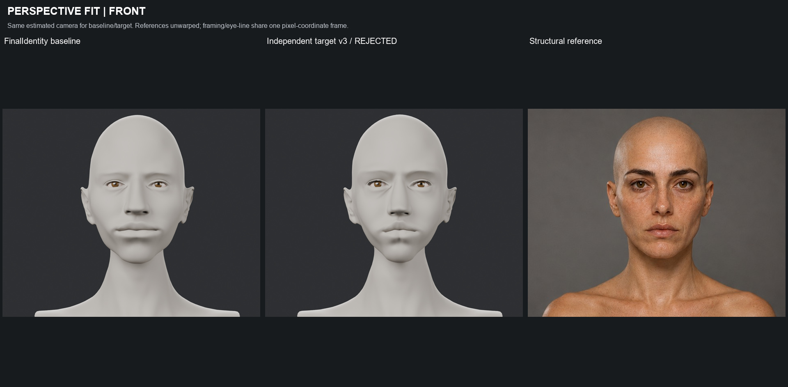

### PERSPECTIVE FIT | SIDE

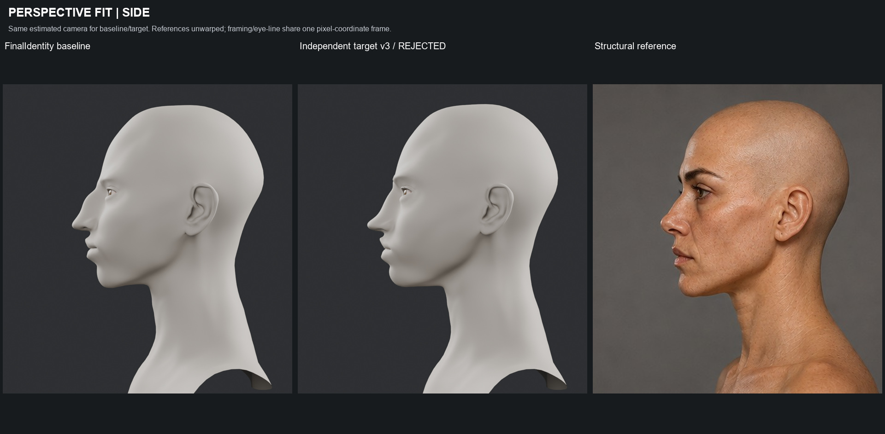

### ORTHOGRAPHIC REVIEW | Front and true side

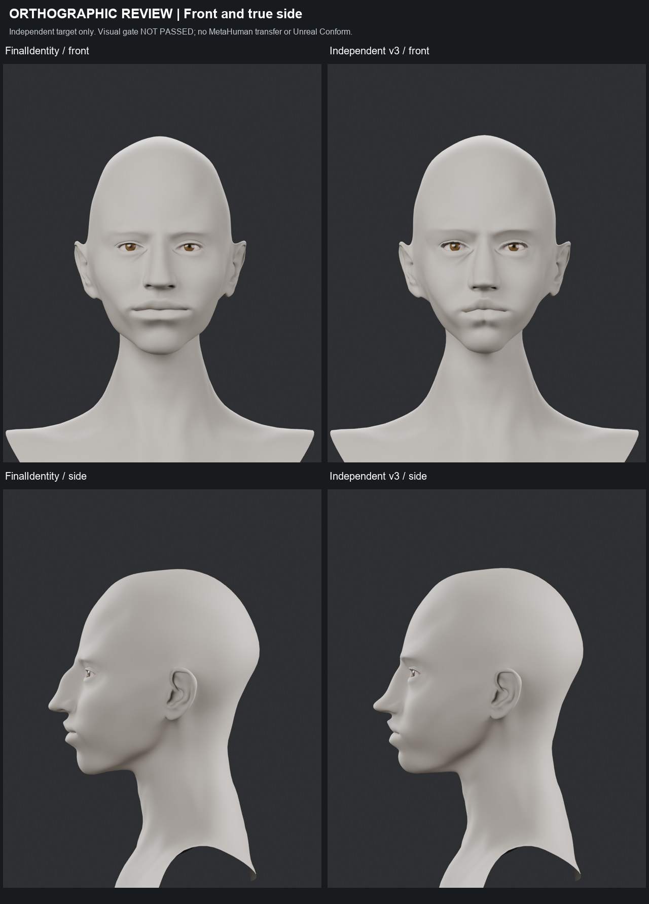

### 3D ANATOMY GATE | Both unreferenced 3/4 views

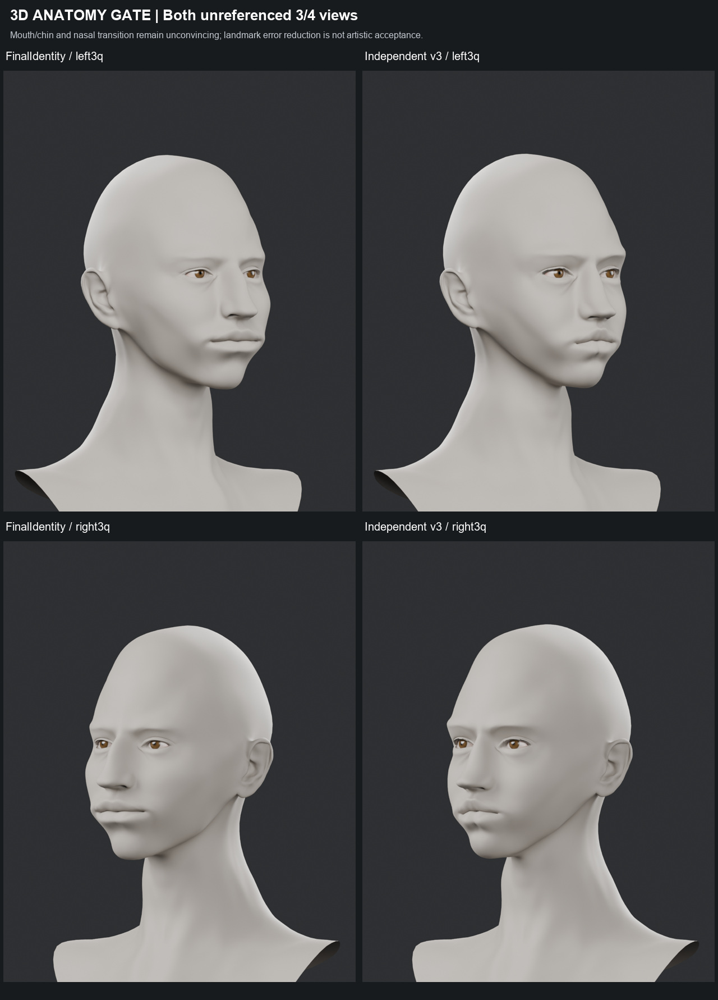

### IDENTITY REVIEW | Concept remains the art authority

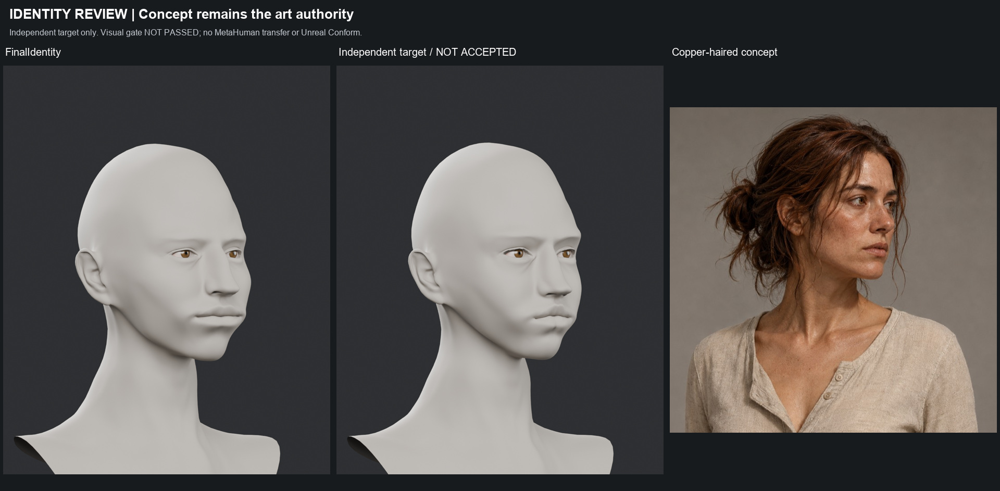

### LANDMARK AUDIT | FRONT

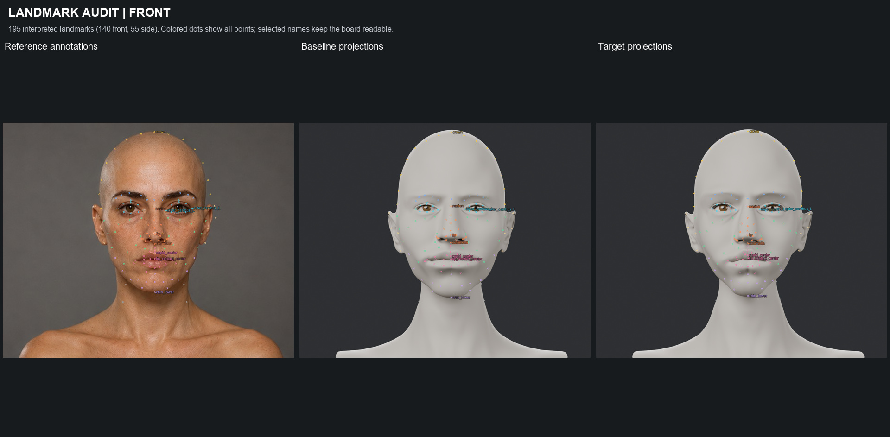

### LANDMARK AUDIT | SIDE

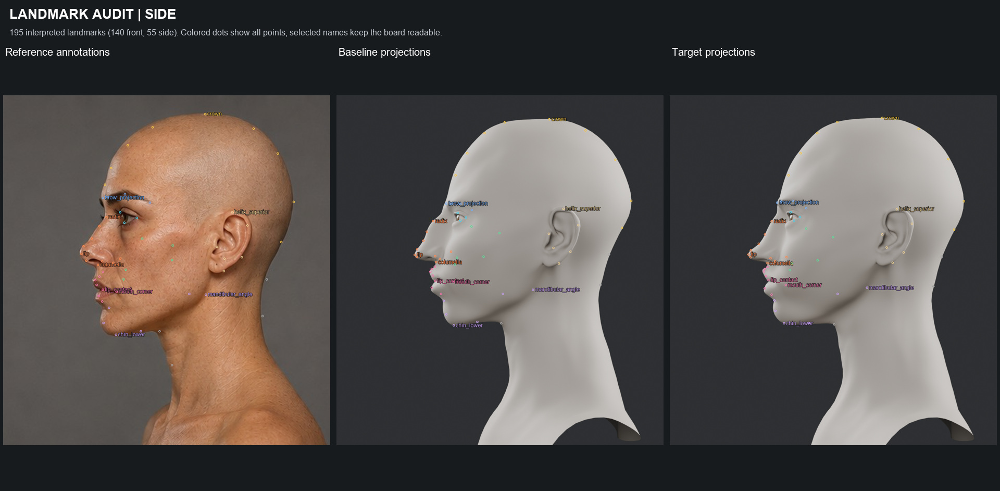

### SILHOUETTE GATE | FRONT

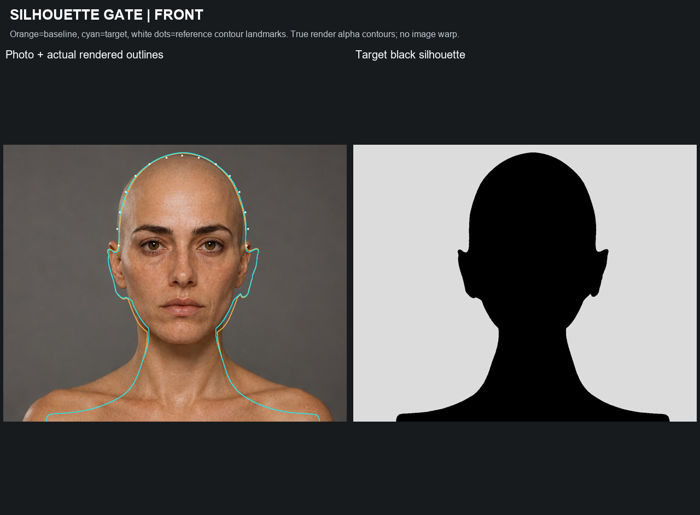

### SILHOUETTE GATE | SIDE

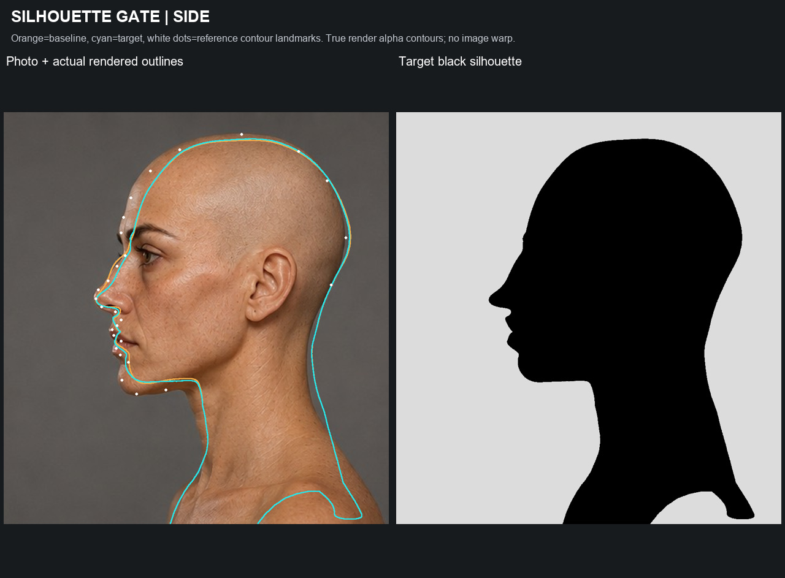

### DETAIL REVIEW | NOSE

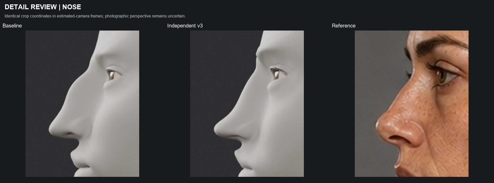

### DETAIL REVIEW | MOUTH

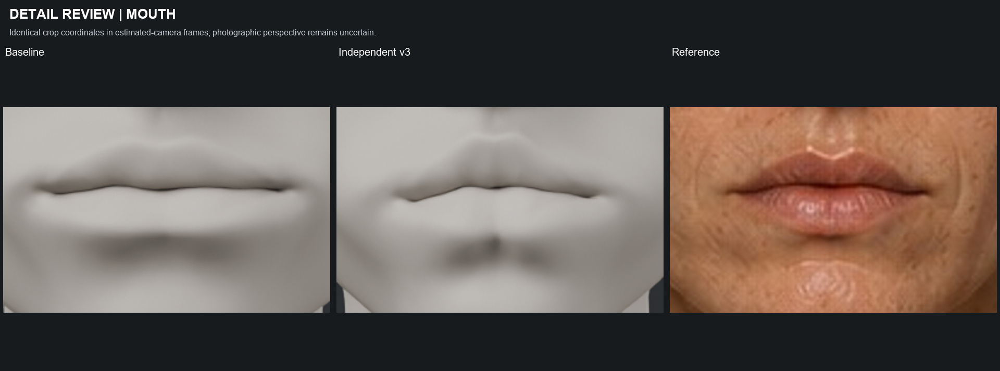

### DETAIL REVIEW | MIDFACE

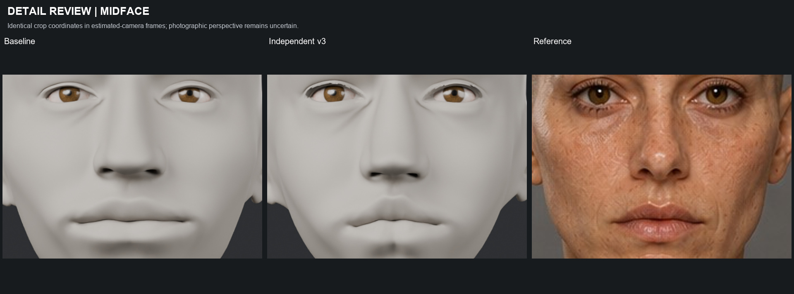

### INDEPENDENT TARGET ITERATIONS | None approved

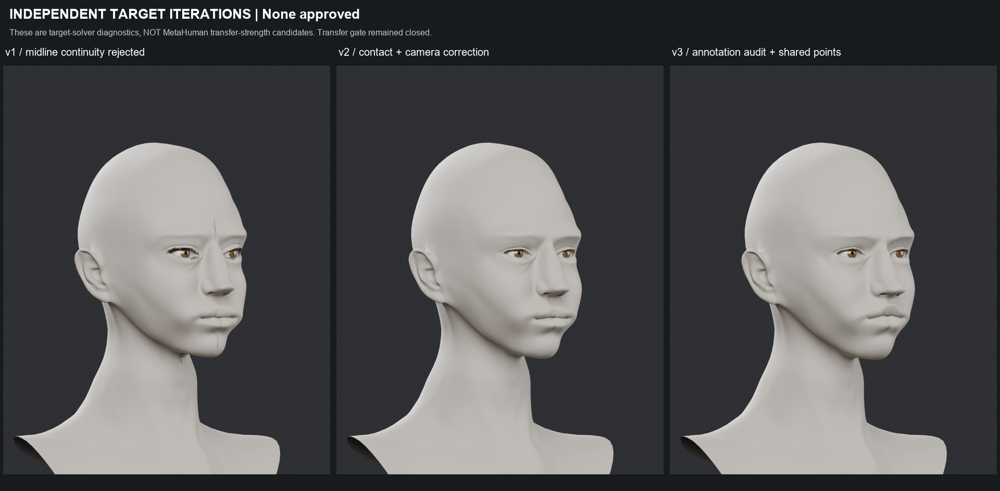

## Teknik kayıtlar

- [camera_estimates_v2.json](camera_estimates_v2.json)
- [camera_estimates_v3.json](camera_estimates_v3.json)
- [reference_landmarks.json](reference_landmarks.json)
- [reference_landmarks_v3.json](reference_landmarks_v3.json)
- [mesh_landmarks_v3.json](mesh_landmarks_v3.json)
- [annotation_review.json](annotation_review.json)
- [fit_metrics_v1.json](fit_metrics_v1.json)
- [fit_metrics_v2.json](fit_metrics_v2.json)
- [fit_metrics_v3.json](fit_metrics_v3.json)
- [target_validation.json](target_validation.json)
- [geometry_failures.json](geometry_failures.json)
- [silhouette_metrics.json](silhouette_metrics.json)
- [preservation_final.json](preservation_final.json)
- [visual_review.json](visual_review.json)
- [boards_manifest.json](boards_manifest.json)
- [delivery_hashes.json](delivery_hashes.json)
- [TARGET_GATE.json](TARGET_GATE.json)

[Korunan FinalIdentity başlangıç raporu](../character-final-identity-2026-09-28/TEKNIK_RAPOR.md)
