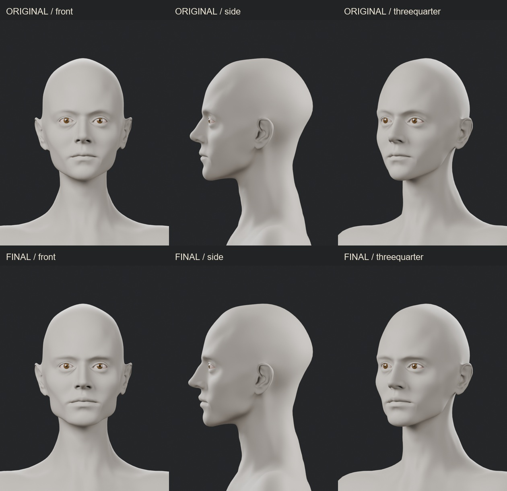
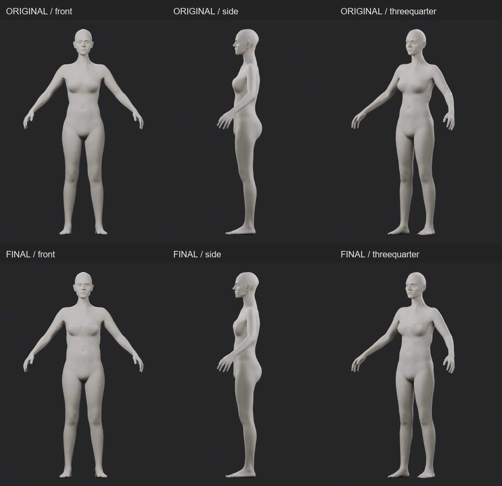
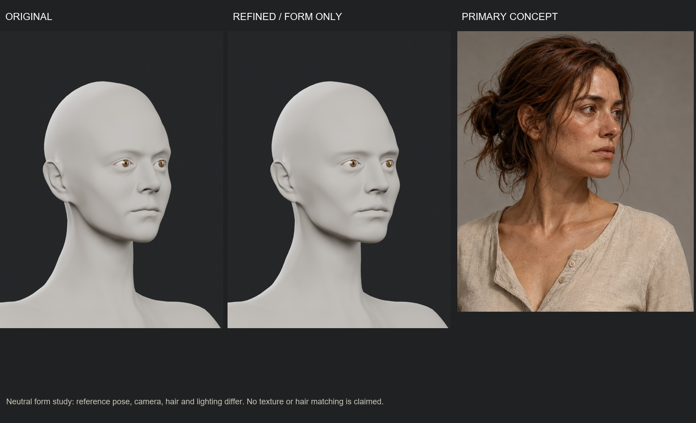
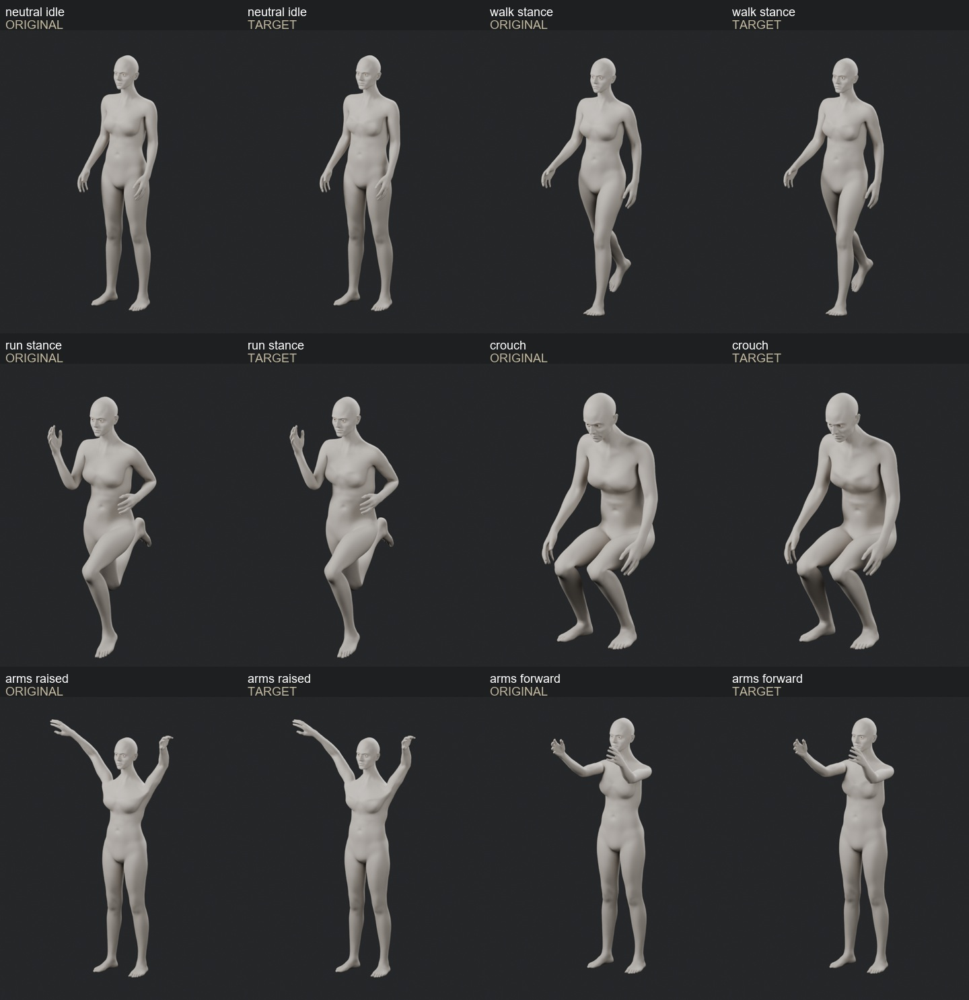
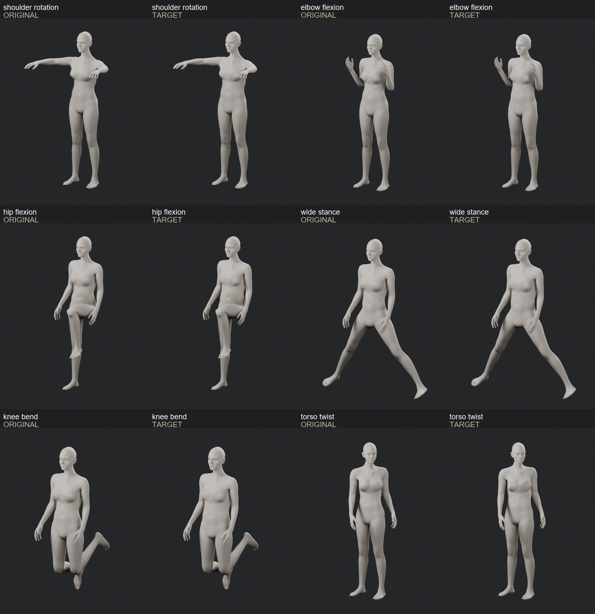

# Sphirus — beden ve baş form hedefleri
> GitHub yayın kapsamı: teknik rapor, karşılaştırma görselleri ve doğrulama kayıtları. Blender/FBX varlıkları yerel `SourceAssets/Characters/SphirusShapeTargets_20260927/` klasöründedir. MetaHuman Conform/import yapılmadı.

27 Eylül 2026 • Blender 5.2 • Unreal projesi 5.8 • Yalnızca form aşaması

Mevcut MetaHuman üzerinde geri alınabilir bir form geçişi yapıldı. Burun, çene–yanak dengesi ve bel–gövde silueti konsepte doğru geliştirildi. Nötr hedefler ve karşılaştırmalar hazır. **MetaHuman Conform/import ve üretim rig doğrulaması yapılmadı.**

## Teslim dosyaları

- Düzenlenebilir çalışma — `Sphirus_ShapeTargets_EDITABLE.blend` (yerel dosya): özgün nesneler gizli korunur; `TARGET_BODY` ve `TARGET_HEAD` üzerindeki `SPH_Concept_Form` değeri **1 = hedef**, **0 = özgün form**. Özgün ifade şekilleri ayrıca korunur.
- Temiz nötr sahne — `Sphirus_NeutralTargets.blend` (yerel dosya): beden, baş, mevcut gözler/dişler; armature, animasyon, kıyafet veya Groom yoktur. Tam baş topolojisi arşivi gizlidir.
- Beden hedefi — `ConformTargets/SM_SPH_BodyTarget.fbx` (yerel dosya) ve baş hedefi — `ConformTargets/SM_SPH_HeadTarget.fbx` (yerel dosya).
- `ConformTargets/Auxiliary/`: mevcut sol/sağ göz ve diş geometrisi. `ReferenceOnly/`: 34.657 vertex içeren tam baş arşivi. `*_source_indices.json` dosyaları bileşenlerin kaynak vertex/poligon eşlemesini tutar.
- Değiştirilmemiş özgün sahne — `Original_Preserved.blend` (yerel dosya). Kaynak sahneyle SHA-256 eşleşir; göreli doku bağımlılıkları kopyalanmıştır.

## Bulunan kaynak yapı ve koruma

Unreal’dan daha önce çıkarılan `MH_MainCharacter` kullanıldı; başka bir insan modeli eklenmedi. Beden: **32.334 vertex / 60.816 üçgen**, 341 kemikli referans rig. Tam baş: **34.657 vertex / 64.094 üçgen**, 874 kemikli yüz rig'i, Basis + **858 ifade shape key'i**. UV kanalı `DiffuseUV`; mevcut skin ağırlıkları korundu. FBX, Unreal DNA/RigLogic verisini taşımaz; bu veri özgün Unreal varlıklarında kalır.

Yeni form ayrı bir shape key'dedir. Özgün koordinatlar, ifade key'leri, vertex/poligon düzeni, UV'ler, ağırlıklar ve kemik rest matrisleri karşılaştırılarak değişmediği doğrulandı. Kaynak MetaHuman'ın denetlenen **86 Unreal paketi** SHA-256 kontrolünden geçti. Bu geçişte Unreal Editor çalıştırılmadı; gameplay, AAMS, Core Motion, kamera veya Blueprint düzenlenmedi.

## Form değişiklikleri

**Baş:** Burun köprüsü belirginleştirildi; burun ucu daha az yukarı dönük olacak şekilde aşağı/öne taşındı. Çene ucu ve mandibula geçişi daha az sivrilen bir alt yüz verecek biçimde dengelendi. Elmacık–yanak geçişi, kaş kemiği, ağız genişliği ve dudak hacmi düzenlendi. Şakak ve boyunda küçük hacim düzeltmeleri yapıldı. Göz küreleri, kulak yerleşimi ve kaynak asimetri korundu. En büyük yüzey hareketi yaklaşık **5,03 mm**; yeni gözenek, makyaj veya cilt detayı yoktur.

**Beden:** Alt kaburga/oblik bölgesinde hacim artırıldı, göğüs ve kalçanın geriye/öne çıkıntısı azaltıldı. Karın–bel–pelvis geçişi yumuşatıldı; üst kol, ön kol ve diz çevresinde küçük form düzeltmeleri yapıldı. Omuz eklem merkezleri, kol/bacak uzunlukları, eller ve ayaklar korundu. En büyük yüzey hareketi **16,36 mm**. Gövde daha az belirgin kum saati silueti taşır; başın genel ölçüsü değiştirilmedi.

**Boy:** özgün **173,40184 cm**, hedef **173,40184 cm**. Blender metre, +Z yukarı / −Y ön; FBX +X ön / +Z yukarı, birim dönüşümü açık. Özgün ayak tabanı ve sahne orijini korunur; taban yaklaşık Z = −0,17 cm'dir.

## Görsel ve teknik kontrol

Ön, yan, arka ve iki yöndeki 3/4 görünümler incelendi; eş kameralı önce/sonra ve doğrudan konsept karşılaştırması hazırlandı. Yüzde burun/alt yüz değişimi, bedende ribcage–bel dengesi görülebilir. Konseptte saç ve giysiyle örtülen anatomide kontrollü yorum yapıldı; tek perspektif görüntüden kesin 3B portre ölçümü çıkarılmadı.

Nötr idle, yürüyüş, koşu, çömelme, kollar yukarı/öne, omuz rotasyonu, dirsek/kalça/diz bükümü, geniş duruş ve gövde burulması olmak üzere **12 geçici poz**, aynı pozdaki özgün modelle karşılaştırıldı. Form değişimine bağlı yeni dejenere üçgen veya ters dönen yüz bulunmadı. Bunlar tek kare geometrik stres pozlarıdır; hareket döngüsü, zemin teması, dinamik çarpışma veya MetaHuman RigLogic testi değildir.

Bulunan ve düzeltilen sorunlar: UV sınırlarındaki ayrık vertex kopyalarının farklı yumuşaması eşitlendi; yaklaşık 0,75 mm baş–beden açıklığı kaynak toleransına geri getirildi; üst göz kapağı ve ağız köşesindeki yerel sıkışma azaltıldı. Nötr birleşim hatası **0,00025 mm'den küçük**, test pozlarında **0,001 mm'den küçük**. Nötr üçgen alanı oranları bedende 0,79–1,24, başta 0,71–1,37 aralığında; yeni yüz katlanması yoktur.

Ham Blender skinning'inde derin diz/dirsek bükümleri ve kaldırılmış kollarda kaynakta da görülen hacim kaybı/sıkışma vardır. Eski ağırlıklar yeniden yapılmadı; bu riskler son MetaHuman rig'i ile tekrar sınanmalıdır. İfade key'leri korunmuştur fakat yeni form üzerinde tam ifade/mimik testi yapılmamıştır.

Altı FBX temiz olarak geri alındı: vertex sayıları aynı, UV farkı **0**, en büyük dünya konumu farkı **0,00014 mm'den küçük**. Temiz Blender sahnesi yeniden açılıp render edildi; eksik doku bağımlılığı ve armature yoktur.

## MetaHuman'a sonraki kontrollü geçiş

Retopoloji, weld, UV yeniden açma veya kemik düzenleme yapılmadı. Ana baş FBX'i yalnızca kaynak skin bileşenidir: **24.414 vertex / 48.004 üçgen**. Bu bir retopoloji değildir; göz/diş gibi üst üste binen UV bileşenleri ayrı dosyalardadır. Tam kaynak baş düzeni ayrıca korunur.

UE 5.8'in kurulu kodu ve örnekleri, Template Conform için **UV correspondence** seçeneğini destekliyor. FBX round trip için vertex sırasına körü körüne güvenmek yerine bu seçenekle eşleşme doğrulanmalıdır. Beden ve eşleşen baş birlikte kullanılmalı; sonraki baş aşamasında mevcut hizayı koruyan seçenek değerlendirilmelidir. Epic'in [Body Conform örnekleri](https://dev.epicgames.com/documentation/metahuman/body-conform-examples) bu ayrı beden/baş akışını anlatır. [Python akışı](https://dev.epicgames.com/documentation/metahuman/metahuman-creator-python-scripting-in-unreal-engine) ve yerel `MetaHumanCharacter/Content/Python/test_conform_from_template.py` incelendi; Conform komutları çalıştırılmadı.

**Açık doğrulama:** Gerçek Template UV eşleşmesi, Unreal eksen/ölçek import kontrolü, Conform sonucunun hedef şekle sadakati ve yeni DNA/rig deformasyonu sonraki aşamada kontrol edilmelidir. Mevcut DNA, yeni yüz için kalibre edilmiş sayılmaz. Saç, kıyafet, üretim malzemesi, cilt boyama ve Unreal import bu teslimin dışında bırakıldı.

Kanıtlar: `Saved/Codex/CharacterShape_20260927/` altında `source_audit.json`, `validation.json`, `preservation_check.json`, `fbx_roundtrip.json`, `neutral_delivery_check.json` ve karşılaştırma görselleri. Teslim dosyaları için `delivery_hashes.json` mevcuttur.

## Yayınlanan teknik kanıtlar

- [validation.json](validation.json)
- [fbx_roundtrip.json](fbx_roundtrip.json)
- [neutral_delivery_check.json](neutral_delivery_check.json)
- [preservation_check.json](preservation_check.json)
- [target_manifest.json](target_manifest.json)
- [delivery_hashes.json](delivery_hashes.json)

## Karşılaştırma görselleri

### Baş: özgün ve rafine

### Beden: özgün ve rafine

### Konsept ile form karşılaştırması

### Geçici poz kontrolleri 1

### Geçici poz kontrolleri 2

