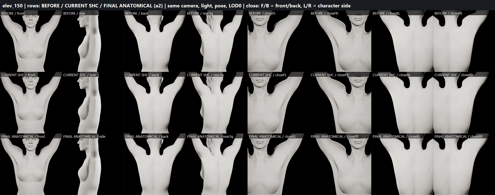
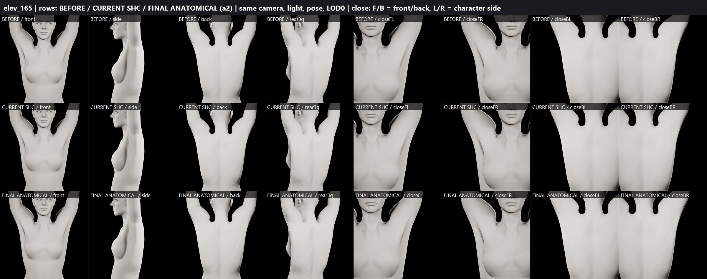
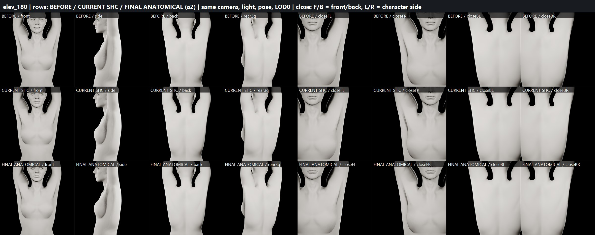

# FINAL ANATOMICAL SHOULDER CORRECTIVE (SHCA) — B2 test candidate (2026-09-29)

Built on top of the working SHC (kept untouched as fallback / CURRENT reference). Candidate:
`/Game/Sphirus/CharacterLab/ShoulderFix_20260928/HighElevCorrective/Anatomical/` —
`SKM_SHCA_BodyMesh`, `SKM_SHCA_FaceMesh`, `ABP_SHCA_Body_PostProcess`, `ABP_SHCA_Face_PostProcess`. Not promoted.

## Final status

| Gate | Result |
|---|---|
| FINAL ANATOMICAL SHOULDER CORRECTIVE | **PARTIAL** |
| BODY PROPORTIONS | PASS (neutral 0.0000 mm at LOD0/1/2) |
| FACE IDENTITY | PRESERVED (face regions 0.0000 mm, all poses) |
| HEAD/BODY SEAM | PASS at LOD0 (native tolerance); corrective seam-neutral at LOD1/2 |
| SHOULDER DEFORMATION | PARTIAL |
| ARMPIT DEFORMATION | PARTIAL (improved folds/depth) |
| BODY DEFORMATION | PARTIAL (no regression) |
| LOD CORRECTIVE | PASS (all LODs; consistent LOD0–2) |
| SAVE/REOPEN | PASS |
| READY FOR FINAL BODY REALISM SCULPT | **NO** — 180° neck→trapezius silhouette still reads artificial (gate §19) |
| PRODUCTION CHARACTER MODIFIED | NO |

## CURRENT SHC
Strengths: fold/ridge removed (peak crease −30…−45 % at 135–180°), zero impact ≤120°, seam/face exact, persistent.
Remaining defects (confirmed on the 3-way boards): flat upper-back plane, no scapular rotation read, generic deltoid,
weak axillary folds, steep neck→trapezius line.
Root cause of the steep line: at full raise the RBF helper `upperarm_out` swings medially to x≈4.5 cm (neutral 19.5),
dragging deltoid-weighted skin toward the neck; it is a silhouette-scale (cm) effect.

## ANATOMICAL REFINEMENT (a2)
Pose-space form added on top of the SHC smoothing (not more smoothing): landmark-anchored local displacements along the
posed surface normal, on the welded HEAD+BODY surface, per side, at 150° (0.75×) and 180° (1.0×):
- scapular upward rotation: lateral inferior-angle / teres-infraspinatus mass (+3.4 mm) and soft medial-border trough
  (−2.4 mm) from (6, 140) to (12, 121) cm → V-shaped scapular layering instead of a flat slab
- posterior deltoid layer (+2.5 mm) and anterior deltoid roundness (+2.5 mm)
- trapezius: concave neck→acromion slope (−2.7 mm) instead of a straight wall (visible effect small, see verdict)
- anterior axillary fold / pec-major free border (+3.0 mm), posterior axillary fold (+1.2–1.7 mm), axilla vault depth (−2.2…−2.5 mm)
- clavicle landmark kept: SHC smoothing halved along the clavicle, +0.7 mm relief
- `SHC_165_l/r` in-between added (= mean of the 150/180 bind deltas) to fix the right-side 165° crossfade
Max displacement: body 6.33 mm (SHC 5.69), head/collar 3.87 mm (SHC 3.20); bind deltas ≤7.2 mm body / ≤3.9 mm head.
Seam vertices share identical deltas (welded solve).

## DRIVER
Curve PoseDrivers (upperarm vs spine_05, swing-only, Gaussian r=40°, threshold 0.03) with new 165° target.
Measured weights (L / R): 120° 0 / 0 · 135° SHC_150 0.50 / 0.44 · 150° 1.00 / 1.00 · 165° SHC_165 1.00 / 1.00
(was R 0.86/0.06) · 180° 1.00 / 1.00 · int/ext rot 90°, forward 90°: 0.

## VISUAL QA (boards_anat/three_way_a2_elev_{150,165,180}.jpg: BEFORE / CURRENT SHC / FINAL × front, side, back, rear 3/4, close front L/R, close back L/R)
- 150°: visible scapular V layering, posterior deltoid step at the deltoid–trapezius junction, defined anterior axillary fold. Good.
- 165°: smooth blend (explicit in-between), both sides equal.
- 180°: back no longer a single flat plane; axilla has structure. BUT the steep neck→trapezius silhouette is essentially
  unchanged from CURRENT SHC — still reads as an artificial elevated shoulder complex.
- L/R: equivalent result; right side started worse and improves more.

Combined crease metrics (peak, BEFORE / CURRENT / FINAL): L180 32.9/20.8/22.0, R180 34.2/22.8/23.7, L150 23.2/16.8/16.5,
R150 29.3/17.8/17.5, L165 28.6/17.8/16.8 — final stays far below BEFORE; small rises vs CURRENT are the intended added folds.

## SEAM (93-sample, LOD0) mean/max mm
neutral 0.00017/0.00047 · 150° 0.00018/0.00039 · 165° 0.00017/0.00037 · 180° 0.00019/0.00036 — identical to native.
LOD1/LOD2: native B2 already shows a posed seam gap when head and body are forced to the same LOD index
(LOD1 ~1.4–1.6 mm mean); the corrective does not change it (Δmean ≤0.02 mm LOD1).

## GEOMETRY
All finite, 0 new degenerate triangles, no inverted faces (peak dihedral ≤ 23.7°), stretch p99 unchanged, Gaussian
primitives (no rippling). No visible self-intersection on boards.

## LOD
Corrective on every LOD: body LOD0–3, face LOD0–7 (6 morphs each; 60 projected LOD morphs). Method: bind-space
closest-point projection of each LODk vertex onto the LOD0 surface (≤1 cm) + barycentric interpolation of LOD0 deltas,
local normal deltas. Validation at 180°: body max 6.3 / 4.9 / 4.3 mm, mean-moved 1.0 / 1.2 / 0.9 mm at LOD0/1/2; head
3.9 mm at all three; neutral 0.0 at all LODs → no abrupt disappearance.

## REGRESSION (38 samples: idle, walk ×2, jog, sprint ×2, crouch, jump ×2, full MetaHuman body-ROM each 1 s + 16.2 s)
Pose sync 0.0000 mm; 29 samples bit-identical (all locomotion, crouch, torso twist, hip flexion/squat segments).
Only overhead samples engage, all improve (native full raise 16.2 s: L 25.7→19.3°, R 26.3→19.1°).

## PERSISTENCE
Save → close → reload from disk: 6+6 morphs, face 864 total, LOD counts 4/8, drivers (165 target, radius, threshold,
curve mode), PP compile state, curve metadata, retarget fix, HeadScale 1.0653988122940063 all persisted; post-reopen
LOD0 (neutral/120/150/165/180) and LOD1 (neutral/150/180) geometry identical to pre-reopen (0.00000 mm).

## Preservation
Accepted B2 59d604a4…, production MH_MainCharacter 45d4d909…, test MetaHuman 00c41871…: byte-identical. Current SHC
assets untouched. Changed: new Anatomical/ set, SHC_165 curve metadata on the ShoulderFix body/face skeleton copies.

## Why not PASS / what the remaining step needs
The remaining defect (neck→trapezius wall) is a centimetre-scale silhouette caused by the `upperarm_out` helper's
medial swing at full raise. A conservative (≤~6–7 mm) corrective cannot fix it; options: (1) retarget the helper output
at the high-elevation RBF target (edit `upperarm_*_out_110` / add a 150/180 helper target that keeps upperarm_out lateral),
or (2) a larger authored trapezius/deltoid pose shape (≈1–1.5 cm) — both outside this task's conservative limits and
needing your decision.

## Boards (BEFORE / CURRENT SHC / FINAL ANATOMICAL)

Data: [crease_anat_final.json](crease_anat_final.json) · [regression_anat.json](regression_anat.json) · [lod_validation.json](lod_validation.json) · [lod_seam.json](lod_seam.json) · [lod_transfer.json](lod_transfer.json) · [reopen_check_shca.json](reopen_check_shca.json)
