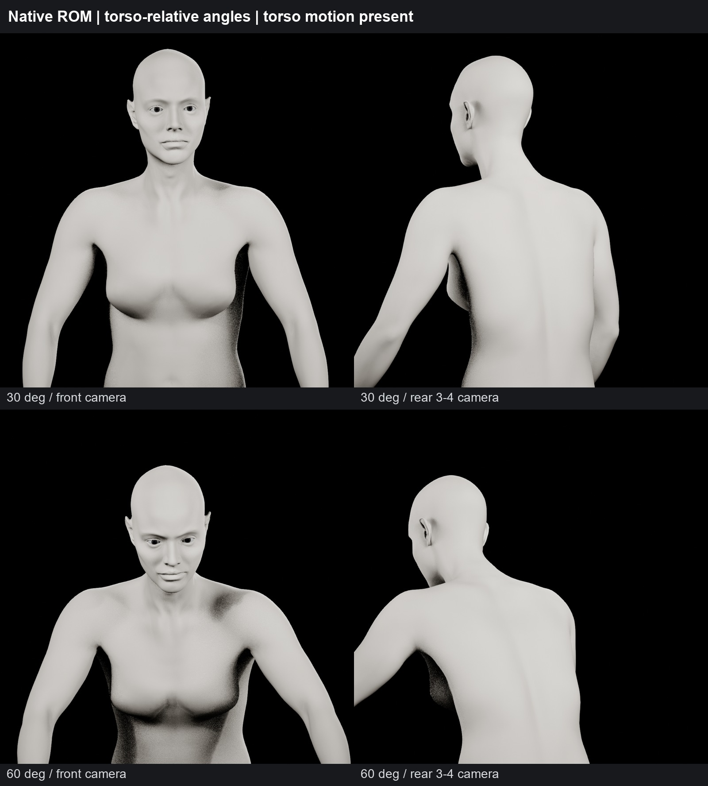
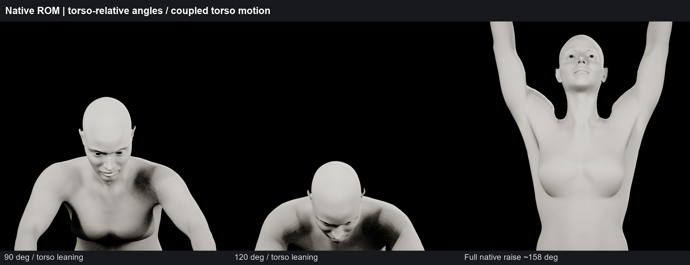
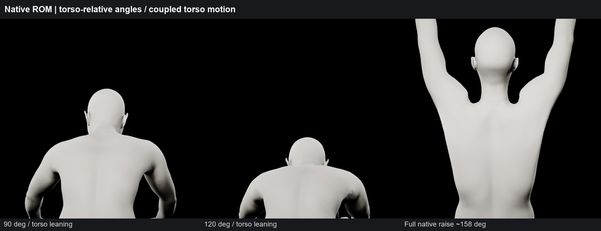
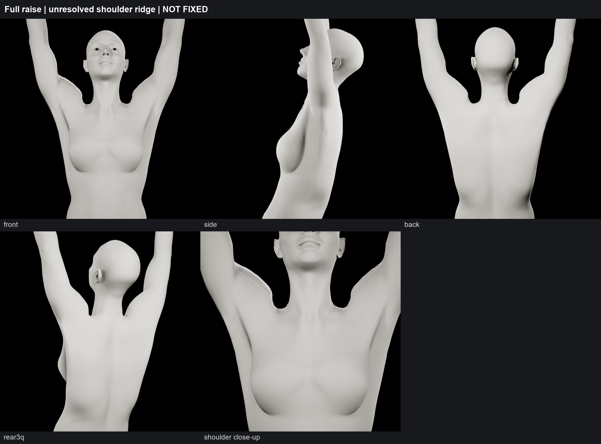
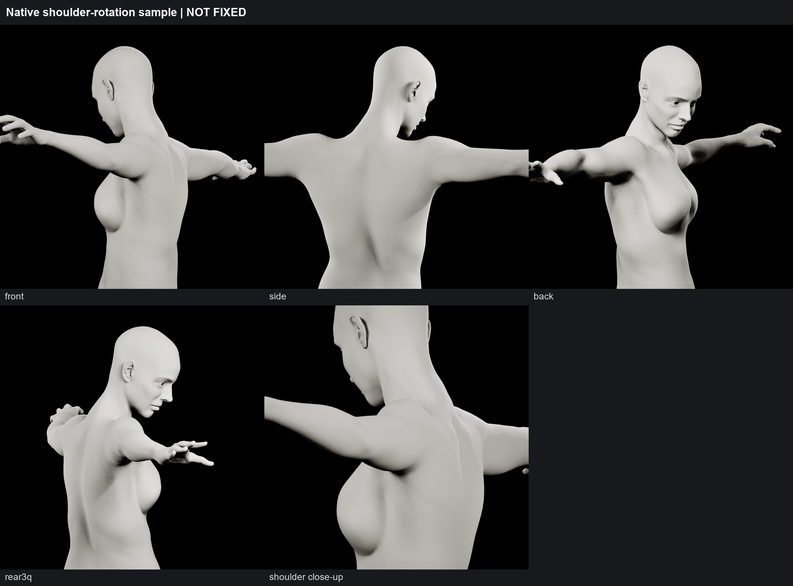
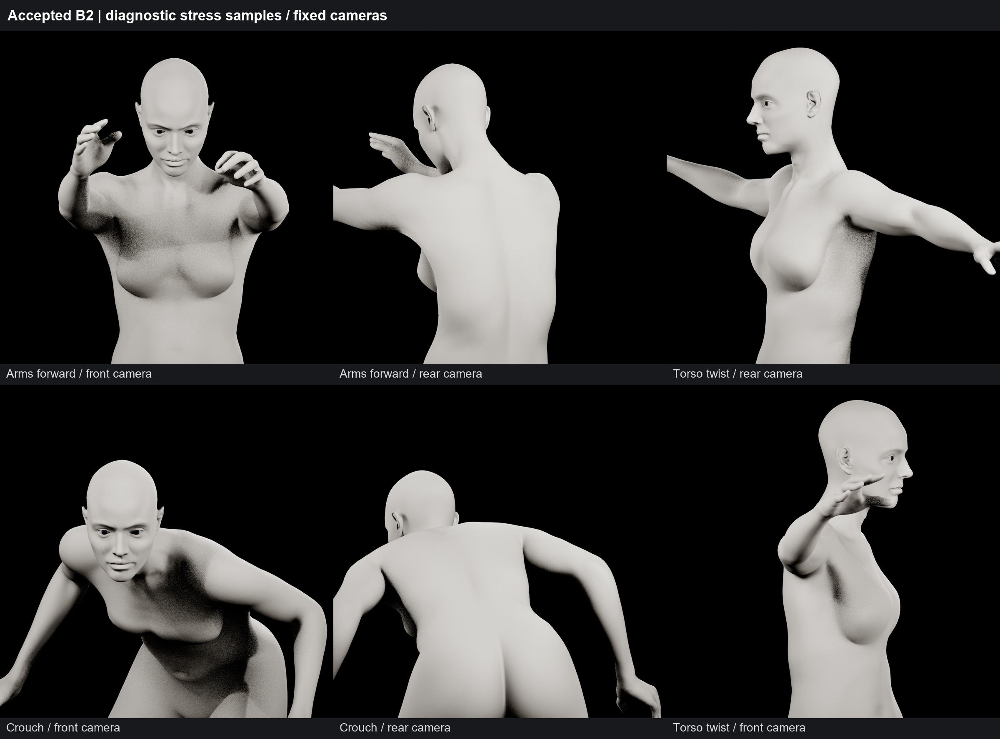
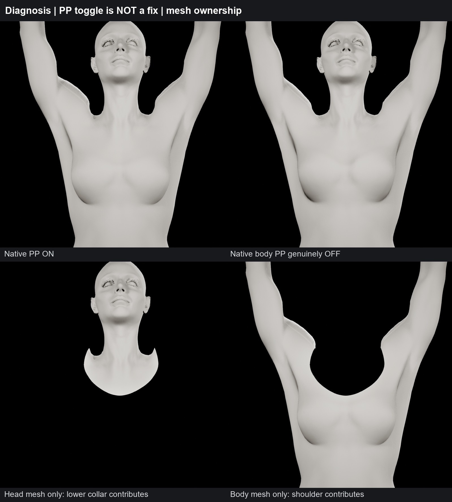
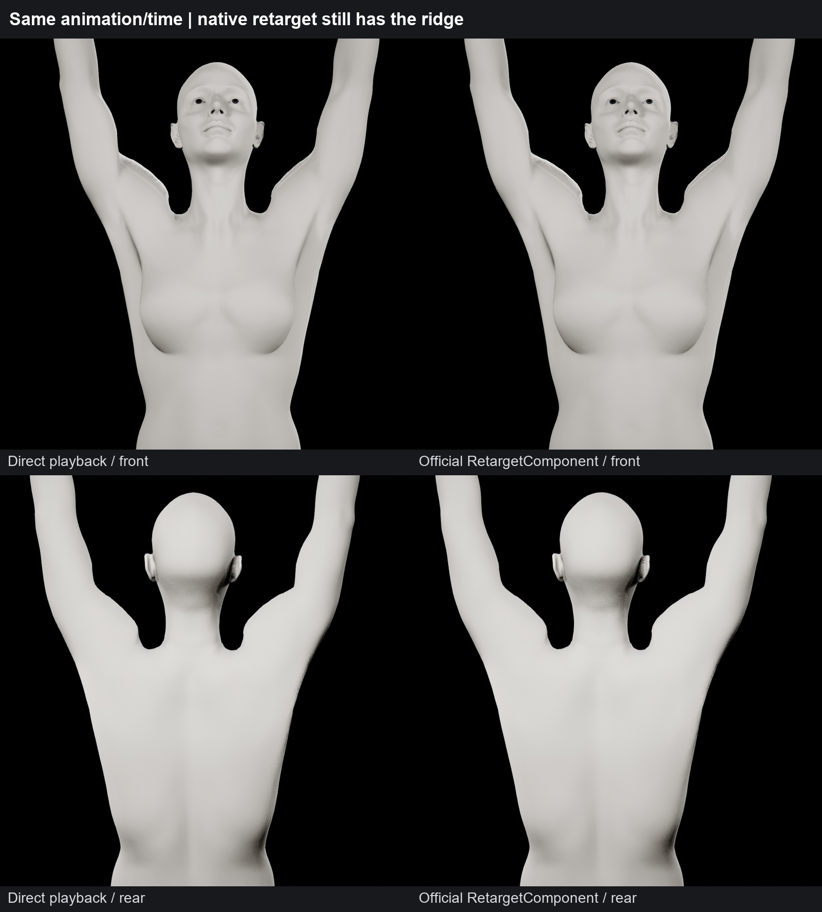
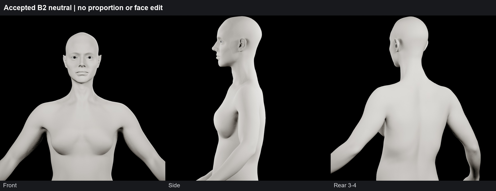

# B2 omuz denetimi — çözüm henüz yok

**Kabul edilen yüz ve oranlar korundu. Omuz deformasyonu FAIL; bu panolar düzeltme öncesi tanı ve kontrol kanıtıdır.**

[Tam Türkçe rapor](REPORT_TR.md) · [Gereken resmî UI adımı](MANUAL_NEXT_STEP.md)

30–120° görüntülerinde native klip gövdeyi de hareket ettirir. İzole abduksiyon testi veya düzeltilmiş aday kabulü değildir. Kamera etiketleri sabit dünya kameralarını belirtir.

## 30° / 60° — gövde hareketiyle birlikte tanısal örnekler

## 90° / 120° / tam kaldırma — ön kamera

## 90° / 120° / tam kaldırma — arka kamera

## Tam kaldırma — çözülmemiş sivri omuz

## Shoulder rotation — sert trapezius geçişi

## Arms forward / torso twist / crouch

## PP ON/OFF ve head/body yüzey ayrımı

## Direct / resmî native retarget karşılaştırması

## Korunan nötr B2

