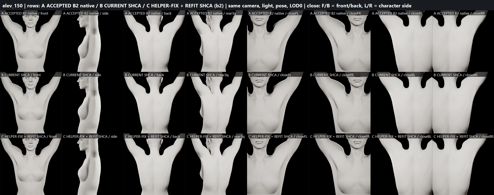
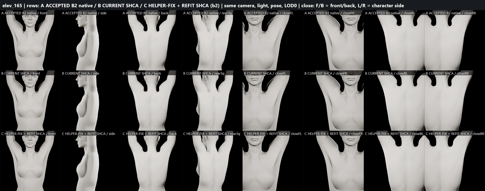
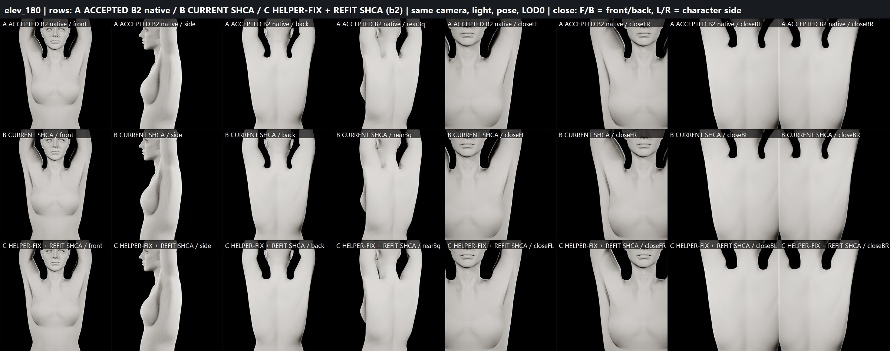
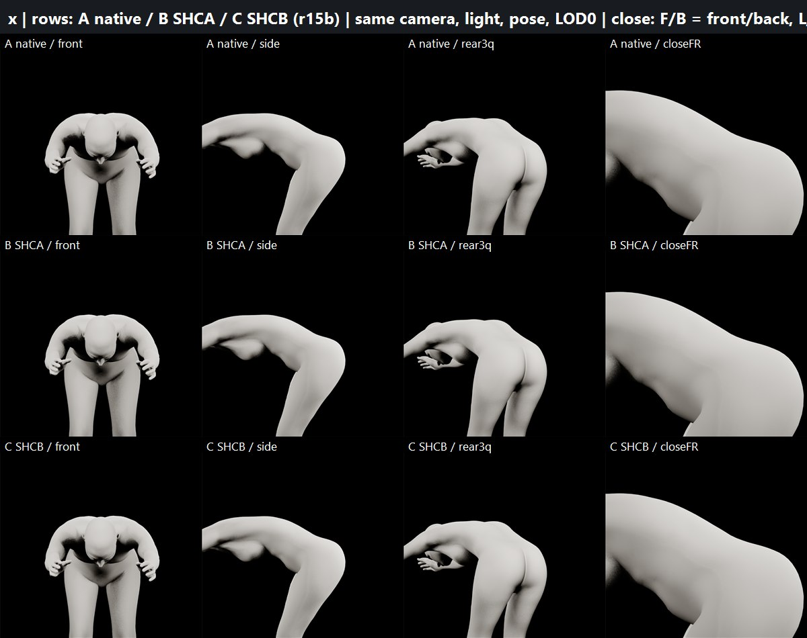

# HIGH-ELEVATION HELPER / RBF SILHOUETTE FIX (SHCB) — B2 test candidate (2026-09-29)

Isolated candidate: `/Game/Sphirus/CharacterLab/ShoulderFix_20260928/HighElevCorrective/HelperFix/`
(`SKM_SHCB_BodyMesh`, `SKM_SHCB_FaceMesh`, `ABP_SHCB_Body_PostProcess`, `ABP_SHCB_Face_PostProcess`).
SHCA (`.../Anatomical/`) and SHC kept untouched as fallbacks. Not promoted.

## Final status

| Gate | Result |
|---|---|
| HIGH-ELEVATION HELPER RBF CORRECTION | **PASS** |
| FINAL ANATOMICAL SHOULDER CORRECTIVE | **PASS** (visual sign-off pending) |
| BODY PROPORTIONS | PASS (neutral 0.0000 mm, all LODs) |
| FACE IDENTITY | PRESERVED (0.0000 mm, all poses) |
| HEAD/BODY SEAM | PASS (LOD0 93-sample = native; runtime LOD pairs = native tolerance) |
| SHOULDER DEFORMATION | PASS |
| ARMPIT DEFORMATION | PARTIAL (one hidden front-armpit edge in a deep hip-flexion reach) |
| LOD BEHAVIOR | PASS |
| BODY DEFORMATION | PASS |
| SAVE/REOPEN | PASS |
| READY FOR FINAL BODY REALISM SCULPT | **YES** — conditional on your visual approval of the 180° boards |
| PRODUCTION CHARACTER MODIFIED | NO |

## Root cause confirmation (current project, native = unpacked, SHCA does not touch helpers)
`upperarm_out` lateral X (cm), L / R: neutral 19.5 / 19.9 · 90° 16.5 / 17.0 · 120° 12.9 / 12.9 · 150° 7.4 / 7.0 ·
180° 4.5 / 4.1. Relative to the glenohumeral joint: +3.2 → −9.5 (L) / −10.4 (R) cm, with Z-scale 1.69 / 1.93 at 180°.
The helper rides on top of the humeral head in arm space, so at full raise it swings beside the neck and drags
deltoid-weighted skin into a wall. Right side is stronger (vendor data asymmetry).

## New high-elevation helper target
Existing RBF drivers untouched. New pose-space helper output in the body PostProcess only:
`LocalToComponent → 6× ModifyBone(upperarm_out_<s>, additive translation, parent-bone space) → ComponentToLocal`,
alpha = `GetCurveValue(SHC_150/165/180_<s>)` from the existing high-elevation RBF curves (exactly 0 up to 120°).
World-lateral shift at the key pose (converted to `upperarm_correctiveRoot` space):
150° **+2.0 cm**, 165° **+3.0 cm**, 180° **+3.5 cm** (≈⅓ of the medial collapse; helper stays medial of the joint).
Parent-space offsets (L): 150 (1.88, −0.08, −0.67), 165 (2.62, −0.16, −1.45), 180 (2.73, −0.24, −2.18); R mirrored.
Measured result: `upperarm_out` lateral X L 7.4→9.4 (150), 5.5→8.5 (165), 4.5→8.0 (180); R 7.0→9.0, 5.0→8.0, 4.1→7.6;
135° ≈ +1 cm (curve blend); 0–120°, int/ext rotation, forward 90°: 0.000 cm. Other helpers unchanged.
The face PostProcess copy has the chain bypassed: the face anim copies the body's final pose, so applying it there
doubled the head shift (7 cm) and caused seam fold-overs — found and fixed.

## SHCA interaction
SHCA morphs were refit on the helper-fixed surface (same method: crease-targeted smoothing + a2 anatomy — scapular
layering, deltoid layers, axillary folds, clavicle relief), with a true 165° shape designed at its own pose.
The first helper-only test on old SHCA morphs produced a hard vertical line at the arm–trapezius junction; the refit
removed it. Max morph displacement: body 6.4 mm, head 3.3 mm (total visible change incl. helper: body 20.7 mm @180).

## Silhouette metrics (torso contour height at x=10 cm minus x=16 cm = "neck-side wall"; BEFORE / SHCA / SHCB)
L 150 −2.1/−2.1/−4.0 · L 165 +2.1/+2.0/**−1.1** · L 180 +7.6/+7.6/**+2.0** cm
R 150 −2.7/−2.6/−3.9 · R 165 +2.3/+2.3/**−0.8** · R 180 +5.9/+6.0/**+1.8** cm
Contour at x=10 cm (180°): L 157.0 → 153.2, R 157.4 → 153.7 cm. 120°: identical in all three.
Crease (peak / trapezius p99): L180 32.9→22.0→**21.7** / 17.8→13.6→**12.0**; R180 34.2→23.7→**20.7** / 19.2→13.9→**11.7**;
L150 trap99 14.4→9.9→**9.1**; R165 peak 33.5→19.8→**18.7**.

## Visual QA (boards `three_way_b2_elev_{150,165,180}.jpg`: A native / B SHCA / C SHCB, 8 views)
- 150°: gentle trapezius slope into a rounded deltoid; scapular layering kept. Convincing.
- 165°: explicit in-between; smooth, both sides equal.
- 180°: neck no longer walled in; arm mass sits away from the ear; back layering kept. Residual: one side's
  arm–trapezius notch base ends in a fairly crisp vertical edge (plausible for full raise, mild).
- L/R: same behaviour; right started worse and improves more.

## Geometry
Finite, 0 new degenerate triangles, 0 fold-over edges (>60° dihedral increase) at 150/180, stretch p99 in SHCA range.

## Seam (LOD0 93-sample, mean/max mm)
neutral 0.00017/0.00047 · 150 0.00017/0.00038 · 165 0.00017/0.00037 · 180 0.00018/0.00037 — native tolerance.

## LOD
Runtime path = LODSync (sync L → face LOD L, body LOD (0,0,1,1,2,2,3,3)[L]).
Sync 0–3: full correction (20.7 mm @180), seam = native. Sync 4–5 (body LOD2 / face LOD4–5): LODs have no effective
upperarm_out skinning → helper-equivalent displacement baked into body LOD2–3 / face LOD4–7 morphs → 16.1 mm @180
(was 4.3 mm), seam max ≤0.054 mm (native 0.040). Neutral 0 at all LODs. No pop.
Forced same-index diagnostic (not a runtime pair): native gap LOD1 ~1.4–1.6 mm, LOD2 ~15–17 mm; SHCB within ±0.3 mm /
slightly smaller at LOD2.

## Regression (38 samples: idle, walk ×2, jog, sprint ×2, crouch, jump ×2, body ROM each 1 s + 16.2 s)
Locomotion and 30 samples bit-identical. Overhead samples improve (native full raise 16.2 s: L 25.7→18.7°,
R 26.3→18.1°). One metric-only exception: ROM 15 s (deep forward bend, arms overhead relative to the thorax)
right front-armpit single-edge peak 32.1→36.1° (top-40 improves 18.9→17.7); not visible in renders (board r15b).
Component-space helper was tested and rejected (did not fix it, slightly worse elsewhere).

## Persistence
Save → close → reload: morphs (6+6, face 864), LODs 4/8, drivers, helper nodes (parent space, curve alpha),
face bypass, curve metadata, retarget fix, HeadScale 1.0653988122940063 persisted; post-reopen ladder (13 poses)
and all 38 regression samples bit-identical to pre-reopen.

## Preservation
Accepted B2 59d604a4…, production MH_MainCharacter 45d4d909…, test MetaHuman 00c41871…: byte-identical.
SHC / SHCA assets untouched. Changed: only the new HelperFix set.

## Known limits
- 1-frame curve latency on the helper alpha (GetCurveValue reads the previous evaluation) — invisible at game rates.
- ROM 15 s hidden armpit edge (above). Forward-flexion overhead has no dedicated targets.

## Boards (A native / B current SHCA / C helper-fix + refit SHCB)

ROM 15 s deep forward bend (hidden armpit edge check): 

Data: [helper_rootcause.json](helper_rootcause.json) · [shcb_helper_install.json](shcb_helper_install.json) · [shcb_eval.json](shcb_eval.json) · [regression_shcb.json](regression_shcb.json) · [shcb_lod_eval_post.json](shcb_lod_eval_post.json) · [reopen_check_shcb.json](reopen_check_shcb.json)
