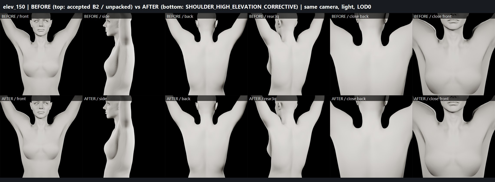
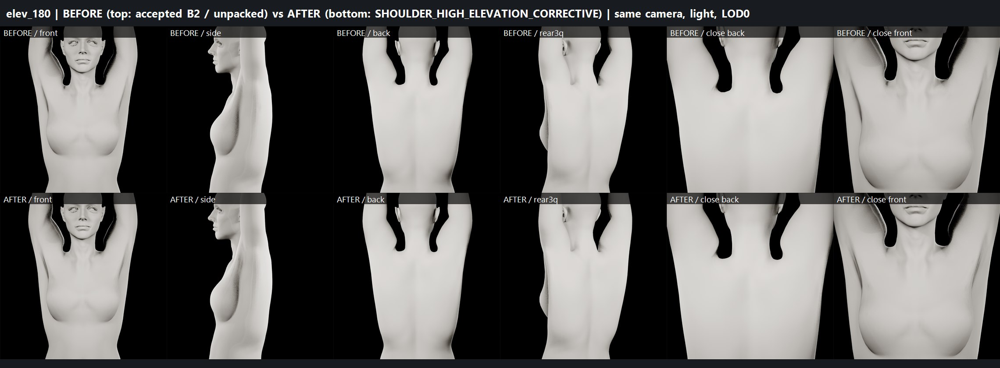
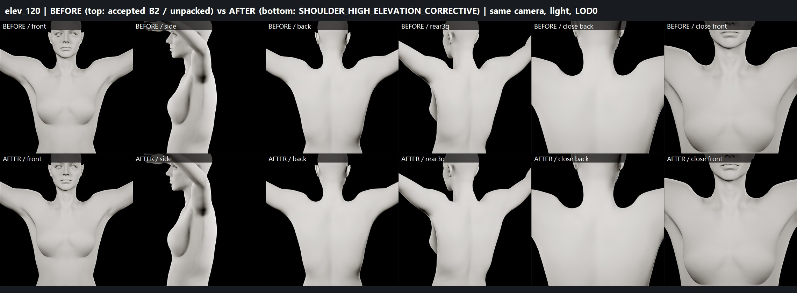
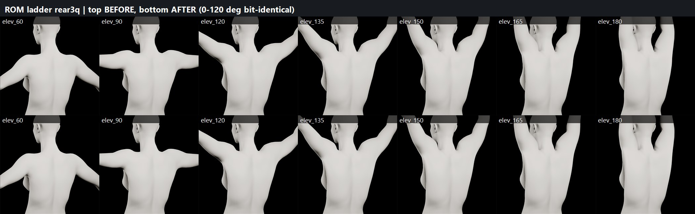
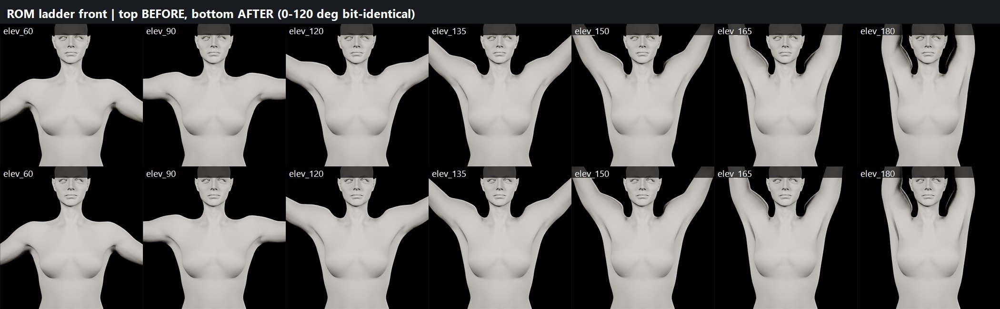

# SHOULDER_HIGH_ELEVATION_CORRECTIVE — B2 test candidate (2026-09-29)

Continues from accepted B2 + official RBF unpack (equivalence PASS). Candidate lives only in
`/Game/Sphirus/CharacterLab/ShoulderFix_20260928/HighElevCorrective/`. Not promoted.

## Final status

| Gate | Result |
|---|---|
| HIGH-ELEVATION CORRECTIVE | **PARTIAL** — technically PASS (driven, zero-impact ≤120°, persistent); visual gain moderate |
| BODY PROPORTIONS | PASS (neutral 0.0000 mm; no parameter edit) |
| FACE IDENTITY | PRESERVED (face regions 0.0000 mm at every pose) |
| HEAD/BODY SEAM | PASS (93-sample max ≤ 0.00040 mm, all 13 poses, identical to native) |
| SHOULDER DEFORMATION | PARTIAL (was FAIL) |
| ARMPIT DEFORMATION | PARTIAL (improved) |
| BODY DEFORMATION | PARTIAL (no regression; high-elevation improved) |
| SAVE/REOPEN | PASS |
| READY FOR FINAL BODY REALISM SCULPT | NO — pending your visual approval of the PARTIAL shoulder |
| PRODUCTION CHARACTER MODIFIED | NO |

## What was built (route A: pose-space corrective morph)

- Target: the pose-space fold was diagnosed as skin compression (~50 % area) at the top of the shoulder, **across the
  head/body seam** — the HEAD mesh owns the upper trapezius/collar (seam at z≈140–143 cm, |x|≤15 cm). The corrective was
  therefore solved on the welded HEAD+BODY surface.
- Shape: crease-targeted volume-preserving (Taubin) smoothing of the posed surface, masked to the shoulder
  (deltoid, trapezius, clavicle, scapular, armpit, upper chest), faded out before the face and midline; per side.
  (Delta Mush and ARAP targets were tested offline and rejected — they worsened the trapezius fold.)
- Bake: bind-space deltas via inverse skinning at 150° and 180° → 4 morphs per mesh
  `SHC_150_l/r`, `SHC_180_l/r` on `SKM_SHC_BodyMesh` (1.3–1.5 k verts, ≤6.4 mm) and `SKM_SHC_FaceMesh`
  (collar only, 0.65–0.7 k verts, ≤3.4 mm); seam vertices share identical deltas. Local normal deltas included.
- Driver: one curve-output PoseDriver per side at the end of `ABP_SHC_Body_PostProcess` and `ABP_SHC_Face_PostProcess`
  (source upperarm relative to spine_05, swing-only, Gaussian r=40°, weight threshold 0.03). Null targets at
  arm-down, 0/30/60/90/120° and forward-90° → measured curves: **0.000 up to 120°**, 0.50 @135°, 1.00 @150°,
  crossfade @165° (L 0.50/0.50, R 0.86/0.06), 1.00 @180°.
- Supporting test-copy edits: morph-curve metadata (4 curves) on the ShoulderFix body skeleton copy and face skeleton copy.

## ROM QA (isolated, pelvis/torso locked) — combined head+body crease increase vs neutral (deg)

| Pose | L peak | R peak | L top-40 | R top-40 | Surface change |
|---|---|---|---|---|---|
| 0–120°, int/ext rot, forward 90° | unchanged | unchanged | unchanged | unchanged | **0.0000 mm** |
| 135° | 17.5→13.4 | 24.0→14.1 | 12.9→9.3 | 14.4→10.0 | ≤2.3 mm |
| 150° | 23.2→16.8 | 29.3→17.8 | 15.8→11.1 | 17.9→12.1 | ≤4.6 mm |
| 165° | 28.6→17.8 | 33.5→19.5 | 18.0→12.4 | 20.8→13.2 | ≤4.7 mm |
| 180° | 32.9→20.8 | 34.2→22.8 | 19.9→14.6 | 22.8→14.4 | ≤5.7 mm |

Regional p99 at 180° (L / R): trapezius 17.8→13.9 / 19.2→12.8, deltoid 13.0→10.1 / 16.1→12.5, armpit 12.1→9.3 /
15.5→9.4, scapular 16.7→12.4 / 15.4→13.1, clavicle 17.9→13.2 / 21.2→11.5, upper chest 16.4→9.6 / 16.9→9.4.

Geometry health: all vertices finite, 0 new degenerate triangles, no inverted faces (peak dihedral ≤ 23°); stretch
p99 unchanged (±0.1); 1st-percentile compression slightly lower in the smoothed fold (e.g. body clavicle 0.56→0.39 @180°).

## Regression (38 samples: idle, walk ×2, jog, sprint ×2, crouch, jump ×2, full MetaHuman body-ROM every 1 s + 16.2 s)
Pose sync 0.0000 mm everywhere. 30 samples bit-identical (0.000 mm) incl. all locomotion, crouch, torso twist,
hip flexion/squat segments. The corrective engages only where arms go overhead (jump arms-up, ROM 14–22 s) and
improves every one (e.g. torso-coupled native raise 16.2 s: L 25.7→19.1°, R 26.3→19.5°). No regression found.

## Save / close / reopen
All candidate packages closed and reloaded from disk: morphs (4+4; face 862 total), drivers (curve mode, threshold),
PP compile state, curve metadata, retarget fix, HeadScale 1.0653988122940063 persisted. Post-reopen full ladder
reproduced every metric exactly (neutral 0.0000 mm, 120° 0.0000 mm, 180° same values, seam unchanged).

## Visual verdict (honest)
Improvement is real but moderate: the deltoid–trapezius notch beside the neck and the rear shoulder contour are softer,
and the upper-chest/clavicle transition is smoother. The broad upper-back plane and steep trapezius line at full raise
remain — this corrective removes folds; it does not add scapular/deltoid anatomy. That is sculpt-level form work.
Boards: `boards/before_after_elev_{120,150,180}.jpg` (front/side/back/rear 3/4/close), `boards/rom_ladder_{front,rear3q}.jpg`.

## Limitations
- Morphs exist on LOD0 only (body 4 LODs, face 8): the corrective is absent at LOD1+ until propagated.
- Right side 165° crossfade is uneven (RBF solve), result still good.
- Visual captures were taken before the 0.001→0.03 threshold change; that change does not affect ≥135° (weights ≥0.45)
  and the post-reopen ladder reproduced identical geometry.

## Preservation
Accepted B2 `59d604a4…`, production `MH_MainCharacter` `45d4d909…`, test MetaHuman `00c41871…`, original unpacked PP
`e08c004a…`: byte-identical. Changed/new files (all inside ShoulderFix_20260928): the 4 HighElevCorrective assets,
2 new ROM clips (135/165), body + face skeleton copies (curve metadata). Checkpoints: `checkpoint_pre_driver`,
`checkpoint_pre_curvemeta`, `checkpoint_pre_threshold`.

## Cleanup candidates (after your approval only)
RBF_UI_20260929 pre-compile/uncompiled checkpoints and `native_/unpacked_compiled_*` captures, EquivalenceFix
`*_v1/_v2/_chk` captures, offline optimisation outputs (opt_*, ub_*, weights_cd*, combo_*). Keep: accepted B2, test
MetaHuman, unpacked assembly, HighElevCorrective, final evidence (v3/v4, vis, reg4).

## Boards

Data: [crease_final.json](crease_final.json) · [regression_final.json](regression_final.json) · [reopen_check.json](reopen_check.json) · [j2_morphs.json](j2_morphs.json)
