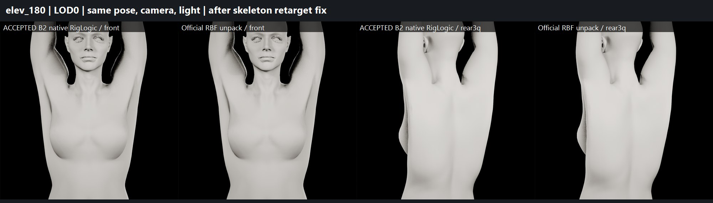
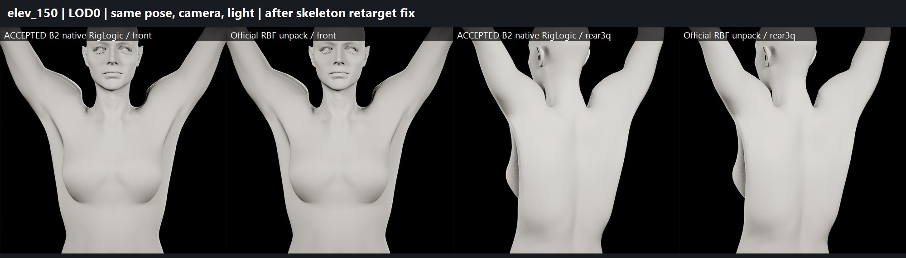
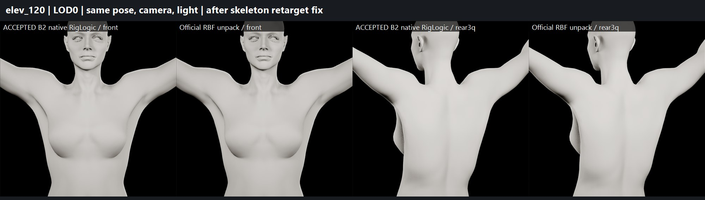
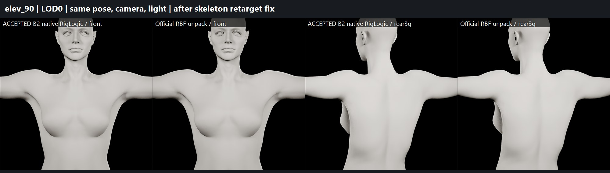
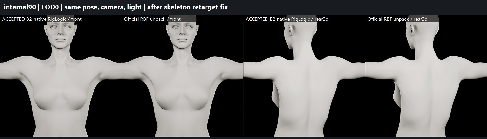
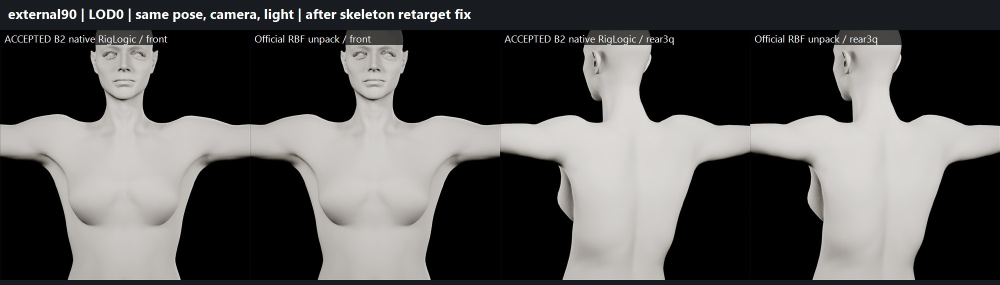
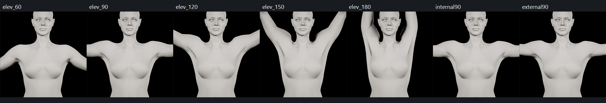
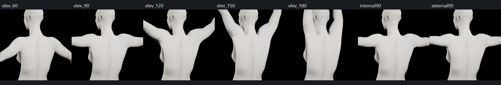

# B2 shoulder — RBF unpack equivalence solved, corrective route evaluated (2026-09-29)

Continuation of the local ShoulderFix work (latest local checkpoint: `RBF_UI_20260929`, 01:27, after the compiled
PostProcess re-run). GitHub history (`f2003930`, `ce9be0bf`, `5c36e337`) was used as evidence only.
Accepted character: `/Game/Sphirus/CharacterLab/NativeBody_20260928/MH_B2_PendingNativeWorkflow` (proportions,
face and HeadScale `1.0653988122940063` locked, not touched).

## Final status

| Gate | Result |
|---|---|
| RBF UNPACK | **PASS** |
| UNPACKED BASELINE EQUIVALENCE | **PASS** (after a test-setup fix, see root cause) |
| BODY PROPORTIONS | PASS (no edit; accepted file byte-identical) |
| FACE IDENTITY | PRESERVED (face regions 0.000 mm native vs unpacked, all poses; no face edit) |
| HEAD/BODY SEAM | PASS (93-sample seam max 0.00047 mm, all poses, both rigs) |
| BODY PERSISTENCE | PASS for existing assets (no body/character edit); skeleton-copy setting saved and read back |
| SHOULDER DEFORMATION | **FAIL** (unchanged, no corrective candidate accepted) |
| ARMPIT DEFORMATION | PARTIAL (unchanged) |
| BODY DEFORMATION | PARTIAL (unchanged) |
| READY FOR USER APPROVAL | **NO** |
| PRODUCTION CHARACTER MODIFIED | **NO** |

## Current local state discovered

- Test MetaHuman `ShoulderFix_20260928/MH_SHOULDER_FIX_NATIVE`, assembled through the official UI with Unpack RigLogic +
  Unpack RBF to PoseAssets ON, finger-half and swing/twist Control Rig unpack OFF.
- `ABP_ShoulderFixNative_PostProcess`: RigLogic node, `CR_MetaHuman_HeadMovement_IK_Proc` Control Rig node, **44 PoseDriver nodes**,
  status `BS_UP_TO_DATE` (compiled + saved in the previous session; re-verified now).
- RBF output: **72 PoseAssets + 72 source AnimSequences**. 44 PoseAssets referenced by the 44 PoseDrivers.
- Isolated shoulder ROM (pelvis/spine locked): `Diagnostics/IsolatedROM/QA_Shoulder_{elev_0..elev_180, internal90, external90, forward90}`.

### The 72 vs 44 PoseAsset question
All 28 unreferenced assets are finger/thumb **non-half** solvers (`PA_{index,middle,ring,pinky}_{l,r}_0{1,2,3}`,
`PA_thumb_{l,r}_0{2,3}`); their `_half` counterparts are the ones wired to the finger PoseDrivers. No shoulder, arm,
leg, clavicle or spine PoseAsset is unreferenced. Whole-body geometry equivalence (≤ 0.13 mm including hands) shows
nothing deformation-relevant is missing → **intentionally unused / redundant in this configuration, not missing correctives.**
Full map: `poseasset_map.json`.

## Root cause of the full-raise mismatch

The previous session's ~1.03 mm full-raise body mismatch came entirely from `upperarm_twistCor_01_l` (1.43 mm).
Local-space analysis showed the unpacked rig applied **exactly zero** translation offset to that joint at every pose,
while the right side matched native to 0.000 mm and rotations matched on both sides.

The vendor MetaHuman body skeleton (`/MetaHumanCharacter/Female/Medium/NormalWeight/Body/metahuman_base_skel`, and the
ShoulderFix copy of it) sets **Translation Retargeting = Skeleton** on `upperarm_twistCor_01_l` and `upperarm_twistCor_02_l`,
while their `_r` mirrors are **AnimationRelative**. PoseAsset evaluation goes through skeleton translation retargeting,
so the RBF PoseAssets' left twistCor translations were replaced by the reference translation. Native RigLogic writes the
joints directly and is unaffected. (`thigh_correctiveRoot_l` has the same asymmetry but is not PoseDriver-driven.)

Category: test/unpack setup (H + I in the brief) — not a character defect. Candidates A–L were checked: PoseDriver nodes
present and symmetric (A), references correct (B), compiled state `BS_UP_TO_DATE` (C), right side identical so graph order
and RigLogic double-evaluation excluded (D, F, G), animation skeleton compatible (K).

**Fix (isolated test copy only):** `ShoulderFix_20260928/Common/.../metahuman_base_skel` → the two left bones set to
AnimationRelative (UI step, Python cannot write `BoneTree` in UE 5.8). Readback: exactly those two bones differ from the
plugin skeleton; plugin skeleton untouched; no rest pose, bone or weight change. Checkpoint of the previous file kept.

A second, harness-level issue was found and fixed: the capture harness could record the native rig's head component and
bone snapshot one case late. Captures are now gated on bone stability plus head/body agreement on shared bones; every
snapshot was verified to match its requested pose (primary bones native vs unpacked 0.00000 mm).

## Unpack equivalence (after fix) — LOD0 CPU-skinned geometry, same pose/camera/light

| Pose | Body max before fix (mm) | Body max (mm) | Body mean | Head max | Face identity max | Seam max native / unpacked | Largest helper diff (rot / transl) |
|---|---|---|---|---|---|---|---|
| neutral | 0.0002 | 0.0002 | 0.00000 | 0.0002 | 0.0 | 0.00047 / 0.00047 | 0° / 0 mm |
| 0° | 0.139 | 0.018 | 0.0002 | 0.008 | 0.0 | 0.00033 / 0.00033 | upperarm_bck_r 0.069° / 0.003 |
| 30° | 0.001 | 0.001 | 0.00002 | 0.0005 | 0.0 | 0.00033 / 0.00032 | 0.005° / 0.000 |
| 60° | 0.031 | 0.031 | 0.0005 | 0.022 | 0.0 | 0.00032 / 0.00033 | clavicle_pec_r 0.063° / 0.008 |
| 90° | 0.296 | 0.089 | 0.0016 | 0.064 | 0.0 | 0.00035 / 0.00035 | clavicle_pec_r 0.183° / 0.019 |
| 120° | 0.626 | 0.128 | 0.0023 | 0.096 | 0.0 | 0.00039 / 0.00039 | clavicle_pec_r 0.267° / 0.016 |
| 150° | 0.849 | 0.107 | 0.0021 | 0.085 | 0.0 | 0.00043 / 0.00038 | clavicle_pec_r 0.232° / 0.008 |
| full (180°) | **1.033** | **0.037** | 0.0008 | 0.031 | 0.0 | 0.00036 / 0.00035 | upperarm_fwd_r 0.152° / 0.003 |
| internal rot @90° | 0.296 | 0.089 | 0.0016 | 0.064 | 0.0 | 0.00035 / 0.00035 | 0.183° / 0.019 |
| external rot @90° | 0.296 | 0.089 | 0.0016 | 0.064 | 0.0 | 0.00035 / 0.00035 | 0.183° / 0.019 |
| forward 90° | 0.082 | 0.082 | 0.0022 | 0.069 | 0.0 | 0.00032 / 0.00032 | upperarm_fwd_r 0.271° / 0.049 |

`upperarm_twistCor_01_l` before the fix: 0.19 mm at 0°, 0.41 @90°, 0.87 @120°, 1.18 @150°, 1.43 @full (first and only
diverging helper). After: all prioritised helpers ≤ 0.27° / ≤ 0.05 mm; remaining residue is UE-RBF vs RigLogic-RBF
numerical interpolation, growing no further than 120°. Visual overlays show no perceptible difference (`boards/eq_*.jpg`).
0 new degenerate triangles, all vertices finite. Per-helper tables: `equivalence_summary.json`.

## Shoulder corrective work — why no candidate was produced

The worst full-raise creases were located on the posed mesh (dihedral increase vs neutral, left side):
trapezius p99 3.6° @90 → 7.2° @120 → 12.2° @150 → 17.3° @full; peak ridge +29.6° at the top-rear
deltoid/trapezius junction. The fold vertices are owned by **`clavicle_l` (main bone) ≈ 27 %**, `upperarm_out` ≈ 25 %,
twistCor/fwd/in/bck, `spine_04`; the clavicle RBF helpers (`clavicle_scap/pec/out`, latissimus) own only 2–5 %.

The corrective options were sized offline with a skinning model validated against Unreal (neutral 0.0003 mm; posed
mean 0.04–0.09 mm) using `Unreal geometry + model delta`:

| Candidate family | Result |
|---|---|
| Edit only the `clavicle_*_up_40` target (weight ramps 0.30 @90 → 1.0 @full) | ≤ 4 % (conservative) / ≤ 13 % (loose, multi-cm helper moves) crease-energy reduction; forward-90 worse |
| Upper bound: all 9 shoulder helpers free per pose (not authorable) | peak ridge 29.6° → 25.5° only, with 27–39 mm surface moves |
| Local skin-weight Laplacian relaxation | worse at every angle (peak 29.7° → 40–44°) |
| Targeted torso↔arm weight transfer (coordinate descent) | broad energy −25 %, but 60–120° peak creases 7–15° → 16–22°; full-raise peak unchanged |
| Fold weight handed to `clavicle_out/scap` + pose-driven via up_40 | 60–90° and rotation poses worse (trap p99 3.6° → 11°), full-raise peak 29.6° → 33.6° |

Every family either fails to remove the ridge or makes 60–120° worse, which the brief defines as FAIL. The fold is a
linear-blend skinning artefact where clavicle, upper-arm helper and spine weights meet, beyond the authored RBF range
(upper-arm targets stop at `out_110`; the full raise extrapolates). Removing it within the locked constraints would need
a new corrective shape or joint (e.g. an extra high-elevation RBF pose with additional helper/morph data), which the
official unpack does not provide and which was not authorised (no Blender, no sculpt). **No PoseAsset, weight or mesh
change was written to any asset.** All offline studies and scripts are kept locally.

## Preservation

- Accepted B2 `MH_B2_PendingNativeWorkflow.uasset` sha256 `59d604a4…` and production `MH_MainCharacter.uasset`
  `45d4d909…`: identical to the start-of-task checkpoint (and to the earlier session's record).
- Test character, PostProcess ABP, PoseAssets: unchanged. Only modified file in CharacterLab / production:
  the isolated ShoulderFix skeleton copy (2 retargeting-mode fields).
- HeadScale `1.0653988122940063` on both accepted and test characters. No body constraint, face, DNA, engine or plugin edit.
- Editor background-throttle setting was disabled for capture and restored.

## Not run

Locomotion/stress regression, save→close→reopen of a corrected candidate and post-correction seam/ROM QA were
**NOT_RUN** because no corrective candidate passed the offline gates. Cleanup (§30) is deferred: nothing deleted.

## Recommended next steps (user decision)

1. Apply the same skeleton fix wherever unpacked RBF will be used (the vendor asymmetry affects any unpacked MetaHuman body in this project).
2. For the ridge itself: either accept native MetaHuman behaviour at extreme elevation (and limit authored ROM to ≈120–150°),
   or authorise a new corrective element (extra high-elevation RBF target with an added helper joint or corrective morph),
   which requires work outside the official unpack.

## Evidence boards

Native B2 (RigLogic) vs official RBF unpack after the fix — front and rear 3/4:

Other poses: [neutral](boards/eq_neutral.jpg) · [30°](boards/eq_elev_30.jpg) · [60°](boards/eq_elev_60.jpg) · [forward 90°](boards/eq_forward90.jpg)

Shoulder defect ladder (unchanged — no corrective applied), 60° → full, internal/external rotation:

Data: [equivalence_summary.json](equivalence_summary.json) · [poseasset_map.json](poseasset_map.json) · [corrective_study.json](corrective_study.json)
