# SPHIRUS — Pass 2 sonrası düzeltici yumuşatma ve beden referansı geçişi

> GitHub kapsamı: rapor, 13 karşılaştırma panosu ve teknik kayıtlar. Blender/FBX dosyaları yerel teslim klasöründedir. [Önceki Pass 2 raporu](../character-identity-pass2-2026-09-27/TEKNIK_RAPOR.md) korunmuştur.

27 Eylül 2026. **Başlangıç: tamamlanmış Pass 2. Son aday: corrective v5.**

Pass 2'nin olgun karakter yapısı korunarak yüzün ve üst gövdenin aşırı sert geçişleri yumuşatıldı. Kullanıcının görev sırasında tekrar verdiği **Adsız.png** beden referansına göre karın–bel–pelvis, uyluk, baldır ve kol formunda ayrıca çalışıldı. Görsel değerlendirme: önceki sürüme göre daha organik, doğal kadın anatomisi açısından daha dengeli bir **kontrollü Conform şekil testi adayı**. Bu, nihai MetaHuman veya üretim rig'i onayı değildir. **Conform ve Unreal import çalıştırılmadı.**

## Başlangıç, koruma ve düzenlenebilir katmanlar

`Sphirus_IdentityPass2_EDITABLE.blend`, `TARGET_BODY`, `TARGET_HEAD`, `SPH_Concept_Form` ve `SPH_Concept_Identity_P2` üzerinden devam edildi. Orijinalden yeniden başlanmadı. `CHECKPOINT_Pass2_EDITABLE.blend` kaynakla byte düzeyinde aynı: SHA-256 `d463a6c9ba23bd553f297c2bc053a04758b6f0e04a0904c86623f606a6063349`.

Orijinal/Pass 1/Pass 2'ye ait **389 dosya** hash kontrolünde değişmemiştir. Ek beden çalışmasından önce yumuşatma v3, teslimler ve kanıtlar `Checkpoint_Before_AdditionalBody/` altında korundu; **33 kontrol noktası dosyası** doğrulandı. v3 mesh anahtarları da birebir korunur. Kontrol edilen **86 Unreal kaynak paketi** değişmedi.

Yeni katmanlar:

- `SPH_Concept_Softening`: Pass 2 anahtarına göreli yüz ve üst beden yumuşatması.
- `SPH_Body_Reference_Correction`: korunmuş Softening anahtarına göreli ek beden çalışması. HEAD üzerindeki farkı **0 mm**; yüz sonucunu değiştirmez.

| Görüntülenecek sürüm | Form | Identity P2 | Softening | Body Reference Correction |
|---|---:|---:|---:|---:|
| Orijinal | 0 | 0 | 0 | 0 |
| Pass 1 | 1 | 0 | 0 | 0 |
| Pass 2 | 1 | 1 | 0 | 0 |
| Ek beden çalışması öncesi yumuşatma | 1 | 1 | 1 | 0 |
| Son teslim | 1 | 1 | 1 | 1 |

Eski ifade anahtarları nötr incelemede sıfırda tutulur. Mevcut referans armature pozları ve dinlenme matrisleri aynıdır.

## Yüzde yumuşatılan bölgeler

Mandibula köşesi, çene çevresi ve çene ucunun bloklu etkisi azaltıldı; yetişkin alt yüz yapısı korundu. Burun kökü/sırtı/uç geçişi daha organik hale getirildi, yan duvarlar hafifçe dolgunlaştırıldı; Pass 2'nin karakterli yetişkin burun projeksiyonu tutuldu. Kaş–glabella–üst orbit geçişindeki sertlik azaltıldı. Göz küreleri taşınmadı veya ölçeklenmedi; olgun kapak açıklığı korundu.

Elmacık altı–yanak–çene bağlantısı sağlıklı hacimle yumuşatıldı. Dudak ve ağız köşelerinde sınırlı hacim düzenlemesiyle sıkışık, düz ifade azaltıldı. İlk denemede lip funnel probunda oluşan tek ek küçük üçgen uyarısı, ağız içi yüzeyin yerel geçişi tutarlı hale getirilerek kaldırıldı. Eski ifade anahtarlarına veya yüz rig'ine müdahale edilmedi.

## Bedende yumuşatma ve ek referans çalışması

Boyun yanları ve trapez hacmi hafifçe azaltıldı; başın destek hissi korundu. Köprücük–deltoid–üst kol geçişinin katılığı azaltıldı. Göğüs ile kaburga arasına sınırlı doğal yumuşaklık geri verildi; eski belirgin göğüs projeksiyonuna dönülmedi.

Sonradan sağlanan beden referansı üzerinde ayrıca şu düzeltmeler yapıldı:

- Alt kaburga, bel ve iliak bölge arasında daha okunur fakat aşırı olmayan geçiş kuruldu; üst ve alt karın hacimleri ayrıldı.
- Arka pelvisin projeksiyonu dengelendi; dış kalça–üst uyluk bağlantısı yumuşatıldı.
- Uyluğun özellikle dış ve diz üstü iç hacmi, baldırın arka/iç/dış hacim dağılımı eklem eksenleri çevresinde düzenlendi. Bacaklar tek parça ölçeklenmedi.
- Üst kolun arka ve ön kolun proksimal hacmi küçük miktarda dengelendi; omuz başı büyütülmedi.
- Birleşim sınırına yaklaşan gövde hareketi yumuşak bir geçiş alanında sıfırlandı. İlk ek beden adayındaki birleşim farkı son sürümde giderildi.

Referanstaki farklı kol pozu, perspektif ve iç çamaşırının destek etkisi nötr anatomiye kopyalanmadı. Beden referansı son talimat doğrultusunda anatomiye yön verdi; bakır saçlı konsept kimlik için ana referans olarak kaldı.

## Bilerek değiştirilmeyenler

Boy, eklem merkezleri, kemik uzunlukları, iskelet mimarisi, rest matrisleri, ağırlıklar, UV'ler, topoloji ve kaynak indeksleri korunur. Eller/ayaklar yeniden tasarlanmadı. Pass 2'nin olgun göz ilişkisi, belirgin burun/orta yüzü ve aktif beden dili tutuldu. Saç, kıyafet, Groom, cilt detayı, doku, yeni üretim materyali veya oyun sistemi oluşturulmadı.

## Ölçülen hareket ve teknik koruma

Bu sayılar kayıtlı mesh koordinatlarından hesaplanır; fotoğraftan çıkarılmış milimetrik anatomi ölçüleri değildir.

| Ölçüt | BODY | Tam HEAD |
|---|---:|---:|
| Pass 2 → son sonuç en büyük vertex hareketi | 9.052445411682 mm | 3.561539888382 mm |
| Yumuşatma v3 → ek beden son sonucu | 8.892329216003 mm | 0.000000000000 mm |
| Orijinal → son sonuç toplam en büyük hareket | 28.727087020874 mm | 10.259721755981 mm |
| Vertex / üçgen | 32.334 / 60.816 | 34.657 / 64.094 |
| Topoloji, polygon/loop sırası | Birebir aynı | Birebir aynı |
| UV katmanları ve koordinatları | Birebir aynı | Birebir aynı |
| Skin ağırlıkları ve vertex grupları | Birebir aynı | Birebir aynı |
| Önceki anahtar koordinatları ve göreli ilişkileri | Korundu | Korundu |

Pass 2'de bulunan 3 beden ve 861 baş anahtarının tamamı; ayrıca yumuşatma v3 anahtarı aynıdır. Baş sayısı Basis, önceki form katmanları ve mevcut ifade/düzeltme verisini içerir. Ayrı deri HEAD hedefi 24.414 vertex / 48.004 üçgendir. Retopoloji, weld, UV yeniden açma veya correspondence bozan işlem yoktur.

**Başlangıç ve son boy: 173.40184020996 cm.** Blender dünya ölçeği metre, −Y ileri / +Z yukarı; FBX +X ileri / +Z yukarı. Ölçek değişmedi.

## Sınırlı ifade kontrolü

**PARTIAL_SANITY_CHECK — nihai yüz doğrulaması değildir.** Sekiz mevcut ham FBX corrective probu tekrar hesaplandı. RigLogic yüz eklemi sürücüleri çalıştırılmadığı için tam göz kapanması ve tam çene/ağız açılması bu testle kanıtlanamaz.

| Ham ifade | Pass 2 karşıt normal uyarısı | Son sürüm uyarısı | Pass 2'de olmayan ek uyarı |
|---|---:|---:|---:|
| blink | 19 | 16 | 0 |
| brows_up | 0 | 0 | 0 |
| brows_down | 0 | 0 | 0 |
| smile | 5 | 5 | 0 |
| mouth_open | 1 | 1 | 0 |
| jaw_open | 0 | 0 | 0 |
| lip_purse | 10 | 10 | 0 |
| lip_funnel | 10 | 10 | 0 |

Blink uyarısı **19 → 16** oldu; kalan 16 küçük üçgen uyarısı açık risktir. Diğer eski smile/ağız/purse/funnel uyarıları da tablodadır. Sekiz probun hiçbirinde Pass 2'ye göre yeni uyarı yoktur. Ek beden katmanı başı değiştirmediği için ifade renderları yumuşatma sonucuyla aynıdır; son v5 dosyasında sayısal test yeniden çalıştırılmıştır. Tam kapak–göz, dudak teması ve çene hareketi ileride MetaHuman yüz sistemiyle değerlendirilmelidir.

## Beden pozları ve birleşim

Orijinal / Pass 2 / son sürüm aynı 12 pozda karşılaştırıldı: nötr idle, yürüyüş, koşu, crouch, kollar yukarı, kollar öne, omuz rotasyonu, dirsek bükümü, kalça bükümü, geniş duruş, derin diz bükümü ve gövde dönüşü. Hem orijinale hem Pass 2'ye karşı **yeni dejenere üçgen: 0; karşıt normal: 0**. Görüntülerde büyük yeni yapısal bozulma görülmedi.

93 baş–gövde eşleşmesi korunur. Nötr azami fark **0.000242560811 mm**; 12 pozun en yüksek birleşim farkı **0.000721197925 mm**. Önceki 0,001 mm altı tolerans korunur. Eski referans skinning'inin uç dirsek/diz/omuz bükümlerinde hacim kaybı kalır. Ağırlıklar yeniden boyanmadı; bu statik geometrik kontrol tüm kesişmeleri veya sürekli oyun animasyonunu doğrulamaz.

## FBX ve nötr teslim

Altı FBX dışa aktarılıp Blender'a geri alındı. Vertex sayıları, polygon/loop düzeni ve UV katmanları aynı; **UV farkı 0**, en büyük dünya konumu farkı **0.000136571398 mm**. Kaynak vertex/polygon eşlemeleri Pass 2 ile aynıdır. Temiz nötr dosyada 0 armature, 5 görünür hedef mesh ve 0 eksik görsel dosyası doğrulandı.

Yerel klasör: `SourceAssets/Characters/SphirusSoftening_20260927/`.

- `Sphirus_Softening_EDITABLE.blend`: önceki sürümler ve iki yeni katmanla düzenlenebilir sonuç.
- `Sphirus_Softening_NeutralTargets.blend`: temiz nötr BODY, HEAD, gözler ve dişler.
- `ConformTargets/SM_SPH_SOFT_BodyTarget.fbx` ve `SM_SPH_SOFT_HeadTarget.fbx`.
- `ConformTargets/Auxiliary/`: göz/diş hedefleri; `ReferenceOnly/`: tam baş topolojisi.
- Kaynak indeks JSON'ları, `target_manifest.json`, `delivery_hashes.json`.

## Görsel karar ve kalan sınırlar

Ön, gerçek yan, arka, ön/arka 3/4, dokusuz kil ve siyah silüet karşılaştırmaları incelendi. Çene daha az keskin, burun geçişi daha organik, kaş ve ağız çevresi daha az serttir. Boyun–omuz desteği korunurken üst gövdenin katılığı azalmıştır. Ek beden çalışması bel–pelvis bağlantısını ve bacak hacmini referansa yaklaştırmıştır. Sonuç hâlâ Pass 1'den daha olgun ve yapılıdır.

**Görsel olarak sonraki kontrollü MetaHuman Conform şekil testi için daha dengeli aday.** Birebir portre veya kalibre edilmiş anatomi eşleşmesi iddiası yoktur; kaynak MetaHuman'ın bazı kafatası özellikleri hâlâ okunur. Referanslar tek bir tarama değildir. Son üretim anatomisi/deformasyon kararı, ilerideki kontrollü MetaHuman testinde yeniden verilecektir. Mevcut UV/topoloji/kaynak eşleme stratejisi korunmuştur; burada MetaHuman kabulü, DNA veya RigLogic uyumu doğrulanmış sayılmaz.

**Bu aşamada duruldu:** Conform, Unreal import, DNA, final rig, saç, kıyafet, materyal/tekstür üretimi, animasyon veya gameplay değişikliği yapılmadı.

## Kanıt dosyaları

- [v5_validation.json](v5_validation.json)
- [expression_validation.json](expression_validation.json)
- [fbx_roundtrip.json](fbx_roundtrip.json)
- [preservation_check.json](preservation_check.json)
- [neutral_delivery_check.json](neutral_delivery_check.json)
- [artistic_review.json](artistic_review.json)
- [v5_change_metrics.json](v5_change_metrics.json)
- [additional_body_checkpoint.json](additional_body_checkpoint.json)
- [target_manifest.json](target_manifest.json)
- [delivery_hashes.json](delivery_hashes.json)

## Karşılaştırma görselleri

Tüm sonuçlar gerçek Blender mesh renderlarıdır. Konsept ve beden referansı kullanıcının verdiği görüntülerdir; yeni sonuç fotoğrafı üretilmemiştir. İfade panoları baş geometrisi ek beden çalışmasında değişmediği için yumuşatma sonucu ile aynıdır; son dosyanın sayısal ifade kontrolü tekrar çalıştırılmıştır.

### Yüz: Pass 2 / düzeltici sonuç — ön, yan, 3/4

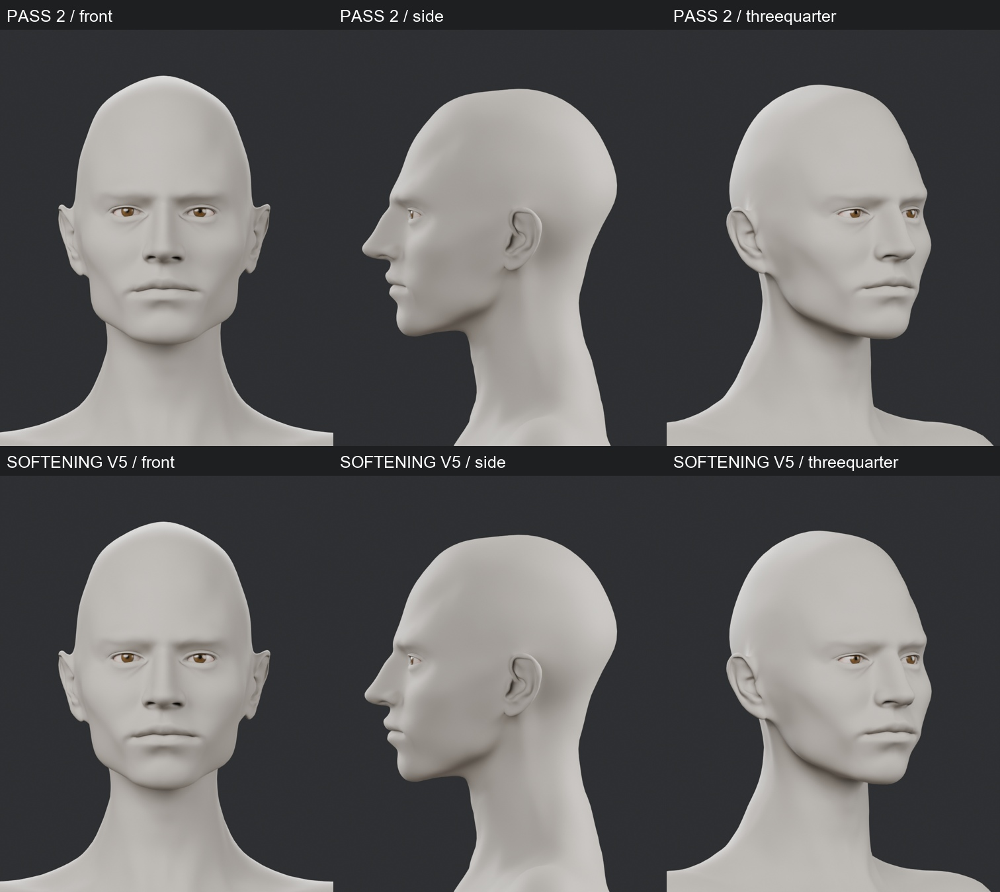

### Beden: Pass 2 / düzeltici sonuç — ön, yan, 3/4

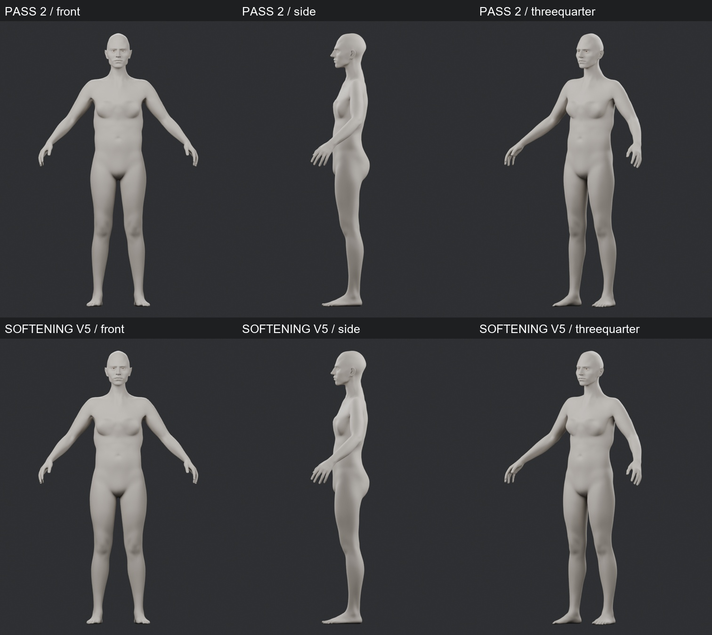

### Ek beden çalışması: Pass 2 / yumuşatma / son sonuç / yeni beden referansı

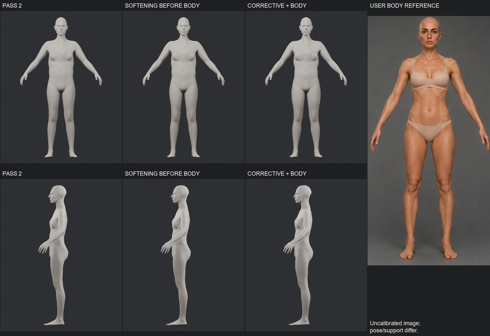

### Yüz: orijinal / Pass 1 / Pass 2 / düzeltici sonuç / ana konsept

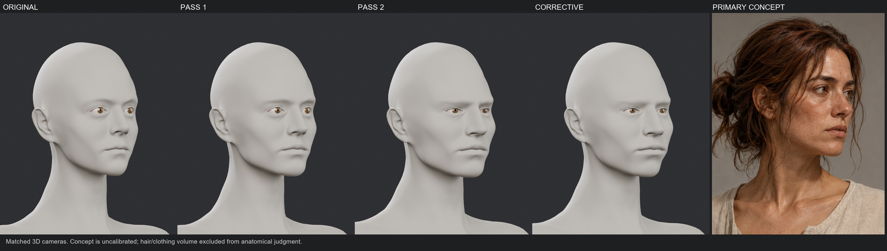

### Beden: orijinal / Pass 1 / Pass 2 / düzeltici sonuç / ana konsept

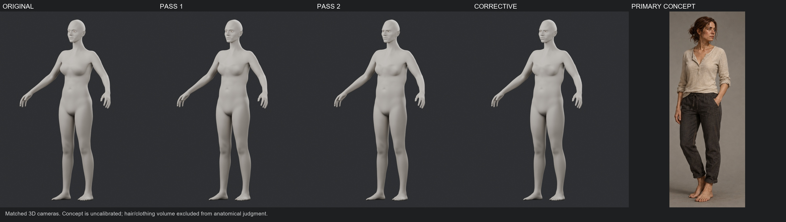

### Beş açıdan tam beden

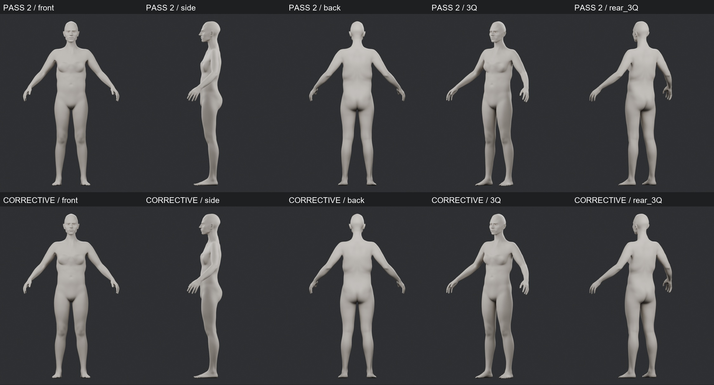

### Tamamen dokusuz kil yüz karşılaştırması

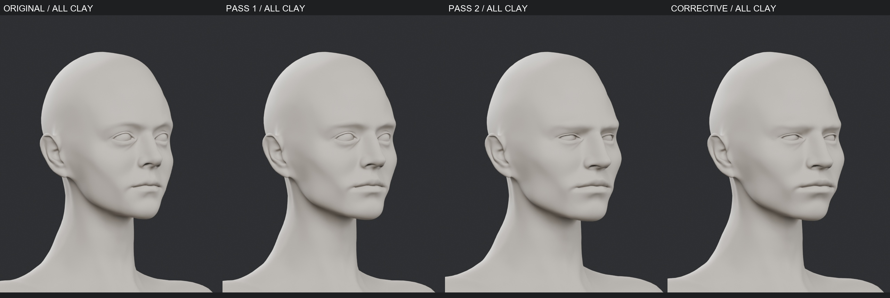

### Siyah silüet karşılaştırması

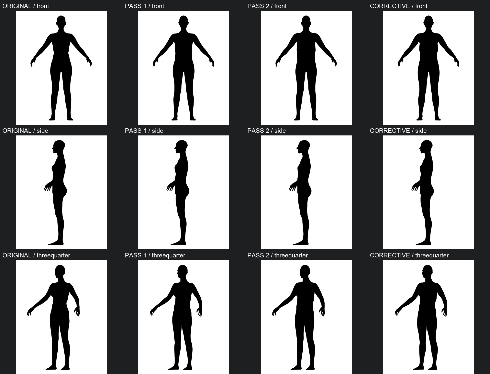

### Üç sürüm: idle / walk / run / crouch

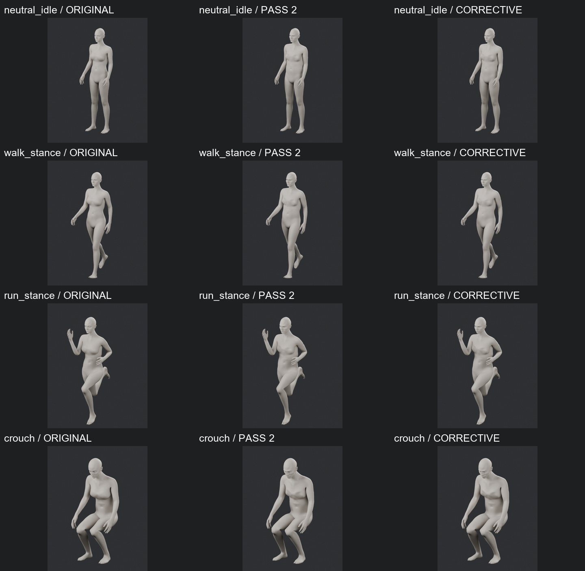

### Üç sürüm: omuz ve dirsek stres pozları

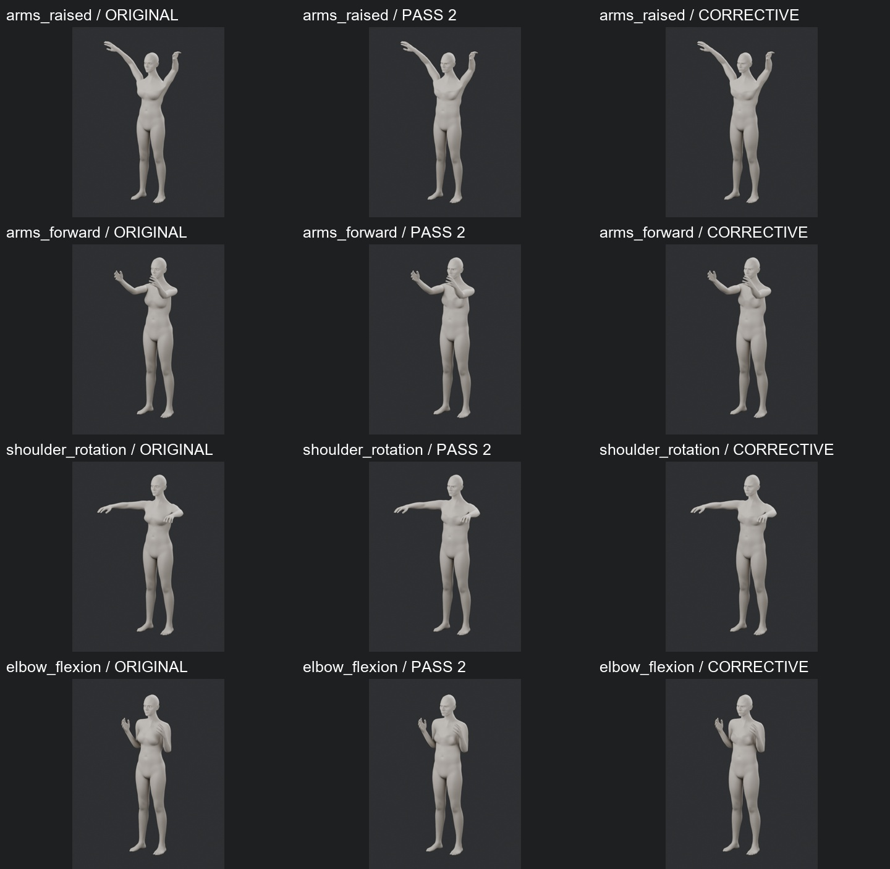

### Üç sürüm: kalça / geniş duruş / diz / gövde dönüşü

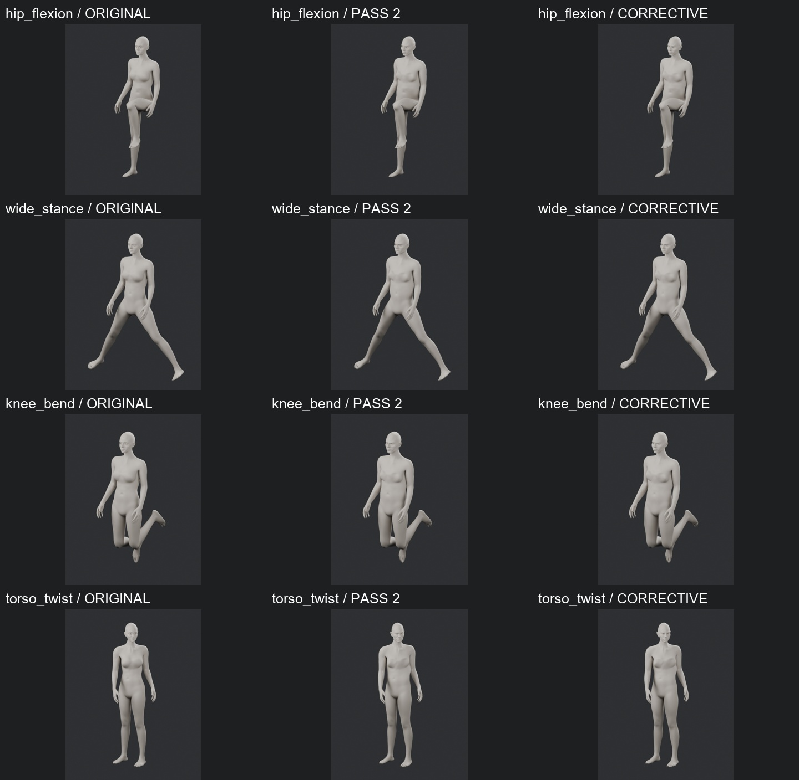

### Ham ifade düzeltmeleri: blink / kaş / smile — PARTIAL

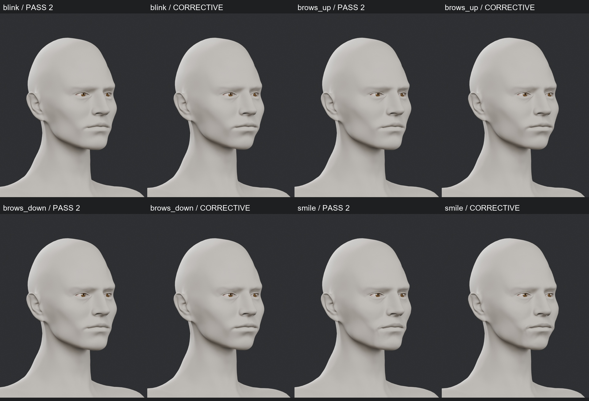

### Ham ifade düzeltmeleri: ağız / jaw / purse / funnel — PARTIAL

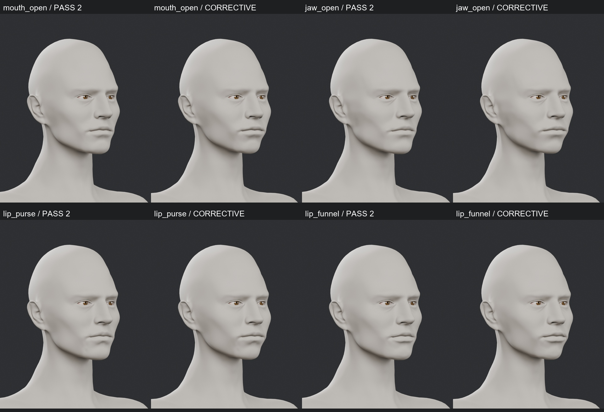
